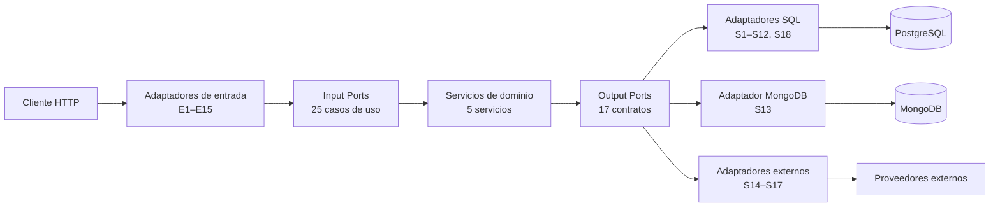

<div align="center">

# NexusMarket

**Marketplace de operaciones comerciales entre compradores y vendedores**

Especificación técnica completa de un marketplace: usuarios y roles, catálogo de productos,
inventario distribuido en bodegas, carrito, pedidos, pagos, facturación, logística, devoluciones,
reembolsos, auditoría y consulta administrativa.

[](./LICENSE)


</div>

---

## 📋 Tabla de Contenidos

1. [Descripción General](#-descripción-general)
2. [Arquitectura](#-arquitectura)
3. [Stack Tecnológico](#-stack-tecnológico)
4. [Estructura del Repositorio](#-estructura-del-repositorio)
5. [Guía de la Documentación (SDD)](#-guía-de-la-documentación-sdd)
6. [Sistema de Referencia](#-sistema-de-referencia)
7. [Contrato de la API REST](#-contrato-de-la-api-rest)
8. [Requisitos Previos e Instalación](#-requisitos-previos-e-instalación)
9. [Uso](#-uso)
10. [Reglas de Contribución](#-reglas-de-contribución)
11. [Buenas Prácticas de Arquitectura](#-buenas-prácticas-de-arquitectura)
12. [Estado del Proyecto y Pendientes](#-estado-del-proyecto-y-pendientes)
13. [Licencia](#-licencia)

---

## 📖 Descripción General

**NexusMarket** es un sistema *marketplace* que centraliza y coordina la operación comercial entre
**compradores**, **vendedores**, **operadores logísticos** y **roles administrativos** (Administrador
y Supervisor).

| Subdominio | Alcance funcional |
|---|---|
| **Identidad y usuarios** | Registro de compradores, incorporación de vendedores (exclusiva del Administrador), cambio de estado operativo (`ACTIVO` / `INACTIVO` / `BLOQUEADO`) |
| **Bodegas** | Bodegas del marketplace y bodegas privadas de vendedor |
| **Catálogo** | Publicación de productos físicos y digitales con variantes (SKU) y cambio de estado |
| **Inventario** | Inventario por **Variante + Bodega**, con movimientos de ingreso, reserva, salida por venta, ajuste y devolución |
| **Carrito** | Selección provisional de artículos por el comprador |
| **Pedidos** | Ciclo `CARRITO → PENDIENTE_PAGO → PAGADO → DESPACHADO → ENTREGADO` (+ `CANCELADO`), inmutable al entregar |
| **Pago y facturación** | Procesamiento de pagos y facturación mediante pasarelas externas |
| **Logística** | Creación de envíos, despacho físico y confirmación de entrega |
| **Devoluciones y reembolsos** | Solicitud, aprobación y reembolso *(fuera de alcance del modelo de dominio)* |
| **Auditoría** | Registro append-only de trazabilidad de toda operación relevante |
| **Reportes** | Consultas administrativas consolidadas de solo lectura |

> **Estado actual:** el repositorio contiene la **especificación completa del sistema (documentación
> SDD)**. **No contiene todavía código fuente de la aplicación.**

---

## 🏗️ Arquitectura

### 2.1 Enfoque de diseño

NexusMarket combina tres enfoques complementarios:

| Enfoque | Aplicación en NexusMarket |
|---|---|
| **DDD** (Domain-Driven Design) | El negocio se modela con **entidades**, **objetos de valor**, **servicios de dominio** e **invariantes** explícitas. El vocabulario del dominio es el vocabulario del código. |
| **Arquitectura Hexagonal** (Ports & Adapters) | El núcleo se comunica con el exterior exclusivamente mediante **puertos** (*interfaces*); HTTP, SQL, MongoDB y proveedores externos son **adaptadores** sustituibles. |
| **SDD** (Spec-Driven Development) | **La especificación es la fuente de verdad.** Cada entidad, caso de uso, puerto y adaptador se deriva de un documento de `SDD/`; la implementación no puede inventar reglas. |

### 2.2 Arquitectura Hexagonal

```text
                        ┌───────────────────────────────┐
                        │        CLIENTE HTTP           │
                        └───────────────┬───────────────┘
                                        │
        ═══════════════════════════════ ▼ ═══════════════════════════════
        MUNDO EXTERNO         ADAPTADORES DE ENTRADA (E1–E15)
        ══════════════════════════════════════════════════════════════
             • REST Controllers                        • Request DTOs (E12)
             • Autenticación / ExecutionContext (E15)  • Response DTOs (E13)
             • Mappers DTO → Comando (E14)             • Errores → HTTP
        ═══════════════════════════════╤ ═══════════════════════════════
                                       │ (llama a)
        ═══════════════════════════════▼ ═══════════════════════════════
        PUERTO DE ENTRADA          25 casos de uso (Input Ports)
        ══════════════════════════════════════════════════════════════
                                       │
        ═══════════════════════════════▼ ═══════════════════════════════
              SERVICIOS DE DOMINIO (5, stateless)
              UserManagement · Catalog · Inventory · OrderProcessing · Audit
        ══════════════════════════════════════════════════════════════
                                       │ (invoca)
        ═══════════════════════════════▼ ═══════════════════════════════
              PUERTOS DE SALIDA — 17 contratos (Output Ports)
        ══════════════════════════════════════════════════════════════
        ══════════════   ══════════════        ══════════════════════════
        ADAPTADORES DE SALIDA (S1–S18)
          • SQL (S1–S12, S18)   • MongoDB (S13)   • Servicios externos (S14–S17)
        ══════════════   ══════════════        ══════════════════════════
                                       │
        ┌──────────────┬───────────────┴──────────────┬──────────────────┐
        ▼              ▼                              ▼                  ▼
   PostgreSQL     MongoDB                  Payment / Logistics /     Cliente
  (transaccional)  (auditoría)              Billing / Identity        (respuesta)
```

### 2.3 Regla de dependencia

> **Única y sin excepciones:** `Adaptador → Puerto → Núcleo`



- Las flechas **entran** al núcleo: los adaptadores dependen de contratos internos.
- **Ninguna flecha sale** del núcleo hacia HTTP, bases de datos, frameworks o proveedores.
- El dominio **no conoce** HTTP, SQL, MongoDB ni la existencia de proveedores externos.
- La traducción de **errores de dominio a códigos HTTP** ocurre en el adaptador de entrada, nunca en
  el dominio.

### 2.4 Estilo arquitectónico

| Aspecto | Decisión |
|---|---|
| Estilo inicial | **Monolito modular** (*Modular Monolith*) con fronteras y puertos claros |
| Entrada | API REST sobre HTTP, JSON (`application/json`, UTF-8) |
| Contexto de ejecución | `ExecutionContext { userId, role }` resuelto por el adaptador de autenticación (nunca enviado por el cliente) |
| Fuente de verdad | **SQL** para el estado transaccional; **MongoDB** exclusivamente para auditoría append-only |
| Integraciones | `PaymentGateway`, `LogisticsGateway`, `BillingGateway`, `IdentityProvider` (tras Output Ports) |

---

## 💻 Stack Tecnológico

| Capa | Tecnología | Rol |
|---|---|---|
| Lenguaje | **TypeScript** | Lenguaje de implementación (tipado estricto del dominio y de los contratos) |
| Runtime | **Node.js** | Entorno de ejecución |
| Entrada | **REST API / HTTP** (JSON) | 24 endpoints expuestos, uno por caso de uso público |
| Arquitectura | **Hexagonal (Ports & Adapters)** + **DDD** | Estilo arquitectónico y modelador del negocio |
| Metodología | **SDD** (Spec-Driven Development) | La especificación dirige la implementación |
| Persistencia transaccional | **SQL** (PostgreSQL) | Fuente de verdad: usuarios, catálogo, bodegas, inventario, carrito, pedidos, envíos |
| Persistencia documental | **MongoDB** | Auditoría y trazabilidad, **append-only** e inmutable (AUD-02) |
| Servicios externos | Pasarelas de pago, logística, facturación e identidad | Adaptadores sustituibles tras Output Ports |
| Framework HTTP | *Pendiente de decisión* (O-09) | No fijado por la especificación |
| Autenticación | *Pendiente de decisión* (O-09) | Se exige encabezado `Authorization`; el esquema queda abierto |

### Dependencias de la arquitectura por mecanismo

```text
SQL      →  Usuarios · Compradores · Vendedores · Productos y Variantes · Bodegas
            Inventario · MovimientosInventario · Carrito · Pedidos · Envíos
            (siempre a través de Output Ports)

MongoDB  →  RegistroAuditoria  (append-only, inmutable, consultable por Supervisor)

Externos →  PaymentGateway · LogisticsGateway · BillingGateway · IdentityProvider
```

### Convenciones transversales de la especificación

| Aspecto | Convención |
|---|---|
| Formato y codificación | JSON `application/json`, UTF-8 |
| Identificadores | **Opacos**, de un único tipo `string` (p. ej. UUID) |
| Encabezado de identidad | `Authorization` obligatorio en **todos** los endpoints |
| Rol del usuario | **Nunca** viaja en el cuerpo: lo resuelve el adaptador de autenticación (E15) |
| Campos no enviados por el cliente | `id`, `rol`, `estado` inicial, `estadoPago`, `estadoPedido`, `cantidadDisponible`, `cantidadReservada` |
| Nomenclatura | Entidades y atributos en español; puertos, adaptadores y DTOs en inglés |
| Códigos de catálogo | Los de `Domain Object Value.md`; **no se traducen ni se inventan** |

---

## 📁 Estructura del Repositorio

```text
Programacion-Web-2-2026/
├── README.md                                   # Este documento
├── LICENSE                                     # MIT License (c) 2026 SamuuVA
├── .gitignore
│
├── SDD/                                        # Especificación (fuente de verdad)
│   ├── contract-alignment.md                   # Alineación Dominio ↔ contratos REST
│   │
│   ├── Domain/                                 # ── NÚCLEO DEL DOMINIO ──
│   │   ├── DomainModel .md                     #   Entidades, jerarquía, relaciones, invariantes
│   │   ├── Domain Object Value.md              #   Objetos de valor y catálogos controlados
│   │   ├── Domain  Servicies.md                #   Servicios de dominio (visión general)
│   │   ├── Input-Ports.md                      #   25 casos de uso + ExecutionContext
│   │   ├── Output-Ports.md                     #   17 contratos de salida
│   │   └── Services/                           #   Detalle por servicio
│   │       ├── UserManagementService.md
│   │       ├── CatalogService.md
│   │       ├── InventoryService.md
│   │       ├── OrderProcessingService.md
│   │       └── AuditService.md
│   │
│   ├── Adapters/                               # ── CAPA DE ADAPTADORES ──
│   │   ├── README.md                           #   Visión general E1–E15 / S1–S18
│   │   ├── architecture.md                     #   Principios, reglas de dependencia, ubicación
│   │   ├── trazabilidad.md                     #   Matriz caso de uso ↔ adaptador ↔ puerto
│   │   ├── input/                              #   Adaptadores de ENTRADA
│   │   │   ├── rest-controllers.md             #     Controllers REST (E1–E11)
│   │   │   ├── request-dtos.md                 #     DTOs de request (E12)
│   │   │   ├── response-dtos.md                #     DTOs de response (E13)
│   │   │   ├── input-mappers.md                #     Mappers DTO → comando (E14)
│   │   │   └── authentication-adapter.md       #     Autenticación y ExecutionContext (E15)
│   │   ├── output/                             #   Adaptadores de SALIDA
│   │   │   ├── persistence-adapters.md         #     Repositorios y unidad de trabajo
│   │   │   ├── sql-adapters.md                 #     S1–S12 sobre SQL
│   │   │   ├── mongodb-adapters.md             #     S13 (auditoría)
│   │   │   └── external-service-adapters.md    #     S14–S17
│   │   └── mappers/                            #   Mappers de salida y de persistencia
│   │       ├── output-mappers.md
│   │       └── persistence-mappers.md
│   │
│   └── Software Architecture/                 # ── ARQUITECTURA ──
│       └── Software Architecture.md            #   Documento central de arquitectura
```

> **Nota sobre nombres de archivo:** varios documentos del dominio contienen espacios internos en el
> nombre (`DomainModel .md`, `Domain  Servicies.md`, `Software Architecture/`). Respeta las rutas
> exactas al enlazarlas o al referenciarlas desde scripts.

### Estructura de referencia prevista para la implementación

Definida en `SDD/Adapters/architecture.md` (§9) y `SDD/Domain/Input-Ports.md` (§32). **No existe
todavía en el repositorio**: es la guía de ubicación física para la futura implementación en
TypeScript.

```text
src/
├── domain/                      # Entidades, value objects, servicios, puertos, excepciones
│   ├── models/   valueobjects/   services/   ports/   exceptions/
├── application/                 # Casos de uso y puertos
│   ├── ports/input/   ports/output/
│   └── services/
├── adapters/
│   ├── in/
│   │   ├── http/                # controllers/ · dto/request/ · dto/response/ · mappers/ · errors/
│   │   └── auth/                # Autenticación y ExecutionContext (E15)
│   └── out/
│       ├── persistence/sql/     # S1–S12 + unidad de trabajo (S18)
│       ├── persistence/mongo/   # S13
│       ├── external/            # S14–S17
│       └── mappers/             # Mappers de persistencia y de salida
└── infrastructure/
    └── config/   database/   security/
```

---

## 📚 Guía de la Documentación (SDD)

La carpeta [`SDD/`](./SDD/) contiene la especificación completa. **La jerarquía de autoridad es
estricta: el dominio manda sobre los adaptadores.**

```text
Domain/  ──define──▶  Adapters/  ──proyecta──▶  API REST
   ▲                        │
   └────── Software Architecture/ ──────────────┘
        (consolida y fija las reglas de ambas capas)
```

### `SDD/Domain/` — Fuente de verdad del negocio

| Documento | Contenido |
|---|---|
| [`DomainModel .md`](./SDD/Domain/DomainModel%20.md) | Modelo de dominio: jerarquía de clases, entidades, relaciones, invariantes globales (`RG-*`, `ORD-01`) y límites del modelo. |
| [`Domain Object Value.md`](./SDD/Domain/Domain%20Object%20Value.md) | Objetos de valor y catálogos cerrados: `SystemRole`, `EstadoUsuario`, `EstadoComercial`, `EstadoProducto`, `EstadoPedido`, `EstadoPago`, `TipoMovimientoInventario`, `TipoBodega`, `CategoriaProducto`, `GravedadAuditoria`, `MetodoEntrega`. |
| [`Domain  Servicies.md`](./SDD/Domain/Domain%20%20Servicies.md) | Visión general de los 5 servicios de dominio, reglas transversales, matriz de precondiciones/postcondiciones e invariantes globales. |
| [`Services/`](./SDD/Domain/Services/) | Detalle operativo de cada servicio: `UserManagementService`, `CatalogService`, `InventoryService`, `OrderProcessingService`, `AuditService`. |
| [`Input-Ports.md`](./SDD/Domain/Input-Ports.md) | **25 casos de uso** (24 expuestos por HTTP + `ReserveInventoryUseCase` interno), `ExecutionContext`, convención de nombres, validación, manejo de errores, autorización y reglas `IP-01…IP-10`. |
| [`Output-Ports.md`](./SDD/Domain/Output-Ports.md) | **17 puertos de salida**, clasificación de repositorios y pasarelas, transacciones, reglas `OP-01…OP-10` y matriz de puertos. |

### `SDD/Adapters/` — Proyección tecnológica

| Documento | Contenido |
|---|---|
| [`README.md`](./SDD/Adapters/README.md) | Vista general de la capa: catálogo resumido de adaptadores **E1–E15** (entrada) y **S1–S18** (salida). |
| [`architecture.md`](./SDD/Adapters/architecture.md) | Principios rectores, criterios para crear un adaptador, reglas de dependencia, ubicación física propuesta, wiring, flujos de petición y de persistencia, decisiones arquitectónicas. |
| [`trazabilidad.md`](./SDD/Adapters/trazabilidad.md) | Matrices de trazabilidad: caso de uso → adaptador → servicio → puerto → tecnología, y verificación de cobertura. |
| [`observaciones-arquitectonicas.md`](./SDD/Adapters/observaciones-arquitectonicas.md) | Registro de **vacíos e inconsistencias O-01…O-18** con impacto, recomendación y acción realizada. |
| [`input/`](./SDD/Adapters/input/) | Adaptadores de entrada: `rest-controllers.md`, `request-dtos.md`, `response-dtos.md`, `input-mappers.md`, `authentication-adapter.md`. |
| [`output/`](./SDD/Adapters/output/) | Adaptadores de salida: `persistence-adapters.md`, `sql-adapters.md`, `mongodb-adapters.md`, `external-service-adapters.md`. |
| [`mappers/`](./SDD/Adapters/mappers/) | Mappers de salida y de persistencia (evitan filtrar modelos de la base de datos al dominio). |

### `SDD/Software Architecture/`

| Documento | Contenido |
|---|---|
| [`Software Architecture.md`](./SDD/Software%20Architecture/Software%20Architecture.md) | **Documento central de arquitectura**: objetivos (`OA-01…OA-10`), contexto, decisiones, verificación arquitectónica y aspectos pendientes de definición. |

### [`SDD/contract-alignment.md`](./SDD/contract-alignment.md)

| Aspecto | Detalle |
|---|---|
| **Propósito** | Traduce, endpoint por endpoint, el dominio en **contratos REST**: método, ruta, encabezados, request, response, errores, mapeo de dominio y persistencia implícita. |
| **Fuente primaria** | `SDD/Domain/` (modelo, objetos de valor, servicios, Input/Output Ports). |
| **Fuente secundaria** | `SDD/Adapters/` (controllers, DTOs, autenticación, trazabilidad, observaciones). |
| **Catálogo** | **24 endpoints** expuestos, uno por caso de uso público; `ReserveInventoryUseCase` queda como contrato interno, sin endpoint. |
| **Convenciones** | JSON/UTF-8, encabezado `Authorization` obligatorio, identificadores opacos (`string`), códigos de catálogo exactos del dominio y envelope de error `{ error, mensaje, detalles[] }`. |
| **Errores** | Correspondencia explícita error de dominio ↔ estado HTTP (`401`, `403`, `404`, `409`, `422`, `500/502/503`). |
| **Persistencia** | Matriz endpoint → repositorios SQL, `AuditRepository` (MongoDB) y servicios externos. |
| **Consumo** | Guía para el frontend y flujos extremo a extremo por rol (comprador, vendedor, administrador, operador logístico, supervisor). |
| **Trazabilidad** | Matriz endpoint ↔ Input Port ↔ servicio ↔ entidad ↔ value object ↔ persistencia. |
| **Regla central** | *Cada endpoint es una proyección del dominio: deriva de un caso de uso, representa entidades y objetos de valor concretos, traduce errores en el adaptador y mapea SQL/MongoDB, sin introducir reglas de negocio nuevas.* |

---

## 🧭 Sistema de Referencia

Toda la especificación usa identificadores estables que permiten citar reglas sin ambigüedad:

| Prefijo | Significado | Ejemplos |
|---|---|---|
| `RG-*` | Regla general del dominio | `RG-01` usuario autenticado · `RG-03` alcance por rol |
| `USR-*` / `SEL-*` | Reglas de usuarios / vendedores | `USR-01` correo y documento únicos · `SEL-01` sin autorregistro de vendedor |
| `INV-*` | Reglas de inventario | `INV-01` no negativo · `INV-02` stock insuficiente · `INV-03` inventario dañado |
| `ORD-*` | Reglas de pedido | `ORD-01` pedido `ENTREGADO` inmutable |
| `AUD-*` | Reglas de auditoría | `AUD-01` auditoría obligatoria · `AUD-02` registros append-only |
| `VO-*` | Reglas de value objects | `VO-02` valores controlados |
| `IP-*` / `OP-*` | Reglas de Input / Output Ports | `IP-10` autenticación fuera del contrato · `OP-06` SQL como fuente de verdad |
| `OA-*` | Objetivos de arquitectura | `OA-01` aislar la lógica de negocio |
| `E1…E15` / `S1…S18` | Adaptadores de entrada / salida | `E1` controllers de usuarios · `S13` `MongoAuditRepository` |
| `O-01…O-18` | Observaciones arquitectónicas (pendientes) | `O-01` devoluciones sin entidad ni puertos |

---

## 🌐 Contrato de la API REST

Resumen del catálogo completo definido en [`SDD/contract-alignment.md`](./SDD/contract-alignment.md):

| # | Método | Ruta | Caso de uso | Actor |
|---|---|---|---|---|
| 1 | `POST` | `/buyers` | `RegisterBuyerUseCase` | Comprador |
| 2 | `POST` | `/sellers` | `OnboardSellerUseCase` | Administrador |
| 3 | `PATCH` | `/users/{userId}/status` | `UpdateUserAccessStatusUseCase` | Administrador |
| 4 | `POST` | `/warehouses` | `CreateWarehouseUseCase` | Administrador / Vendedor |
| 5 | `POST` | `/products` | `CreateProductUseCase` | Vendedor |
| 6 | `PATCH` | `/products/{productId}/status` | `UpdateProductStatusUseCase` | Vendedor / Administrador |
| 7 | `POST` | `/inventory/replenishments` | `ReplenishStockUseCase` | Vendedor / Oper. Logístico |
| 8 | `POST` | `/inventory/dispatches` | `DispatchInventoryUseCase` | Operador Logístico |
| 9 | `POST` | `/carts/{cartId}/items` | `AddItemToCartUseCase` | Comprador |
| 10 | `DELETE` | `/carts/{cartId}/items/{itemId}` | `RemoveItemFromCartUseCase` | Comprador |
| 11 | `POST` | `/carts/{cartId}/confirmation` | `ConfirmCartUseCase` | Comprador |
| 12 | `POST` | `/orders` | `ConfirmOrderUseCase` | Comprador |
| 13 | `GET` | `/orders/{orderId}` | `GetOrderUseCase` | Roles autorizados |
| 14 | `PATCH` | `/orders/{orderId}/status` | `UpdateOrderStatusUseCase` | Roles autorizados |
| 15 | `POST` | `/orders/{orderId}/payments` | `ProcessPaymentUseCase` | Flujo comercial |
| 16 | `POST` | `/orders/{orderId}/invoices` | `CreateInvoiceUseCase` | Sistema |
| 17 | `POST` | `/orders/{orderId}/shipments` | `CreateShipmentUseCase` | Sistema / Oper. Logístico |
| 18 | `POST` | `/orders/{orderId}/dispatch` | `DispatchOrderUseCase` | Operador Logístico |
| 19 | `POST` | `/orders/{orderId}/delivery` | `ConfirmDeliveryUseCase` | Operador Logístico |
| 20 | `POST` | `/orders/{orderId}/returns` | `RequestReturnUseCase` | Comprador |
| 21 | `PATCH` | `/returns/{returnId}/approval` | `ApproveReturnUseCase` | Vendedor |
| 22 | `POST` | `/orders/{orderId}/refunds` | `ProcessRefundUseCase` | Flujo autorizado |
| 23 | `GET` | `/reports` | `GenerateAdministrativeReportUseCase` | Supervisor |
| 24 | `GET` | `/audit-logs` | `QueryAuditLogUseCase` | Supervisor |

**Convenciones transversales**

- Todas las peticiones exigen encabezado **`Authorization`**; el rol **nunca** viaja en el cuerpo.
- `Content-Type: application/json` en peticiones con cuerpo; `Accept: application/json` recomendado.
- Identificadores **opacos** tipados como `string` (los ejemplos numéricos de la especificación son
  ilustrativos).
- Envelope de error uniforme:

```json
{
  "error": "<codigo-estable>",
  "mensaje": "<descripcion legible>",
  "detalles": [{ "campo": "<nombre>", "problema": "<motivo>" }]
}
```

- Un **pago rechazado no es un error**: es un resultado de negocio (`estadoPago: "RECHAZADO"`) en una
  respuesta `200`.
- La escritura de auditoría **no se expone** como endpoint: los registros son append-only y solo se
  consultan (`GET /audit-logs`).

---

## 🛠️ Requisitos Previos e Instalación

### 8.1 Requisitos previos

Para **revisar el proyecto** (lectura y navegación de la especificación):

| Requisito | Detalle |
|---|---|
| Visor de Markdown | Cualquiera: GitHub, VS Code, Typora, Obsidian |
| Editor recomendado | **Visual Studio Code** con vista previa de Markdown |
| Git *(opcional)* | Útil para historial, ramas y comparación de cambios |

Para **implementar el sistema** (aún no disponible en el repositorio):

| Requisito | Detalle |
|---|---|
| **Node.js** (LTS) | Runtime de la implementación |
| **TypeScript** | Lenguaje del código de aplicación |
| Gestor de paquetes | npm / yarn / pnpm |
| **PostgreSQL** (o SQL equivalente) | Persistencia transaccional |
| **MongoDB** | Persistencia documental para auditoría |
| Editor con soporte TypeScript | VS Code + extensión de TypeScript |
| Linter / formateador | ESLint + Prettier (a definir por el equipo) |

### 8.2 Instalación — Revisar la especificación

**Paso 1 · Clonar el repositorio**

```bash
git clone https://github.com/SamuuVA/Programacion-Web-2-2026.git
cd Programacion-Web-2-2026
```

**Paso 2 · Verificar la estructura**

```bash
# Listar la especificación
dir SDD
```

```powershell
# PowerShell
Get-ChildItem -Recurse SDD
```

**Paso 3 · Leer en el orden recomendado**

```text
 1. SDD/Domain/DomainModel .md                        → entender el negocio
 2. SDD/Domain/Domain Object Value.md                 → catálogos cerrados
 3. SDD/Domain/Domain  Servicies.md                   → operaciones y reglas
 4. SDD/Domain/Services/*.md                          → detalle por servicio
 5. SDD/Domain/Input-Ports.md                         → los 25 casos de uso
 6. SDD/Domain/Output-Ports.md                        → los 17 puertos de salida
 7. SDD/Software Architecture/Software Architecture.md → arquitectura consolidada
 8. SDD/Adapters/README.md y architecture.md          → capa de adaptadores
 9. SDD/Adapters/trazabilidad.md                      → verificar cobertura
10. SDD/contract-alignment.md                        → contrato REST derivado
11. SDD/Adapters/observaciones-arquitectonicas.md     → pendientes O-01…O-18
```

**Paso 4 · Abrir en el editor**

```bash
code .
```

### 8.3 Instalación — Ejecución de la aplicación

> **No existe todavía código de aplicación.** No hay `package.json`, `tsconfig.json` ni scripts de
> compilación. Cuando se implemente, esta sección se completará con los comandos concretos de
> arranque, migraciones y variables de entorno.

```bash
# Verificación de prerrequisitos (para la futura implementación)
node --version
npm --version
tsc --version
```

---

## 🚀 Uso

| Objetivo | Acción |
|---|---|
| **Estudiar el negocio** | Empieza por `SDD/Domain/DomainModel .md` y sigue las referencias cruzadas. |
| **Implementar un caso de uso** | Busca su `Input Port` en `Input-Ports.md` (§21), su endpoint en `contract-alignment.md` (§4) y sus adaptadores en `Adapters/trazabilidad.md`. |
| **Añadir un adaptador** | Verifica los criterios de `Adapters/architecture.md` (§4): debe implementar un Output Port, consumir un Input Port o resolver un límite externo documentado. |
| **Verificar cobertura** | Consulta `Adapters/trazabilidad.md` (§6 y §7) para detectar elementos sin trazabilidad completa. |
| **Revisar huecos** | Revisa `Adapters/observaciones-arquitectonicas.md` para los hallazgos abiertos O-01…O-18. |

---

## 🤝 Reglas de Contribución

### Reglas generales

1. **La especificación dirige al código.** Ninguna regla de negocio se implementa sin estar
   documentada en `SDD/`. Si falta, se documenta primero.
2. **Prohibido inventar.** No se crean entidades, puertos, adaptadores, endpoints ni tecnologías que no
   estén justificados por un documento existente.
3. **Cambios mínimos y trazables.** Un PR modifica lo que dice el título e incluye la referencia al
   documento SDD afectado.
4. **Idioma del dominio: español.** Entidades, atributos y métodos de dominio en español; puertos,
   adaptadores y DTOs en inglés. Los códigos de los catálogos **no se traducen**.
5. **Documentación en español**, en Markdown limpio: tablas para reglas, bloques de código para
   ejemplos y diagramas.

### Checklist antes de abrir un PR

- [ ] ¿La regla de negocio afectada está documentada en `SDD/Domain/`?
- [ ] ¿Se respetó la regla de dependencia `Adaptador → Puerto → Núcleo`?
- [ ] ¿El dominio quedó libre de referencias a HTTP, SQL, MongoDB o proveedores?
- [ ] ¿Los identificadores se mantienen como `string` opaco?
- [ ] ¿Los valores de estado, rol y categoría provienen de los catálogos de `Domain Object Value.md`?
- [ ] ¿La trazabilidad del nuevo elemento está actualizada en `Adapters/trazabilidad.md`?
- [ ] ¿Se actualizó `contract-alignment.md` si el cambio afecta a un contrato HTTP?
- [ ] ¿Se registró una nueva observación (`O-NN`) si el cambio detecta una inconsistencia?
- [ ] ¿Se evitó modificar documentos de `SDD/` fuera del objetivo del trabajo?

---

## ✅ Buenas Prácticas de Arquitectura

### A. Aislamiento del dominio

- El núcleo **no importa** nada de frameworks HTTP, drivers SQL, drivers de MongoDB ni SDKs de
  proveedores.
- Las entidades se modelan en el lenguaje del negocio, no en el de la base de datos.
- Las **reglas de negocio viven en el dominio**; los adaptadores traducen, no deciden.

### B. Inversión de dependencias

- El dominio declara **puertos** (interfaces); la infraestructura los **implementa**.
- Los casos de uso dependen de puertos abstractos, nunca de implementaciones concretas.
- Sustituir PostgreSQL por otro motor, o el proveedor de pagos por otro, **no debe tocar el
  dominio**.

```typescript
// ✅ El caso de uso depende del puerto (interfaz), no de la implementación
export interface OrderRepository {
  guardar(pedido: Pedido): Promise<void>;
  buscarPorId(id: string): Promise<Pedido | null>;
}

// ❌ Prohibido en el dominio: conocer el motor de persistencia
// import { Pool } from 'pg';
```

### C. Traducción en los adaptadores

| Aspecto | Regla |
|---|---|
| DTOs | Los DTOs de request/response **nunca** son entidades del dominio. |
| Mappers | Traducen DTO → comando y entidad → response, de forma explícita y testeable. |
| Errores | El dominio lanza errores de negocio; el adaptador los traduce a HTTP con el envelope `{ error, mensaje, detalles }`. |
| Identidad | El rol y el usuario provienen del `ExecutionContext`, **nunca** del cuerpo de la petición. |
| Persistencia | Los modelos de base de datos no se filtran al dominio: existen mappers de persistencia. |

### D. Persistencia responsable

- **SQL** = fuente de verdad transaccional. Las operaciones de reserva y salida de inventario deben
  ser **atómicas**; la unidad de trabajo pertenece a infraestructura, no al dominio.
- **MongoDB** = auditoría y trazabilidad, **append-only e inmutable**. No replica datos transaccionales.
- Todo movimiento de inventario **debe** generar registro de auditoría (AUD-01).

### E. Pureza del dominio

- Los **servicios de dominio son stateless**; la lógica se apoya en entidades y objetos de valor.
- Los **value objects** protegen sus invariantes (enums cerrados, rangos, formatos) y se validan en su
  construcción.
- Los identificadores son **opacos** y de un único tipo (`string`).
- El cliente nunca envía `id`, `rol`, `estado` inicial, `estadoPago`, `estadoPedido`,
  `cantidadDisponible` ni `cantidadReservada`: los determina el dominio.

### F. Testabilidad

- El núcleo se prueba **sin infraestructura** mediante adaptadores de prueba (`Fake*`) que implementan
  los mismos puertos.
- Cada caso de uso debe poder probarse dado un puerto falso y un `ExecutionContext` construido.
- Las reglas transversales (transiciones de estado, autorización) deben ser verificables con pruebas
  de dominio.

### G. Consistencia y estilo

- Estilo inicial: **monolito modular** — fronteras claras, sin microservicios prematuros.
- Convenciones de nombres fijadas en `DomainModel .md` (§2.4) y respetadas en todo el código.
- Los contratos REST se derivan de la especificación: **un endpoint por caso de uso expuesto**, y un
  caso de uso interno **no** produce endpoint público.

---

## 📊 Estado del Proyecto y Pendientes

| Aspecto | Estado |
|---|---|
| Especificación de dominio | ✅ Completa (modelo, value objects, servicios, Input/Output Ports) |
| Especificación de adaptadores | ✅ Completa (E1–E15, S1–S18, trazabilidad) |
| Alineación de contratos REST | ✅ 24 endpoints documentados |
| Arquitectura de software | ✅ Documento central consolidado |
| **Código fuente** | ⬜ **Pendiente** — el repositorio es puramente documental |
| Esquema físico de base de datos | ⬜ Pendiente |
| Framework HTTP y autenticación | ⬜ Pendiente (O-09) |
| Proveedores externos (pago, logística) | ⬜ Pendiente |
| Pruebas automatizadas | ⬜ Pendiente |

Los vacíos e inconsistencias detectados (**O-01…O-18**) están registrados con su impacto,
recomendación y estado en
[`SDD/Adapters/observaciones-arquitectonicas.md`](./SDD/Adapters/observaciones-arquitectonicas.md).
Los pendientes específicos del contrato REST están en
[`SDD/contract-alignment.md`](./SDD/contract-alignment.md) §11.

---

## 📄 Licencia

Este proyecto está bajo la licencia [MIT](./LICENSE).

```text
MIT License — Copyright (c) 2026 SamuuVA
```

---

<div align="center">

**NexusMarket** · Especificación SDD de un marketplace con DDD y Arquitectura Hexagonal
<sub>Documento derivado de `SDD/` — la especificación es la fuente de verdad del proyecto.</sub>

</div>
