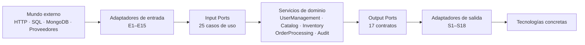
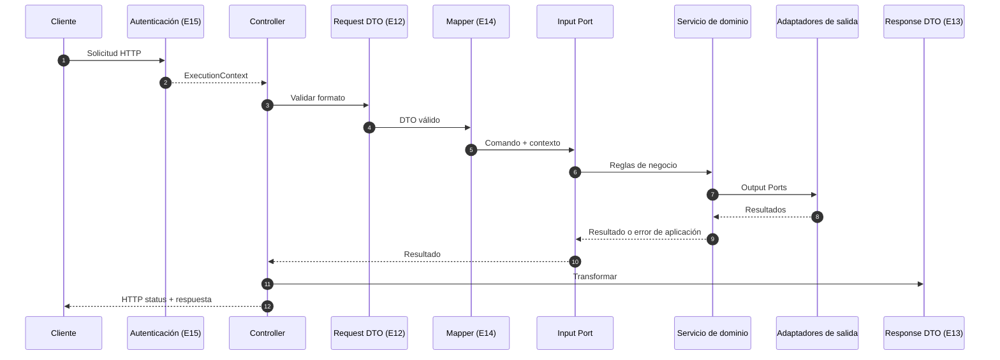
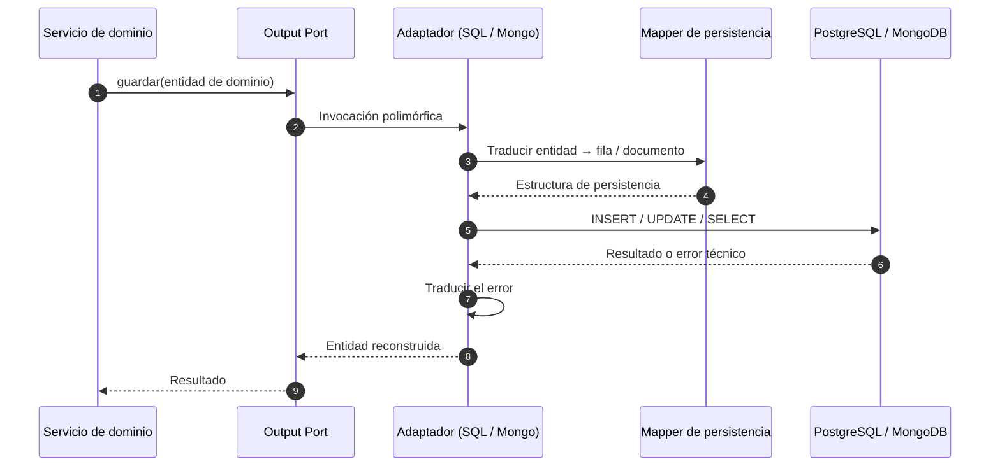

# Adaptadores — NexusMarket

> Capa de **Adapters** de la arquitectura hexagonal (Ports & Adapters) + DDD de NexusMarket.

Este directorio contiene la documentación de diseño de la capa de adaptadores. **No contiene código**
y no modifica ninguna especificación existente del proyecto.

---

## 1. ¿Qué es la capa de adaptadores?

Es el conjunto de componentes que conectan los **límites externos** del sistema (HTTP, PostgreSQL,
MongoDB, proveedores externos) con los **contratos internos** ya definidos en el proyecto:

- **Input Ports** (`../Domain/Input-Ports.md`): 25 casos de uso.
- **Output Ports** (`../Domain/Output-Ports.md`): 17 contratos de salida.

Un adaptador **traduce**; no decide reglas de negocio.

```text
Mundo externo  →  Adaptador  →  Puerto  →  Núcleo (dominio y aplicación)
```

## 2. ¿Qué problema resuelve?

| Problema | Solución de esta capa |
|---|---|
| El dominio no debe conocer HTTP ni bases de datos | Los adaptadores absorben toda dependencia tecnológica |
| El modelo HTTP no debe exponer entidades internas | Request DTOs, Response DTOs y mappers explícitos |
| El formato de la base de datos no debe filtrarse | Mappers de persistencia y contratos en términos del dominio |
| Los proveedores externos no deben acoplarse al núcleo | Adaptadores sustituibles detrás de `PaymentGateway`, `LogisticsGateway`, etc. |
| El proyecto debe poder probarse sin infraestructura | Adaptadores de prueba que implementan los mismos puertos |
| Las tecnologías deben poder cambiar sin reescribir el negocio | Sustitución de adaptadores sin tocar puertos ni dominio |

## 3. Relación con Ports & Adapters



La dirección de dependencia es siempre `Adaptador → Puerto → Núcleo`. Ninguna flecha sale del núcleo
hacia una tecnología (ver `architecture.md`, §3 y §7).

## 4. Adaptadores que existen

| Grupo | Cantidad documentada |
|---|---|
| Adaptadores de entrada (controllers REST) | 11 grupos (E1–E11) |
| Adaptadores de soporte de entrada (DTOs y mappers) | 3 (E12–E14) |
| Adaptador de entrada transversal (autenticación y contexto) | 1 (E15) |
| Adaptadores de salida SQL | 12 (S1–S12) |
| Adaptador de salida documental (MongoDB) | 1 (S13) |
| Adaptadores de servicios externos | 4 (S14–S17, dos condicionales) |
| Adaptador de infraestructura (unidad de trabajo) | 1 (S18) |
| Adaptadores de prueba | Definidos por puerto (`Fake*`) |

## 5. Adaptadores de entrada

| ID | Adaptador | Puerto(s) consumido(s) | Servicio/Caso de uso | Documento |
|---|---|---|---|---|
| E1 | Controllers de usuarios (`BuyerController`, `SellerController`, `UserController`) | `RegisterBuyerUseCase`, `OnboardSellerUseCase`, `UpdateUserAccessStatusUseCase` | `UserManagementService` | `input/rest-controllers.md` |
| E2 | `WarehouseController` | `CreateWarehouseUseCase` | Pendiente de definición (O-04) | `input/rest-controllers.md` |
| E3 | `ProductController` | `CreateProductUseCase`, `UpdateProductStatusUseCase` | `CatalogService` | `input/rest-controllers.md` |
| E4 | `InventoryController` | `ReplenishStockUseCase`, `DispatchInventoryUseCase` | `InventoryService` | `input/rest-controllers.md` |
| E5 | `CartController` | `AddItemToCartUseCase`, `RemoveItemFromCartUseCase`, `ConfirmCartUseCase` | `OrderProcessingService` | `input/rest-controllers.md` |
| E6 | `OrderController` | `GetOrderUseCase`, `ConfirmOrderUseCase`, `UpdateOrderStatusUseCase` | `OrderProcessingService` | `input/rest-controllers.md` |
| E7 | `PaymentController`, `InvoiceController` | `ProcessPaymentUseCase`, `CreateInvoiceUseCase` | `OrderProcessingService` / pendiente | `input/rest-controllers.md` |
| E8 | `ShipmentController` | `CreateShipmentUseCase`, `DispatchOrderUseCase`, `ConfirmDeliveryUseCase` | `OrderProcessingService` + `InventoryService` | `input/rest-controllers.md` |
| E9 | `ReturnController`, `RefundController` | `RequestReturnUseCase`, `ApproveReturnUseCase`, `ProcessRefundUseCase` | Pendiente de definición (O-01) | `input/rest-controllers.md` |
| E10 | `ReportController` | `GenerateAdministrativeReportUseCase` | Consulta de lectura (`ReportingQuery`) | `input/rest-controllers.md` |
| E11 | `AuditController` | `QueryAuditLogUseCase` | `AuditService` | `input/rest-controllers.md` |
| E12 | Request DTOs | Todos los casos de uso con comando documentado | — | `input/request-dtos.md` |
| E13 | Response DTOs | Todos los casos de uso con salida documentada | — | `input/response-dtos.md` |
| E14 | Mappers de entrada | Traducen DTO → comando | — | `input/input-mappers.md` |
| E15 | Autenticación y contexto | Produce `ExecutionContext{userId, role}` | Todos | `input/authentication-adapter.md` |

## 6. Adaptadores de salida

| ID | Adaptador | Puerto implementado | Tecnología | Documento |
|---|---|---|---|---|
| S1–S3 | `SQLUserRepository`, `SQLSellerRepository`, `SQLBuyerRepository` | `UserRepository`, `SellerRepository`, `BuyerRepository` | SQL | `output/sql-adapters.md` |
| S4 | `SQLProductRepository` | `ProductRepository` | SQL | `output/sql-adapters.md` |
| S5 | `SQLWarehouseRepository` | `WarehouseRepository` | SQL | `output/sql-adapters.md` |
| S6–S7 | `SQLInventoryRepository`, `SQLInventoryMovementRepository` | `InventoryRepository`, `InventoryMovementRepository` | SQL | `output/sql-adapters.md` |
| S8 | `SQLCartRepository` | `CartRepository` | SQL | `output/sql-adapters.md` |
| S9 | `SQLOrderRepository` | `OrderRepository` | SQL | `output/sql-adapters.md` |
| S10 | `SQLInvoiceRepository` (condicional) | `InvoiceRepository` | SQL | `output/sql-adapters.md` |
| S11 | `SQLShipmentRepository` | `ShipmentRepository` | SQL | `output/sql-adapters.md` |
| S12 | `SQLReportingQueryAdapter` | `ReportingQuery` | SQL (solo lectura) | `output/persistence-adapters.md` |
| S13 | `MongoAuditRepository` | `AuditRepository` | MongoDB | `output/mongodb-adapters.md` |
| S14 | Adaptador de pasarela de pago | `PaymentGateway` | Proveedor externo (por definir) | `output/external-service-adapters.md` |
| S15 | Adaptador de logística | `LogisticsGateway` | Proveedor externo (por definir) | `output/external-service-adapters.md` |
| S16 | Adaptador de facturación externa (condicional) | `BillingGateway` | Proveedor externo (por definir) | `output/external-service-adapters.md` |
| S17 | Adaptador de proveedor de identidad (condicional) | `IdentityProvider` | Proveedor de identidad (por definir) | `output/external-service-adapters.md` |
| S18 | Unidad de trabajo transaccional | — (infraestructura) | SQL | `output/persistence-adapters.md` |

## 7. Puerto utilizado por cada adaptador

La correspondencia completa se encuentra en `trazabilidad.md` (§3). Resumen:

```text
Entrada:  Input Ports de ../Domain/Input-Ports.md (§21)
Salida:   Output Ports de ../Domain/Output-Ports.md (§27)
```

Ningún adaptador implementa o consume un puerto distinto de los documentados; los 17 Output Ports
tienen adaptador asignado y 24 de los 25 Input Ports tienen adaptador de entrada
(`ReserveInventoryUseCase` es interno).

## 8. Servicios y casos de uso que intervienen

| Servicio de dominio | Adaptadores de entrada | Adaptadores de salida |
|---|---|---|
| `UserManagementService` | E1 | S1–S3, S13 |
| `CatalogService` | E3 (y E2 según decisión pendiente) | S4–S5, S13 |
| `InventoryService` | E4, E8 | S5–S7, S13 |
| `OrderProcessingService` | E5–E8 | S8–S9, S11, S13–S15 |
| `AuditService` | E11 (consulta) | S13 |
| Sin servicio asignado (pendiente) | E2, E7 (`CreateInvoiceUseCase`), E9 | S10 o S16 |

Detalle por caso de uso en `trazabilidad.md` (§2).

## 9. Dependencias existentes

```text
Adaptador de entrada → Input Ports, DTOs, mappers de entrada, ExecutionContext
Adaptador de salida  → Output Port que implementa, mappers, librería del motor o SDK del proveedor
Servicio de dominio  → Entidades, objetos de valor, Output Ports
Composición          → Todos los adaptadores, solo para inyectar dependencias
```

## 10. Dependencias prohibidas

```text
Núcleo (dominio/aplicación) → HTTP, REST, JSON
Núcleo → Express, Fastify ni ningún framework HTTP
Núcleo → PostgreSQL, SQL Server, MySQL, MongoDB
Núcleo → Prisma, TypeORM ni librerías de persistencia
Núcleo → SDK de pago, logística o identidad
Núcleo → credenciales, endpoints o tokens de terceros

Adaptador → Adaptador (controller → repositorio, repositorio → gateway, etc.)
Adaptador → Reglas de negocio
Adaptador → Entidades de dominio como contrato público de HTTP
Adaptador → Modelos de persistencia expuestos al núcleo
```

Base: `../Domain/Input-Ports.md` (§5.1, §29, §31) y `../Domain/Output-Ports.md` (§2, §8.1, §21).

## 11. Cómo fluye una petición



Detalle en `architecture.md` (§11) y `input/rest-controllers.md` (§8).

## 12. Cómo fluye una operación de persistencia



Detalle en `architecture.md` (§12), `output/persistence-adapters.md` (§5) y
`mappers/persistence-mappers.md`.

## 13. Qué tecnologías son detalles de implementación

| Elemento | ¿Es detalle de implementación? | Estado |
|---|---|---|
| Framework HTTP (Express, Fastify u otro) | Sí | No decidido; el núcleo no debe conocerlo |
| Motor SQL (PostgreSQL recomendado) | Sí | No decidido formalmente |
| Librería de acceso a datos | Sí | No decidida; Prisma/TypeORM aparecen solo como contraejemplos |
| MongoDB y su driver | Sí | Decidido para auditoría |
| SDK de proveedores de pago, logística, identidad | Sí | Proveedores no definidos |
| Serialización JSON, estructura de rutas, códigos de éxito | Sí | Catálogo de endpoints pendiente |
| Mecanismo de autenticación (JWT, sesiones, OAuth2, OIDC) | Sí | Pendiente |
| Composición e inyección de dependencias | Sí | Criterios documentados en `architecture.md` (§10) |
| Entidades, objetos de valor, servicios y puertos | **No** | Son el núcleo y no se modifican |

## 14. Decisiones arquitectónicas tomadas

| # | Decisión | Base | Documento |
|---|---|---|---|
| 1 | Los controllers REST son adaptadores de entrada | `Input-Ports.md` §3, §4, §35 | `architecture.md` §13 |
| 2 | Un adaptador por Output Port, sin repositorio genérico | `Output-Ports.md` §4, §27 | `architecture.md` §13 |
| 3 | SQL como fuente autoritativa y MongoDB solo para auditoría | `Output-Ports.md` §5, §12, §17 | `architecture.md` §13 |
| 4 | Adaptadores externos sustituibles; facturación e identidad condicionales | `Output-Ports.md` §8, §9, §10, §14, §18 | `architecture.md` §13 |
| 5 | Separación estricta entre reglas de negocio y traducción técnica | `Input-Ports.md` §22, §29; `Domain  Servicies.md` §3 | `architecture.md` §13 |
| 6 | No se implementan adaptadores sin puerto documentado | Criterio de análisis (sección 4 de `architecture.md`) | `architecture.md` §13 |
| 7 | La autenticación es un único adaptador transversal (E15) que produce el `ExecutionContext` | `Input-Ports.md` §8, §27 (IP-10) | `input/authentication-adapter.md` §12 |
| 8 | Los DTOs y mappers existen para separar modelo HTTP, de dominio y de persistencia | `Input-Ports.md` §4, §29 (IP-08) | `input/request-dtos.md`, `mappers/*` |
| 9 | La atomicidad reside en la unidad de trabajo (S18) y no en el dominio | `Output-Ports.md` §19 | `output/persistence-adapters.md` §5 |
| 10 | `ReserveInventoryUseCase` no se expone por HTTP | `Input-Ports.md` §21 | `input/rest-controllers.md` §4 |

---

## 15. Documentos de esta carpeta

```text
SDD/Adapters/
├── README.md                            ← Este documento
├── architecture.md                      Arquitectura de adaptadores, reglas y decisiones
├── trazabilidad.md                      Casos de uso ↔ adaptadores ↔ puertos ↔ servicios
├── observaciones-arquitectonicas.md     Hallazgos, divergencias y pendientes (O-01 … O-18)
├── input/
│   ├── rest-controllers.md              E1–E11: controllers, endpoints, errores, seguridad
│   ├── request-dtos.md                  E12: contratos de entrada
│   ├── response-dtos.md                 E13: contratos de salida
│   ├── input-mappers.md                 E14: DTO → comando
│   └── authentication-adapter.md        E15: identidad, rol y ExecutionContext
├── output/
│   ├── persistence-adapters.md          Reglas comunes, transacciones, errores, fakes
│   ├── sql-adapters.md                  S1–S12: adaptadores SQL
│   ├── mongodb-adapters.md              S13: auditoría documental
│   └── external-service-adapters.md     S14–S17: pago, logística, facturación, identidad
└── mappers/
    ├── output-mappers.md                Resultado → Response DTO
    └── persistence-mappers.md           Dominio ↔ persistencia
```

### Orden de lectura sugerido

```text
1. README.md                          (visión general)
2. architecture.md                    (reglas y decisiones)
3. input/rest-controllers.md          (entrada)
4. output/sql-adapters.md             (salida más relevante)
5. trazabilidad.md                    (correspondencias)
6. observaciones-arquitectonicas.md   (qué falta por decidir)
```

## 16. Estado y pendientes

**Definido en esta documentación:** los 33 grupos de adaptadores (E1–E15 y S1–S18), sus puertos, sus dependencias, sus
reglas, sus flujos y su trazabilidad.

**Pendiente de definición (no inventado):**

```text
Mecanismo de autenticación y proveedor de identidad
Framework HTTP concreto
Motor SQL, librería de acceso a datos, esquema y migraciones
Proveedores de pago y logística
Modelos de lectura de ReportingQuery
Formato de fechas y paginación
```

**Resuelto y reflejado en la documentación:** catálogo de endpoints HTTP (`../contract-alignment.md`,
O-08); decisión de facturación —`BillingGateway`— (O-12); entidades `Factura`/`Envio` y devoluciones
declaradas fuera del alcance (`DomainModel .md` §15.1; O-01, O-02); estrategia de consistencia SQL ↔
MongoDB (`Output-Ports.md` §19.1, O-11); formato de identificadores —`string` opaco— (O-05); catálogo
definitivo de errores con mapeo HTTP (`Input-Ports.md` §26, O-18). El detalle está en
`observaciones-arquitectonicas.md`.

## 17. Restricciones respetadas en este trabajo

```text
Archivos creados:   solo .md dentro de SDD/Adapters/
Archivos modificados fuera de SDD/Adapters/: ninguno
Dominio, servicios, Input Ports, Output Ports: solo lectura
Código fuente: no se creó (no existe código en el repositorio)
Dependencias o package.json: no se instaló ni se modificó nada
Comandos de implementación: no se ejecutaron
```

### Regla central

> **Los adaptadores traducen entre tecnologías externas y los contratos internos, no contienen
> reglas de negocio, no se conocen entre sí y nunca invierten la dirección de la dependencia.**


