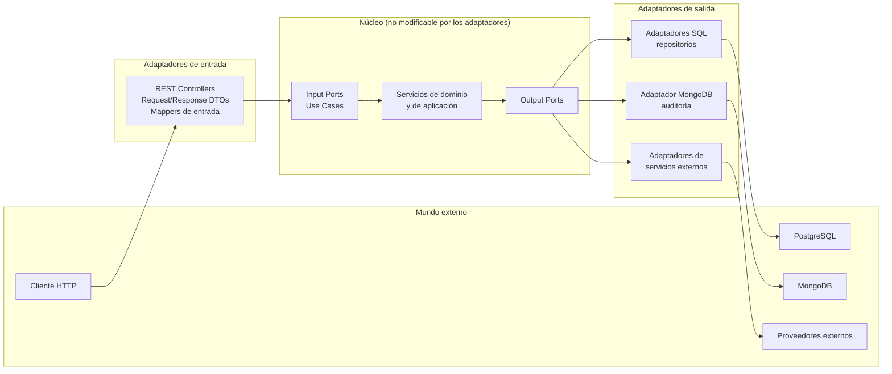
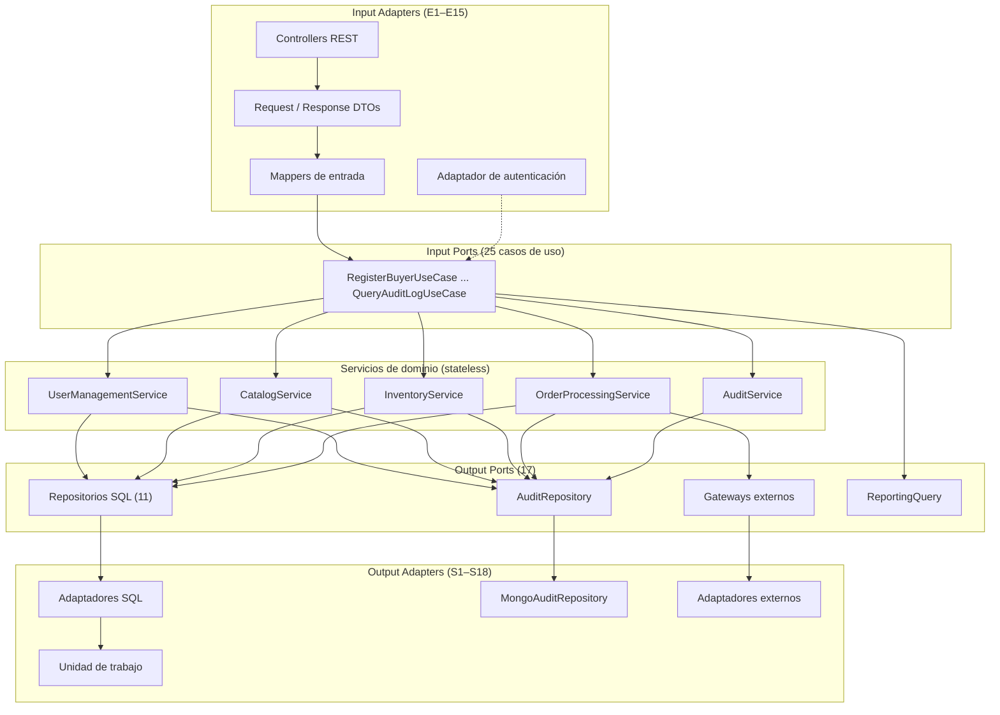
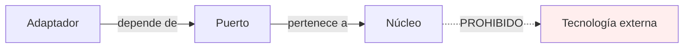
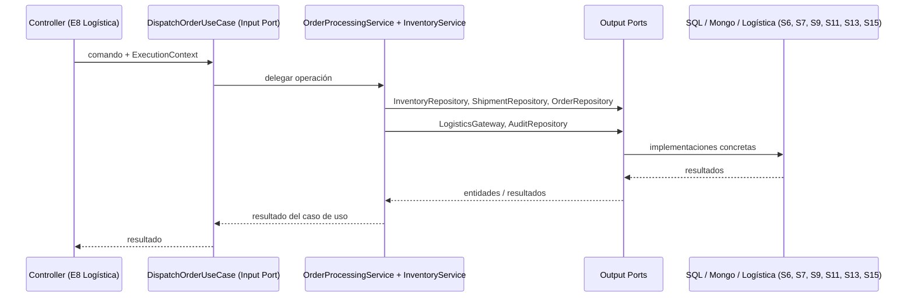
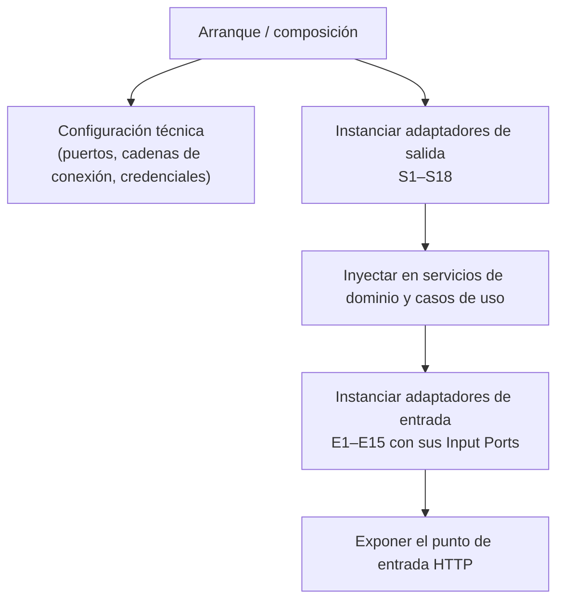
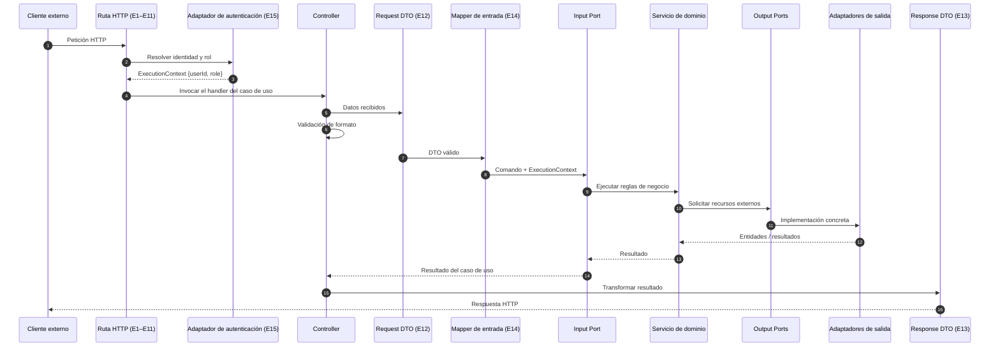
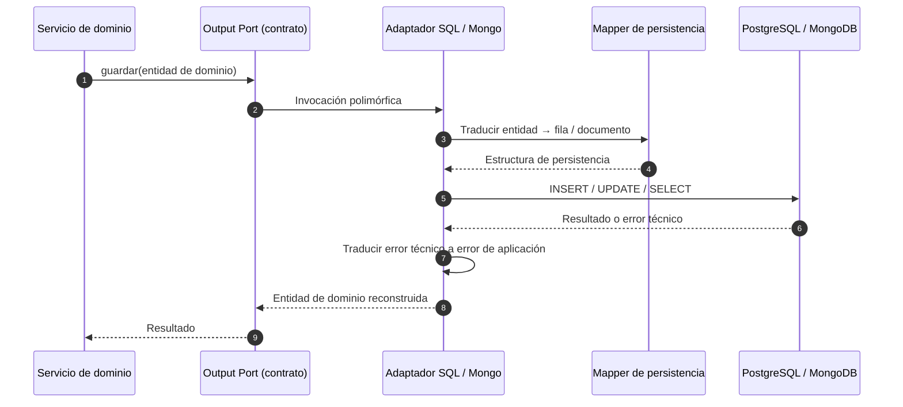

# Arquitectura de Adaptadores — NexusMarket

## 1. Propósito

Este documento define la **capa de Adapters** de NexusMarket y explica cómo se conecta con los
puertos ya definidos en la arquitectura hexagonal del proyecto.

Su alcance es exclusivamente **de diseño y documentación**. No contiene código, no sustituye a los
documentos de dominio, servicios, Input Ports ni Output Ports, y no modifica ninguno de ellos.

La capa de adaptadores responde a una única pregunta:

> **¿Cómo se conectan los límites externos del sistema (HTTP, PostgreSQL, MongoDB, proveedores
> externos) con los contratos internos ya definidos (Input Ports y Output Ports) sin contaminar el
> dominio?**

---

## 2. Documentación analizada

Toda decisión de este documento se deriva de los siguientes archivos existentes del repositorio:

| Documento | Ruta | Aporte a la capa de Adapters |
|---|---|---|
| Modelo de dominio | `SDD/Domain/DomainModel .md` | Entidades, roles, estados, invariantes que los adaptadores deben mapear sin alterar |
| Objetos de valor | `SDD/Domain/Domain Object Value.md` | Catálogos controlados que deben representarse en DTOs y en persistencia |
| Servicios de dominio | `SDD/Domain/Domain  Servicies.md` | Operaciones y errores que los adaptadores deben invocar y traducir |
| Servicios (detalle) | `SDD/Domain/Services/*.md` | Precondiciones, flujos, errores e invariantes por servicio |
| Input Ports | `SDD/Domain/Input-Ports.md` | 25 casos de uso, `ExecutionContext`, flujo de solicitud, reglas de validación |
| Output Ports | `SDD/Domain/Output-Ports.md` | 17 puertos, adaptadores SQL/Mongo, transacciones, manejo de errores, mapeo |

No se creó ningún adaptador que no pueda justificarse con uno de estos documentos.

---

## 3. Principio rector: Puertos y Adaptadores aplicado a NexusMarket

`Input-Ports.md` (sección 3) y `Output-Ports.md` (sección 2) establecen la arquitectura
**Hexagonal (Ports and Adapters) + DDD**, con **Monolito Modular** como estilo inicial,
**TypeScript** como lenguaje y **Node.js** como runtime.

La regla de dependencia es única y no admite excepciones:

```text
Adapter ──▶ Port ──▶ Application / Domain
```



### Lectura del diagrama

- Las flechas **entran** al núcleo: los adaptadores dependen de contratos internos.
- Ninguna flecha **sale** del núcleo hacia HTTP, MongoDB, PostgreSQL o frameworks.
- Los adaptadores nunca se invocan entre sí: se comunican únicamente a través de puertos y
  servicios (ver sección 8).

---

## 4. Criterios para decidir si un adaptador es necesario

Un elemento de infraestructura se documenta como adaptador **solo si cumple al menos uno** de:

1. **Implementa un Output Port** declarado en la matriz de `Output-Ports.md` (sección 27).
2. **Consume un Input Port** declarado en el resumen de `Input-Ports.md` (sección 21).
3. **Resuelve un límite externo exigido explícitamente** por los documentos: por ejemplo, la
   resolución de identidad y rol que produce el `ExecutionContext` (`Input-Ports.md`, sección 8) o
   la unidad de trabajo transaccional descrita en `Output-Ports.md` (sección 19).

Si un componente no cumple ninguno de los tres criterios, **no se crea**.

Esta regla evitó duplicar abstracciones habituales en otras arquitecturas (handlers separados de
controllers, capa de servicio adicional, adaptador de caché, etc.) que no tienen puerto asociado.

---

## 5. Catálogo de adaptadores identificados

### 5.1 Adaptadores de entrada

| # | Adaptador | Tipo | Puerto consumido | Documento |
|---|---|---|---|---|
| E1 | Adaptador REST de Usuarios (comprador, vendedor y administración de usuarios) | Input Adapter | `RegisterBuyerUseCase`, `OnboardSellerUseCase`, `UpdateUserAccessStatusUseCase` | `input/rest-controllers.md` |
| E2 | Adaptador REST de Bodegas | Input Adapter | `CreateWarehouseUseCase` | `input/rest-controllers.md` |
| E3 | Adaptador REST de Catálogo | Input Adapter | `CreateProductUseCase`, `UpdateProductStatusUseCase` | `input/rest-controllers.md` |
| E4 | Adaptador REST de Inventario | Input Adapter | `ReplenishStockUseCase`, `DispatchInventoryUseCase` | `input/rest-controllers.md` |
| E5 | Adaptador REST de Carrito | Input Adapter | `AddItemToCartUseCase`, `RemoveItemFromCartUseCase`, `ConfirmCartUseCase` | `input/rest-controllers.md` |
| E6 | Adaptador REST de Pedidos | Input Adapter | `GetOrderUseCase`, `ConfirmOrderUseCase`, `UpdateOrderStatusUseCase` | `input/rest-controllers.md` |
| E7 | Adaptador REST de Pago y Facturación | Input Adapter | `ProcessPaymentUseCase`, `CreateInvoiceUseCase` | `input/rest-controllers.md` |
| E8 | Adaptador REST de Logística y Envíos | Input Adapter | `CreateShipmentUseCase`, `DispatchOrderUseCase`, `ConfirmDeliveryUseCase` | `input/rest-controllers.md` |
| E9 | Adaptador REST de Devoluciones y Reembolsos | Input Adapter | `RequestReturnUseCase`, `ApproveReturnUseCase`, `ProcessRefundUseCase` | `input/rest-controllers.md` |
| E10 | Adaptador REST de Reportes | Input Adapter | `GenerateAdministrativeReportUseCase` | `input/rest-controllers.md` |
| E11 | Adaptador REST de Auditoría | Input Adapter | `QueryAuditLogUseCase` | `input/rest-controllers.md` |
| E12 | Request DTOs (contratos de entrada) | Soporte de entrada | Todos los casos de uso con comando documentado | `input/request-dtos.md` |
| E13 | Response DTOs (contratos de salida HTTP) | Soporte de entrada | Todos los casos de uso con salida documentada | `input/response-dtos.md` |
| E14 | Mappers de entrada | Soporte de entrada | Traducen E12 hacia los comandos de la aplicación | `input/input-mappers.md` |
| E15 | Adaptador de autenticación y resolución de contexto | Input Adapter transversal | Produce el `ExecutionContext` para todos los Input Ports | `input/authentication-adapter.md` |

Los adaptadores E1–E11 no se crean "uno por endpoint": cada uno agrupa los casos de uso del mismo
dominio funcional y delega en el Input Port correspondiente. Un adaptador **no contiene reglas de
negocio** (`Input-Ports.md`, secciones 5.2 y 22).

`ReserveInventoryUseCase` se documenta como caso de uso **interno**: `Input-Ports.md` (sección 21)
lo asigna al "Flujo de pedido", no a un actor externo. Su exposición HTTP queda como decisión
pendiente (ver `observaciones-arquitectonicas.md`).

### 5.2 Adaptadores de salida

| # | Adaptador | Tipo | Puerto implementado | Documento |
|---|---|---|---|---|
| S1 | `SQLUserRepository` | Persistence Adapter (SQL) | `UserRepository` | `output/sql-adapters.md` |
| S2 | `SQLSellerRepository` | Persistence Adapter (SQL) | `SellerRepository` | `output/sql-adapters.md` |
| S3 | `SQLBuyerRepository` | Persistence Adapter (SQL) | `BuyerRepository` | `output/sql-adapters.md` |
| S4 | `SQLProductRepository` | Persistence Adapter (SQL) | `ProductRepository` | `output/sql-adapters.md` |
| S5 | `SQLWarehouseRepository` | Persistence Adapter (SQL) | `WarehouseRepository` | `output/sql-adapters.md` |
| S6 | `SQLInventoryRepository` | Persistence Adapter (SQL) | `InventoryRepository` | `output/sql-adapters.md` |
| S7 | `SQLInventoryMovementRepository` | Persistence Adapter (SQL) | `InventoryMovementRepository` | `output/sql-adapters.md` |
| S8 | `SQLCartRepository` | Persistence Adapter (SQL) | `CartRepository` | `output/sql-adapters.md` |
| S9 | `SQLOrderRepository` | Persistence Adapter (SQL) | `OrderRepository` | `output/sql-adapters.md` |
| S10 | `SQLInvoiceRepository` | Persistence Adapter (SQL) | `InvoiceRepository` (variante documentada) | `output/sql-adapters.md` |
| S11 | `SQLShipmentRepository` | Persistence Adapter (SQL) | `ShipmentRepository` | `output/sql-adapters.md` |
| S12 | `SQLReportingQueryAdapter` | Query Adapter (solo lectura) | `ReportingQuery` | `output/persistence-adapters.md` |
| S13 | `MongoAuditRepository` | Persistence Adapter (documental) | `AuditRepository` | `output/mongodb-adapters.md` |
| S14 | Adaptador de pasarela de pago | External Service Adapter | `PaymentGateway` | `output/external-service-adapters.md` |
| S15 | Adaptador de logística | External Service Adapter | `LogisticsGateway` | `output/external-service-adapters.md` |
| S16 | Adaptador de facturación externa (condicional) | External Service Adapter | `BillingGateway` | `output/external-service-adapters.md` |
| S17 | Adaptador de proveedor de identidad (condicional) | External Service Adapter | `IdentityProvider` | `output/external-service-adapters.md` |
| S18 | Unidad de trabajo / manejador transaccional | Infrastructure Adapter | No implementa un puerto funcional: es el mecanismo de atomicidad SQL | `output/persistence-adapters.md` |

Los adaptadores S1–S13 se nombran con el prefijo de la tecnología (`SQL`, `Mongo`) porque el
nombre del puerto ya expresa la abstracción. Este convenio aparece de forma explícita en
`Output-Ports.md` (secciones 27 y 16 a 18).

### 5.3 Adaptadores de prueba

Derivados de `Output-Ports.md` (sección 26), que documenta el uso de dobles de prueba:

| Adaptador | Reemplaza a | Propósito |
|---|---|---|
| `Fake*Repository` en memoria | S1–S11 | Pruebas unitarias de servicios y casos de uso sin base de datos |
| `FakeAuditRepository` | S13 | Pruebas de generación de trazabilidad |
| `FakePaymentGateway`, `FakeLogisticsGateway` | S14–S15 | Pruebas del flujo comercial sin proveedores externos |

Los adaptadores de prueba son adaptadores legítimos de la arquitectura: implementan los mismos
puertos, por lo que el núcleo no distingue entre producción y prueba.

### 5.4 Adaptadores evaluados y descartados

| Componente evaluado | Decisión | Justificación |
|---|---|---|
| "HTTP Handlers" separados de los controllers | No se crea | Duplicaría la responsabilidad de E1–E11. `Input-Ports.md` (sección 4) identifica al controller como el Input Adapter HTTP. |
| Adaptadores GraphQL, gRPC, CLI, colas de mensajes | No se crean | `Input-Ports.md` (sección 33) los menciona solo como posibilidad futura; no hay puerto ni requisito actual. |
| Adaptador de base de datos SQL Server / MySQL | No se crea | `Output-Ports.md` (sección 16) recomienda PostgreSQL como opción inicial; el puerto permanece neutral. |
| Segundo adaptador documental para datos transaccionales | No se crea | `Output-Ports.md` (secciones 5 y 17) prohíben que MongoDB sea una segunda fuente autoritativa de los mismos datos. |
| Adaptador de notificaciones (correo/SMS) | No se crea | No existe puerto de notificación en la matriz de `Output-Ports.md` (sección 27), aunque la sección 1 menciona "servicios de notificación" como dependencia a evitar. Queda pendiente de definición. |
| Adaptador de entrega de productos digitales | No se crea | `DomainModel .md` define `ProductoDigital`, pero no existe puerto ni caso de uso concreto para su entrega. Pendiente de definición. |
| Adaptador de caché, almacenamiento de archivos | No se crea | No hay puerto asociado ni requisito documentado. |
| Middleware de autorización con reglas de negocio | Parcial | La verificación de identidad y de rol declarado es responsabilidad del adaptador (E15); la autorización según reglas de negocio permanece en los servicios (`Input-Ports.md`, sección 22; `Domain  Servicies.md`, secciones 3 y 4). |

---

## 6. Relación entre adaptadores, servicios y puertos



### Reglas que se derivan del diagrama

1. Un **Input Adapter** solo conoce: DTOs, mappers y contratos de Input Port.
2. Un **Input Port** solo conoce: comandos, contexto de ejecución y servicios.
3. Un servicio de dominio solo conoce: entidades, objetos de valor y **Output Ports**.
4. Un **Output Adapter** solo conoce: el contrato de su Output Port, la tecnología que encapsula y
   los mappers de persistencia.
5. Ningún servicio de dominio conoce a un Output Adapter concreto: recibe la implementación por
   inyección (composición en infraestructura).

---

## 7. Reglas de dependencia

### 7.1 Dependencias permitidas

| Origen | Puede depender de |
|---|---|
| Adaptador de entrada | Input Ports (interfaces de caso de uso), DTOs propios, mappers de entrada, utilidades de validación de formato |
| Adaptador de salida | Output Port que implementa, mappers de persistencia/externos, librería del motor o SDK del proveedor |
| Servicio de dominio | Entidades, objetos de valor, Output Ports |
| Composición / infraestructura | Todos los adaptadores y el núcleo, únicamente para **inyectar** dependencias |

### 7.2 Dependencias prohibidas

Según `Input-Ports.md` (sección 5.1) y `Output-Ports.md` (secciones 2, 8.1 y 21), el núcleo
**no debe** depender de:

```text
HTTP / REST / JSON
Express / Fastify / cualquier framework HTTP
PostgreSQL, SQL Server, MySQL u otro motor SQL
MongoDB
Prisma / TypeORM / librerías de persistencia
SDK de proveedores de pago o logísticos
Tokens, endpoints o credenciales de terceros
Node.js como detalle de plataforma dentro del dominio
```

Y los adaptadores **no deben**:

- Llamarse entre sí (por ejemplo, un controller no invoca un repositorio).
- Contener reglas de negocio (por ejemplo, decidir si un pedido puede cancelarse).
- Exponer entidades del dominio directamente como respuesta HTTP.
- Exponer modelos de persistencia (`PrismaModel`, `TypeOrmEntity`, `MongoDocument`, filas SQL) hacia
  el núcleo.

### 7.3 Verificación de la regla



Un cambio de motor de base de datos, de framework HTTP o de proveedor externo debe implicar
únicamente la sustitución de un adaptador, sin tocar dominio, servicios ni puertos.

---

## 8. Relación y acoplamiento entre adaptadores

Los adaptadores **no se conocen entre sí**. Cada adaptador resuelve un único límite externo.

| Relación | ¿Permitida? | Explicación |
|---|---|---|
| Controller → Controller | No | Dos casos de uso que colaboran lo hacen mediante los casos de uso o los servicios, no entre controllers. |
| Controller → Repositorio | No | El acceso a datos ocurre dentro del servicio de dominio, a través del Output Port. |
| Controller → Servicio de dominio | No | El controller depende del **Input Port**; el servicio es un detalle de la implementación del caso de uso. |
| Repositorio → Repositorio | No | Si dos puertos deben participar en la misma operación, la coordinación corresponde al servicio y la atomicidad a la unidad de trabajo (S18). |
| Repositorio → Gateway externo | No | Son límites externos distintos; los coordina el servicio de dominio. |
| Adaptador → Puerto | Sí | Es la única dirección válida. |
| Adaptador → Composición / configuración | Sí | Únicamente para recibir dependencias y parámetros técnicos. |

### Casos de colaboración que sí existen (a través del núcleo)



El diagrama muestra que la colaboración entre adaptadores (inventario, pedidos, envíos, logística,
auditoría) se coordina en el **servicio de dominio**, nunca entre adaptadores.

---

## 9. Ubicación física propuesta (documentación, no implementación)

La estructura de referencia **única** es la de `Input-Ports.md` (sección 32), que **incluye el lado de
entrada de los adaptadores**. `Output-Ports.md` (sección 15) ya se ha alineado con esta misma raíz
`src/` (resuelve la observación O-13):

```text
src/
├── application/
│   ├── ports/
│   │   ├── input/          # Casos de uso por dominio
│   │   └── output/         # Contratos de salida
│   └── services/
├── adapters/
│   ├── in/
│   │   └── rest/           # Adaptadores de entrada REST
│   └── out/                # Adaptadores de salida
├── domain/
│   ├── models/  valueobjects/  services/  ports/  exceptions/
└── infrastructure/
    ├── config/  database/  security/
```

El detalle del lado de salida (`adapters/out/persistence/{sql,mongo}`, `adapters/out/external`) proviene
de `Output-Ports.md` (sección 15). La separación entrada / salida / dominio / infraestructura se mantiene.

Para esta capa de documentación se adopta la siguiente ubicación conceptual de los adaptadores, que
respeta ambos documentos:

```text
adapters/
├── in/                          # Adaptadores de entrada (E1–E15)
│   ├── http/
│   │   ├── controllers/         # Un controller por dominio funcional (E1–E11)
│   │   ├── dto/request/         # E12
│   │   ├── dto/response/        # E13
│   │   ├── mappers/             # E14
│   │   └── errors/              # Traducción de errores a respuestas HTTP
│   └── auth/                    # E15 (contexto y autenticación)
└── out/                         # Adaptadores de salida (S1–S18)
    ├── persistence/
    │   ├── sql/                 # S1–S12 + S18
    │   └── mongo/               # S13
    ├── external/                # S14–S17
    └── mappers/                 # Mappers de persistencia y externos
```

La estructura física puede variar durante la implementación, pero debe mantener la separación
**entrada / salida / dominio / infraestructura** exigida por `Input-Ports.md` (sección 32) y
`Output-Ports.md` (sección 15).

---

## 10. Composición y configuración (wiring)

Los adaptadores se instancian en un único punto de composición (arranque de la aplicación).



Reglas de composición:

1. El núcleo **no se autoinstancia** ni busca dependencias por sí mismo: las recibe.
2. Ninguna cadena de conexión, credencial o URL de proveedor vive dentro del núcleo.
3. Los parámetros técnicos se resuelven en infraestructura, no en los servicios de dominio.
4. Un adaptador solo puede sustituirse por otro si ambos implementan exactamente el mismo puerto.

---

## 11. Flujo de una petición de entrada

Este flujo corresponde a la secuencia de 14 pasos de `Input-Ports.md` (sección 24), detallada con
los adaptadores identificados:



Separación de validaciones (`Input-Ports.md`, secciones 25.1 y 25.2):

| Tipo de validación | Responsable | Ejemplo |
|---|---|---|
| Formato, tipos, campos obligatorios, formato de correo | Adaptador de entrada (E12/E14) | `correoElectronico` con formato inválido |
| Reglas de negocio e invariantes | Servicios de dominio | Correo duplicado, documento duplicado, stock insuficiente |

El adaptador de entrada **nunca** decide si una operación es válida para el negocio: solo garantiza
que la solicitud es estructuralmente interpretable.

---

## 12. Flujo de una operación de persistencia



Principios aplicados:

1. **Ida y vuelta completa:** el adaptador traduce en ambas direcciones; el núcleo solo ve
   entidades y objetos de valor.
2. **Sin fugas de modelo:** nunca se devuelven filas, documentos ni entidades de ORM al núcleo
   (`Output-Ports.md`, sección 21).
3. **Errores traducidos:** los errores técnicos se convierten en errores con significado para la
   aplicación (`Output-Ports.md`, sección 20).
4. **Atomicidad en el adaptador:** cuando una operación abarca varios puertos (por ejemplo, la
   reserva de inventario), la transacción pertenece al adaptador o a la unidad de trabajo, no al
   dominio (`Output-Ports.md`, sección 19).

---

## 13. Decisiones arquitectónicas

### Decisión 1 — Los controllers REST son adaptadores de entrada

**Decisión.** Los controllers de NexusMarket se consideran adaptadores de entrada y son el único
mecanismo de entrada documentado.

**Justificación.** Su responsabilidad consiste en transformar solicitudes HTTP externas en
invocaciones a los Input Ports, sin contener reglas de negocio.

**Base.** `Input-Ports.md` (secciones 3, 4 y 35): "Entrada principal: REST API", "Input Adapter:
Controllers"; `Output-Ports.md` (sección 2).

**Consecuencia.** El dominio y los casos de uso no dependen de HTTP; es posible añadir otro
adaptador de entrada (CLI, mensajería) sin modificar el núcleo (`Input-Ports.md`, sección 33).

---

### Decisión 2 — Un adaptador por Output Port, sin repositorio genérico

**Decisión.** Cada Output Port de la matriz de `Output-Ports.md` (sección 27) tiene su propio
adaptador de salida. No se crea un repositorio genérico único.

**Justificación.** Los puertos ya están separados por responsabilidad (persistencia transaccional,
auditoría, servicios externos, consultas). Un repositorio genérico rompería esa separación e
introduciría acoplamiento entre dominios.

**Base.** `Output-Ports.md` (sección 4: "evitar ports excesivamente genéricos").

**Consecuencia.** Cambiar MongoDB solo afecta a `AuditRepository`; cambiar el proveedor de pagos
solo afecta al adaptador de `PaymentGateway`.

---

### Decisión 3 — SQL como fuente autoritativa y MongoDB limitado a auditoría

**Decisión.** Los once repositorios transaccionales se implementan con adaptadores SQL. MongoDB se
usa exclusivamente para `AuditRepository`.

**Justificación.** `Output-Ports.md` establece SQL como fuente principal de verdad (sección 5) y
MongoDB para auditoría y trazabilidad (secciones 12 y 17), prohibiendo explícitamente duplicar los
datos transaccionales.

**Base.** `Output-Ports.md` (secciones 5, 12 y 17).

**Consecuencia.** Los adaptadores SQL y el adaptador documental tienen ciclos de vida
independientes; la auditoría nunca se usa como reemplazo de los datos de negocio.

---

### Decisión 4 — Adaptadores externos sustituibles y opcionales

**Decisión.** `PaymentGateway`, `LogisticsGateway`, `BillingGateway` e `IdentityProvider` se
implementan mediante adaptadores sustituibles; los dos últimos solo si el diseño final los exige.

**Justificación.** La especificación funcional no determina proveedores ni mecanismos técnicos.

**Base.** `Output-Ports.md` (secciones 8, 9, 14 y 18); `Input-Ports.md` (sección 8).

**Consecuencia.** Es posible avanzar con adaptadores de prueba (`FakePaymentGateway`) sin depender
de un contrato comercial y sustituirlos después sin tocar el núcleo.

---

### Decisión 5 — Separación estricta entre reglas de negocio y traducción técnica

**Decisión.** Las reglas de negocio permanecen en los servicios de dominio; los adaptadores solo
traducen (HTTP ↔ comando, entidad ↔ persistencia, contrato ↔ proveedor).

**Justificación.** Los servicios documentan explícitamente precondiciones, invariantes y errores;
duplicarlas en los adaptadores generaría contradicciones difíciles de detectar.

**Base.** `Input-Ports.md` (sección 22); `Domain  Servicies.md` (sección 3); `Services/*.md`.

**Consecuencia.** Un adaptador puede rechazar una solicitud mal formada, pero nunca puede "decidir"
si una cancelación, una reserva o un reembolso están permitidos.

---

### Decisión 6 — No se implementan adaptadores sin puerto documentado

**Decisión.** No se diseña ningún adaptador para caché, notificaciones, almacenamiento de archivos
ni entrega de productos digitales.

**Justificación.** No existen puertos asociados en la arquitectura documentada; crearlos sin
contrato previo constituiría invención de componentes.

**Base.** Criterio de análisis de este documento (sección 4); matriz de `Output-Ports.md`
(sección 27).

**Consecuencia.** Si el proyecto incorpora esos requisitos, primero debe declararse el Output Port
en el núcleo y solo después el adaptador correspondiente.

---

## 14. Verificación arquitectónica

| Pregunta de control | Resultado |
|---|---|
| ¿Cada adaptador tiene una responsabilidad clara? | Sí. Un adaptador por dominio funcional (entrada) y un adaptador por Output Port (salida). |
| ¿Cada adaptador está relacionado con un puerto? | Sí, salvo S18 (unidad de trabajo), justificado por `Output-Ports.md` (sección 19). |
| ¿Se respeta la inversión de dependencias? | Sí: `Adapter → Port → Core`. |
| ¿El dominio permanece independiente? | Sí: ninguna dependencia hacia HTTP, SQL, MongoDB o SDK externos. |
| ¿Se evita el acoplamiento con frameworks? | Sí: los frameworks viven únicamente en los adaptadores y en la composición. |
| ¿Se evita duplicación? | Sí: no hay handlers paralelos, capa de servicio adicional ni repositorio genérico. |
| ¿Los DTOs tienen una razón? | Sí: separar el modelo HTTP del modelo de dominio (`request-dtos.md`, `response-dtos.md`). |
| ¿Los mappers tienen una razón? | Sí: los modelos HTTP, de dominio, de persistencia y de proveedores son distintos por diseño. |
| ¿La persistencia está aislada? | Sí: `persistence-adapters.md`, `sql-adapters.md`, `mongodb-adapters.md`. |
| ¿REST está aislado? | Sí: `rest-controllers.md`. |
| ¿Es coherente con los documentos existentes? | Sí; las divergencias detectadas se documentan en `observaciones-arquitectonicas.md` sin modificar los originales. |

---

## 15. Pendientes de definición

Puntos que siguen abiertos (no decididos por la documentación actual; no se inventaron valores):

1. **Framework HTTP concreto.** Express/Fastify aparecen solo como dependencias prohibidas del núcleo.
2. **Mecanismo de autenticación** (JWT, sesiones, OAuth, proveedor de identidad) y existencia de S17.
3. **Proveedores** de pago, logística y facturación externa.
4. **Motor SQL final** (PostgreSQL recomendado) y **librería de acceso a datos**.
5. **Paginación, filtros y formato de fechas** en las respuestas HTTP.

Resueltos (ver `observaciones-arquitectonicas.md`): catálogo de endpoints HTTP
(`../contract-alignment.md`, O-08); decisión de facturación —`BillingGateway`, S10 no utilizado
inicialmente— (O-12); formato de identificadores —`string` opaco— (O-05); devoluciones declaradas fuera
de alcance (`DomainModel .md` §15.1, O-01); catálogo de errores con mapeo HTTP (`Input-Ports.md` §26,
O-18); exposición de `ReserveInventoryUseCase` (`Input-Ports.md` §21, O-07); estructura única del
proyecto (§9, O-13).

---

## 16. Mapa de la documentación de adaptadores

```text
SDD/Adapters/
├── README.md                          → Visión general de la capa de adaptadores
├── architecture.md                    → Este documento
├── trazabilidad.md                    → Matrices adaptador ↔ puerto ↔ caso de uso ↔ servicio
├── observaciones-arquitectonicas.md   → Hallazgos, divergencias y pendientes detectados
├── input/
│   ├── rest-controllers.md            → E1–E11
│   ├── request-dtos.md                → E12
│   ├── response-dtos.md               → E13
│   ├── input-mappers.md               → E14
│   └── authentication-adapter.md      → E15
├── output/
│   ├── persistence-adapters.md        → Visión general S1–S13, S18 y adaptadores de prueba
│   ├── sql-adapters.md                → S1–S12
│   ├── mongodb-adapters.md            → S13
│   └── external-service-adapters.md   → S14–S17
└── mappers/
    ├── output-mappers.md              → Transformación resultado → response DTO
    └── persistence-mappers.md         → Transformación dominio ↔ persistencia
```

### Regla central de esta capa

> **Los adaptadores de NexusMarket traducen entre tecnologías externas y los contratos internos
> (Input Ports y Output Ports). No contienen reglas de negocio, no se conocen entre sí y nunca
> invierten la dirección de la dependencia.**


