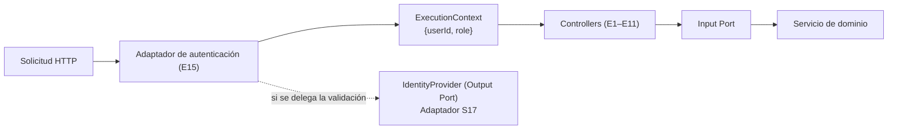
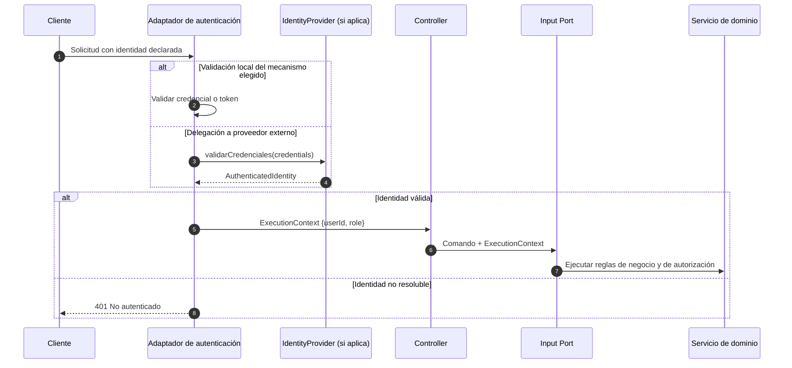

# Adaptador de autenticación y resolución de contexto

> Adaptador de entrada **E15** de la capa de adaptadores de NexusMarket.

## 1. Propósito

Documentar el adaptador encargado de **resolver la identidad del solicitante y producir el
`ExecutionContext`** que consumen todos los Input Ports, manteniendo fuera del núcleo cualquier
mecanismo técnico de autenticación.

## 2. Base documental

| Regla o concepto | Documento | Contenido |
|---|---|---|
| Todas las operaciones requieren usuario autenticado | `Input-Ports.md` §8; `Domain  Servicies.md` §3 | RG-01 |
| Cada usuario tiene un único rol | `Domain  Servicies.md` §3; `Domain Object Value.md` §4 | RG-02 |
| Ningún participante administra información fuera de su rol | `Domain  Servicies.md` §3; `DomainModel .md` §3.1 | RG-03 |
| `ExecutionContext{userId, role}` | `Input-Ports.md` §8 | "Representa la identidad y el rol que ya fueron resueltos por la infraestructura de entrada" |
| Mecanismo técnico queda fuera del alcance | `Input-Ports.md` §8 y §27; `Output-Ports.md` §14 | No se fija JWT, OAuth2, OIDC, cookies, sesiones, MFA, hash de contraseñas, refresh tokens ni proveedor de identidad |
| `IdentityProvider` (condicional) | `Output-Ports.md` §14 | Solo si el diseño exige abstraer un proveedor de identidad |

## 3. Responsabilidad

Este adaptador:

1. Extrae la identidad presentada por el cliente (cabecera, cookie o mecanismo equivalente **según
   el diseño que se defina**).
2. Valida la **autenticidad de la identidad declarada** (firma, vigencia de token o sesión válida,
   según el mecanismo elegido).
3. Produce el `ExecutionContext` con `userId` y `role`.
4. Adjunta ese contexto a la invocación del Input Port.
5. Rechaza la solicitud si no puede resolver una identidad válida.

No decide reglas de negocio, no autoriza operaciones concretas y no registra auditoría.

## 4. Ubicación arquitectónica



El adaptador se ejecuta **antes** o **junto** al controller (por ejemplo, como middleware de la
capa HTTP). No sustituye al controller ni lo duplica, y no constituye un adaptador separado por
cada endpoint.

## 5. Relación con puertos

| Relación | Detalle |
|---|---|
| Input Ports | No consume ninguno: produce el contexto que ellos reciben |
| `IdentityProvider` (Output Port condicional) | Se usa únicamente si la validación de credenciales se delega a un proveedor externo de identidad (`Output-Ports.md`, §14) |
| Adaptador S17 | Implementa `IdentityProvider` si esa decisión se toma |
| `UserRepository` | **No** debe usarse desde este adaptador: la verificación del estado operativo del usuario pertenece al núcleo (ver §8) |

## 6. Mecanismo de autenticación (pendiente de definición)

La documentación **no define** el mecanismo. Este documento no lo elige. Cualquiera de las
alternativas mencionadas por la especificación requeriría un diseño de seguridad adicional:

```text
Alternativas mencionadas y no decididas:
- JWT
- Sesiones
- OAuth 2.0
- OpenID Connect
- Proveedor de identidad externo
```

| Alternativa | Impacto sobre este adaptador | Decisión |
|---|---|---|
| Token firmado (JWT u equivalente) | Validación criptográfica y extracción de `userId`/`role` de las declaraciones | Pendiente |
| Sesión gestionada por el servidor | Recuperación de la sesión y del usuario asociado | Pendiente |
| Proveedor externo | Uso del Output Port `IdentityProvider` y del adaptador S17 | Pendiente |

Mientras el mecanismo no se defina, el contrato interno a respetar es el `ExecutionContext`
descrito en `Input-Ports.md` (§8).

---

## 7. Flujo de funcionamiento



Puntos clave del flujo:

- El adaptador **no** determina si el rol alcanza para la operación: entrega el contexto al núcleo.
- El servicio aplica RG-02 y RG-03 (`Domain  Servicies.md`, §3) y decide la autorización real.

---

## 8. Verificación del estado operativo del usuario

`Domain Object Value.md` (§5) establece que un usuario `ACTIVO` puede autenticarse y realizar
operaciones, mientras `INACTIVO` y `BLOQUEADO` corresponden a cuentas deshabilitadas o bloqueadas.

```text
Para verificar el estado operativo se necesita leer el usuario:
Usuario → UserRepository (Output Port)
```

Existen dos alternativas y **ninguna está decidida en la documentación**:

| Alternativa | Descripción | Riesgo |
|---|---|---|
| A. Verificación en el caso de uso / servicio | El núcleo consulta `UserRepository` y valida el estado (`UserRepository` ya expone "recuperar estado y rol del usuario", `Output-Ports.md` §5.1) | Ninguno arquitectónico: respeta la inversión de dependencias |
| B. Verificación en el adaptador de entrada | El adaptador consulta `UserRepository` | **Contradice** la regla de que un adaptador de entrada no accede a repositorios (`architecture.md` §8) |

**Recomendación (documentada, no implementada):** alternativa A. El adaptador solo resuelve
identidad y rol; la validez operativa de la cuenta se verifica en el núcleo.

---

## 9. Dependencias

### Permitidas

```text
E15 → Mecanismo de autenticación elegido (cabecera, cookie, token, sesión)
E15 → Elementos del adaptador de entrada (contexto, errores HTTP)
E15 → IdentityProvider (Output Port), solo si la validación se delega a un proveedor externo
```

### Prohibidas

```text
E15 → Reglas de negocio de autorización
E15 → Servicios de dominio
E15 → Repositorios transaccionales (salvo la decisión explícita y documentada del §8)
E15 → Generación de registros de auditoría
```

---

## 10. Manejo de errores

| Situación | Resultado |
|---|---|
| Sin identidad presentada | `401 No autenticado` |
| Identidad inválida, vencida o con firma incorrecta | `401 No autenticado` |
| Identidad de un usuario inexistente | `401 No autenticado` (la existencia se valida en el núcleo) |
| Identidad válida pero rol insuficiente para la operación | Determinado por el servicio de dominio → `403 Prohibido` según el mapeo del adaptador |
| Identidad válida pero cuenta `INACTIVO` o `BLOQUEADO` | Determinado por el núcleo → `403 Prohibido` o `401`, según la decisión del §8 (pendiente) |
| Fallo del proveedor de identidad | `503 Servicio no disponible` (a definir) |

---

## 11. Consideraciones de seguridad

1. Los datos de identidad presentados por el cliente **no son confiables** hasta ser validados.
2. El rol nunca se toma del cuerpo de la solicitud (`request-dtos.md`, §5).
3. Las credenciales y tokens no se registran en trazas ni en mensajes de error.
4. `DomainModel .md` (§5.1) exige almacenamiento seguro de la credencial: el adaptador no debe
   recibir, almacenar ni propagar la contraseña más allá de la validación.
5. La autorización fina permanece en el núcleo, donde también se aplica el alcance por rol (RG-03).
6. La clave, el secreto o la configuración del mecanismo de autenticación viven en infraestructura,
   nunca en el dominio (`architecture.md`, §7.2).

---

## 12. Decisiones de este adaptador

### Decisión

Modelar la autenticación como un **único adaptador transversal (E15)** que produce el
`ExecutionContext`, y no como un adaptador por endpoint ni como un Input Port.

### Justificación

`Input-Ports.md` (§8) define el contexto como el resultado de la infraestructura de entrada y
declara que el mecanismo técnico queda fuera del alcance de los Input Ports. `Output-Ports.md`
(§14) trata la autenticación como "una preocupación arquitectónica separada del dominio".

### Base

`Input-Ports.md` (§8); `Output-Ports.md` (§14); `Domain  Servicies.md` (§3).

### Consecuencia

El núcleo recibe siempre identidad y rol resueltos y no conoce el mecanismo. Cambiar de JWT a
sesiones, o delegar en un proveedor externo, solo afecta a este adaptador (y, si aplica, al
adaptador S17).

---

## 13. Pendientes de definición

- Mecanismo de autenticación (JWT, sesiones, OAuth 2.0, OpenID Connect o proveedor externo).
- Decisión sobre la verificación del estado operativo del usuario (§8).
- Decisión sobre el uso del Output Port `IdentityProvider` y, por tanto, sobre la existencia del
  adaptador S17.
- Forma concreta de las credenciales (`Credentials`) y del resultado `AuthenticatedIdentity`
  documentados como concepto en `Output-Ports.md` (§14).
- Estrategia de expiración, renovación y revocación, si el mecanismo lo requiere.
- Documento de arquitectura de seguridad, exigido por `Output-Ports.md` (§14) y todavía inexistente.

