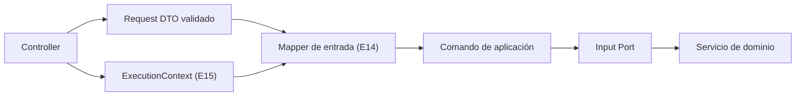

# Mappers de entrada — Request DTO → Comando de aplicación

> Adaptador de soporte **E14** de la capa de adaptadores de NexusMarket.

## 1. Propósito

Definir la responsabilidad, el alcance y las reglas de los **mappers de entrada**: los componentes
que transforman un Request DTO validado más el `ExecutionContext` en los argumentos con los que se
invoca un **Input Port**.

## 2. Responsabilidad

```text
Request DTO + ExecutionContext
        │
        ▼
   Mapper de entrada (E14)
        │
        ▼
Comando de aplicación + ExecutionContext
        │
        ▼
    Input Port
```

El mapper:

1. Traduce nombres y formas del modelo HTTP al modelo de aplicación.
2. Normaliza valores (por ejemplo, recortar espacios en cadenas) y convierte tipos.
3. Adjunta el `ExecutionContext` al comando cuando el caso de uso lo requiere.
4. No consulta la base de datos, no invoca puertos y no decide reglas de negocio.

## 3. Ubicación arquitectónica



`Input-Ports.md` (sección 33) muestra conceptualmente la invocación del caso de uso:

```text
interface RegisterBuyerUseCase {
    execute(command, context): BuyerResult;
}
```

El mapper construye el par `(command, context)`; el controller solo lo entrega al Input Port.

## 4. Mapeo DTO → comando

Los comandos están documentados en `Input-Ports.md` (secciones 9 a 20). Como los DTOs se derivaron
directamente de esos comandos, el mapeo es mayoritariamente **1:1**; su valor arquitectónico es
aislar el contrato HTTP del contrato de aplicación, de modo que un cambio de nombre o de forma en
HTTP no obligue a modificar el núcleo.

| Mapper | Request DTO | Comando destino | Transformación documentada |
|---|---|---|---|
| `toRegisterBuyerCommand` | `RegisterBuyerRequest` | `RegisterBuyerCommand` | 1:1 sobre `nombreCompleto`, `correoElectronico`, `documentoIdentidad`, `direccionPrincipal`, `direccionesAdicionales` |
| `toOnboardSellerCommand` | `OnboardSellerRequest` | `OnboardSellerCommand` | 1:1 + `adminId` proveniente del `ExecutionContext` (`Services/UserManagementService.md`, §4.2: `onboardSeller(adminId, sellerData)`) |
| `toUpdateUserAccessStatusCommand` | `UpdateUserAccessStatusRequest` | `UpdateUserAccessStatusCommand` | 1:1 + `adminId` proveniente del `ExecutionContext` (`updateUserAccessStatus(adminId, userId, newStatus)`) |
| `toCreateWarehouseCommand` | `CreateWarehouseRequest` | `CreateWarehouseCommand` | 1:1 |
| `toCreateProductCommand` | `CreateProductRequest` | `CreateProductCommand` | 1:1, incluida la colección `variantes[]`; `sellerId` proviene del `ExecutionContext` (`publishProduct(sellerId, productData, variantsData)`) |
| `toUpdateProductStatusCommand` | `UpdateProductStatusRequest` | `UpdateProductStatusCommand` | 1:1 + `sellerId` desde el contexto |
| `toReplenishStockCommand` | `ReplenishStockRequest` | `ReplenishStockCommand` | 1:1; el actor (`operatorId`) proviene del contexto (`replenishStock(operatorId, ...)`) |
| `toDispatchInventoryCommand` | `DispatchInventoryRequest` | `DispatchInventoryCommand` | 1:1; el actor (`operatorId`) proviene del `ExecutionContext` (resuelto O-06) |
| `toAddItemToCartCommand` | `AddItemToCartRequest` | `AddItemToCartCommand` | 1:1 |
| `toRemoveItemFromCartCommand` | `RemoveItemFromCartRequest` | `RemoveItemFromCartCommand` | 1:1 |
| `toConfirmCartCommand` | `ConfirmCartRequest` | `ConfirmCartCommand` | 1:1 + `buyerId` desde el contexto (`createOrderFromCart(buyerId, ...)`) |
| `toProcessPaymentCommand` | `ProcessPaymentRequest` | `ProcessPaymentCommand` | 1:1 (contenido de `paymentData` no documentado) |
| `toCreateInvoiceCommand` | `CreateInvoiceRequest` | `CreateInvoiceCommand` | 1:1 (contenido de `billingData` no documentado) |
| `toCreateShipmentCommand` | `CreateShipmentRequest` | `CreateShipmentCommand` | 1:1 |
| `toRequestReturnCommand` | `RequestReturnRequest` | `RequestReturnCommand` | 1:1; el comprador proviene del contexto |
| `toProcessRefundCommand` | `ProcessRefundRequest` | `ProcessRefundCommand` | 1:1 |
| `toGenerateAdministrativeReportCommand` | `GenerateAdministrativeReportRequest` | `GenerateAdministrativeReportCommand` | 1:1 |
| `toQueryAuditLogCommand` | `QueryAuditLogRequest` | `QueryAuditLogCommand` | 1:1 |

### 4.1 Identificadores que no vienen del DTO

| Comando | Argumento derivado del contexto | Base |
|---|---|---|
| `RegisterBuyerCommand` | Actor del registro | `Input-Ports.md` §9.1 |
| `OnboardSellerCommand` | `adminId` | `Domain  Servicies.md` §4.2 |
| `UpdateUserAccessStatusCommand` | `adminId` | `Domain  Servicies.md` §4.3 |
| `CreateProductCommand` / `UpdateProductStatusCommand` | `sellerId` | `Domain  Servicies.md` §5.1, §5.2 |
| `ReplenishStockCommand` / `DispatchInventoryCommand` | actor operador | `Services/InventoryService.md` §4 |
| `ConfirmCartCommand` | comprador propietario del carrito | `Services/OrderProcessingService.md` §4 |
| `RequestReturnCommand`, `ApproveReturnCommand` | actor solicitante o aprobador | `Input-Ports.md` §17 |

Esta derivación es la que impide que un cliente suplante a otro usuario enviando una identidad en
el cuerpo de la solicitud.

---

## 5. Mapeo de parámetros de ruta y consulta

Los casos de uso de lectura o de operación sobre un recurso identificado por su identificador no
tienen comando documentado. La transformación esperada es:

| Caso de uso | Origen HTTP | Argumento del Input Port |
|---|---|---|
| `GetOrderUseCase` | Identificador del pedido en la ruta | `orderId` + `ExecutionContext` (el alcance depende del rol: `Input-Ports.md` §14.2) |
| `QueryAuditLogUseCase` | Identificador de usuario, tipo de evento, rango de fechas y severidad | `QueryAuditLogCommand` + `ExecutionContext` |
| `GenerateAdministrativeReportUseCase` | Tipo de reporte, rango de fechas y filtros | `GenerateAdministrativeReportCommand` + `ExecutionContext` |

**Pendiente de definición:** la forma exacta de los parámetros de ruta y de consulta depende del
catálogo de endpoints, todavía no documentado.

---

## 6. Reglas de transformación

### Permitidas en el mapper

```text
Renombrar campos entre el modelo HTTP y el modelo de aplicación
Convertir tipos simples (texto → número, texto → fecha con formato previamente definido)
Normalizar valores (espacios, mayúsculas/minúsculas en códigos de catálogo)
Construir subestructuras documentadas (por ejemplo, una lista de variantes)
Adjuntar el ExecutionContext al comando
```

### Prohibidas en el mapper

```text
Consultar la base de datos o cualquier Output Port
Invocar un servicio de dominio
Decidir si una operación es válida para el negocio
Modificar estados del dominio
Generar auditoría
Exponer o construir entidades de dominio
Ocultar un error de negocio
```

### Frontera con el dominio

```text
Mapper:   "convierto y ordeno los datos"
Servicio: "decido si la operación es válida y mantengo las invariantes"
```

---

## 7. Manejo de errores

| Situación | Responsable | Resultado |
|---|---|---|
| Campo con formato inválido | Mapper / validación de DTO | Error de validación (`400`); el Input Port no se invoca |
| Conversión imposible (por ejemplo, cantidad no numérica) | Mapper | Error de validación (`400`) |
| Campo de catálogo con valor no permitido | Mapper / validación de DTO | Error de validación (`400`) |
| Regla de negocio incumplida | Servicio de dominio | Error de negocio traducido por el adaptador (`409`/`422`) |

El mapper **nunca** convierte un error de negocio en una excepción de infraestructura ni viceversa.

---

## 8. Dependencias

### Permitidas

```text
Mapper de entrada → Request DTO
Mapper de entrada → Comando de aplicación (contrato)
Mapper de entrada → ExecutionContext
```

### Prohibidas

```text
Mapper de entrada → Servicios de dominio
Mapper de entrada → Output Ports / repositorios
Mapper de entrada → Entidades de dominio (más allá de los tipos del comando)
Mapper de entrada → Librerías de HTTP o de persistencia
```

---

## 9. Decisiones de este adaptador

### Decisión

Mantener los mappers de entrada **separados** de los controllers y de los DTOs.

### Justificación

`Input-Ports.md` (sección 4) enumera el Request DTO, el Mapper y el Input Port como elementos
distintos; `Input-Ports.md` (sección 24) sitúa el mapper entre el DTO y el Input Port.

### Base

`Input-Ports.md` (secciones 4, 24 y 33).

### Consecuencia

El controller permanece delgado, el DTO permanece sin lógica y el comando de aplicación no conoce
el modelo HTTP. Cuando el mapeo sea 1:1 el mapper es una función pequeña, pero su existencia
preserva la frontera arquitectónica.

---

## 10. Pendientes de definición

- Forma interna de `paymentData`, `billingData`, `items`, `filters` y `dateRange` durante el mapeo.
- Formato definitivo de fechas y de paginación.

Resueltos (ver `../observaciones-arquitectonicas.md`): formato de identificadores —`string` opaco— (O-05);
`operatorId` desde el `ExecutionContext` (O-06); entrada conceptual de `ConfirmOrderUseCase`,
`UpdateOrderStatusUseCase` y `ApproveReturnUseCase` (`Input-Ports.md` §14.1–§14.3, §17.2; O-03).

