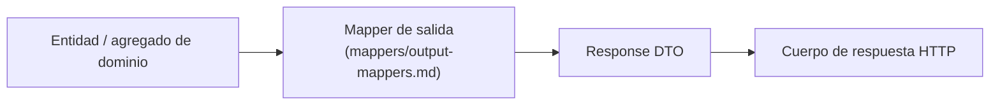

# Response DTOs — Contratos de salida HTTP

> Adaptador de soporte **E13** de la capa de adaptadores de NexusMarket.

## 1. Propósito

Definir los **Response DTOs**: la representación pública que el adaptador de entrada devuelve al
cliente HTTP. Constituyen la frontera entre el resultado del caso de uso y el cuerpo de la
respuesta.

## 2. ¿Por qué existen?

| Razón | Explicación |
|---|---|
| No exponer entidades del dominio | `Input-Ports.md` (sección 4) separa el modelo de dominio del modelo HTTP; una entidad completa expondría atributos internos y relaciones. |
| Proteger datos sensibles | `Usuario.contraseña` (`DomainModel .md`, §5.1) nunca debe salir del sistema. |
| Estabilizar el contrato | El cliente depende del DTO, no de la estructura interna del agregado. |
| Evitar agregados innecesarios | Una respuesta de producto no debe arrastrar todo el catálogo del vendedor. |
| Permitir composición de vistas | Varios DTOs pueden combinar datos de un caso de uso de lectura (`ReportingQuery`). |

## 3. Relación con las entidades del dominio

El mapper selecciona los campos públicos. Una entidad del dominio **no** es serializable por sí
misma hacia HTTP.

---

## 4. Catálogo de Response DTOs

Los campos provienen exclusivamente del modelo de dominio (`DomainModel .md`) y de los objetos de
valor (`Domain Object Value.md`). No se agregaron atributos inexistentes.

### 4.1 Usuarios

| Response DTO | Entidad base | Campos documentados | Campos excluidos |
|---|---|---|---|
| `BuyerResponse` | `Comprador` + `Usuario` | `id`, `nombreCompleto`, `correoElectronico`, `rol`, `estado`, `direccionPrincipal`, `direccionesAdicionales`, `estadoComercial` | `contraseña` |
| `SellerResponse` | `Vendedor` + `Usuario` | `id`, `nombreCompleto`, `correoElectronico`, `rol`, `estado`, `razonSocial` | `contraseña` |
| `UserStatusResponse` | `Usuario` | `id`, `estado` | `contraseña`, cualquier dato comercial |

`rol` se expresa con los códigos de `SystemRole` y `estado` con los códigos de `EstadoUsuario`
(`Domain Object Value.md`, §4 y §5).

### 4.2 Bodegas y catálogo

| Response DTO | Entidad base | Campos documentados |
|---|---|---|
| `WarehouseResponse` | `Bodega` (abstracta) | `id`, `nombre`, `ubicacion`, `tipoBodega`; para `BodegaVendedor` se identifica su vendedor propietario (`DomainModel .md`, §7.1) |
| `ProductResponse` | `Producto` + `Variante`[] | `id`, `nombre`, `descripcion`, `categoria`, `estado`, `vendedor` (identificador), `variantes[]` con `id`, `sku`, `nombreVariante`, `precio` (`DomainModel .md`, §6) |
| `ProductStatusResponse` | `Producto` | `id`, `estado` |

La distinción entre producto físico y digital se refleja en la respuesta mediante el tipo de
producto documentado (`ProductoFisico` / `ProductoDigital`, `DomainModel .md`, §6.2 y §6.3).

### 4.3 Inventario

| Response DTO | Entidad base | Campos documentados |
|---|---|---|
| `InventoryMovementResponse` | `MovimientoInventario` | tipo de movimiento, fecha, cantidad, variante, bodega y actor responsable (`Services/InventoryService.md`, §5; `Domain Object Value.md`, §10) |
| `InventoryResponse` | `Inventario` | `id`, bodega, variante, `cantidadDisponible`, `cantidadReservada` (`DomainModel .md`, §7.2) |

### 4.4 Carrito y pedidos

| Response DTO | Entidad base | Campos documentados |
|---|---|---|
| `CartResponse` | `CarritoDeCompras` + `ItemCarrito` | `id`, `comprador`, `items[]` con `variante`, `cantidad`, `precioUnitario` (`DomainModel .md`, §8) |
| `OrderResponse` | `Pedido` + `ItemPedido` | `id`, comprador, `items[]`, estado del pedido, estado del pago, línea con precios registrados (`Domain  Servicies.md`, §7.1) |
| `OrderStatusResponse` | `Pedido` | `id`, estado del pedido (códigos de `EstadoPedido`, `Domain Object Value.md`, §8) |

### 4.5 Pago, facturación y logística

| Response DTO | Base documental | Campos documentados |
|---|---|---|
| `PaymentStatusResponse` | `EstadoPago` (`Domain Object Value.md`, §9) | `PENDIENTE`, `APROBADO`, `RECHAZADO`, `REEMBOLSADO`; corresponde al resultado de `ProcessPaymentUseCase` (`Input-Ports.md`, §15.1) |
| `InvoiceResponse` | `InvoiceRepository` (`Output-Ports.md`, §9) | **Pendiente de definición:** la entidad `Factura` no está descrita en `DomainModel .md` |
| `ShipmentResponse` | `ShipmentRepository` (`Output-Ports.md`, §11) | **Pendiente de definición:** la entidad `Envio` no está descrita en `DomainModel .md` |
| `ReturnResponse` / `RefundResponse` | — | **Pendiente de definición:** no existe entidad ni puerto de devoluciones/reembolsos |

### 4.6 Reportes y auditoría

| Response DTO | Base documental | Campos documentados |
|---|---|---|
| `AdministrativeReportResponse` | `AdministrativeReport` (`Input-Ports.md`, §19.1) + `ReportingQuery` (`Output-Ports.md`, §13.1) | Resumen de ventas, inventario y pedidos. **La forma exacta de cada resumen no está definida.** |
| `AuditLogResponse` | `RegistroAuditoria` (`DomainModel .md`, §11) | Operación (qué ocurrió), fecha/hora (cuándo), actor (quién), entidad afectada (sobre qué), resultado y severidad (`Services/AuditService.md`, §6) |

---

## 5. Estados y catálogos en las respuestas

Los valores de estado se serializan con los **códigos exactos** definidos en el dominio. No se
inventan traducciones ni etiquetas nuevas.

| Catálogo | Valores permitidos en la respuesta | Fuente |
|---|---|---|
| `SystemRole` | `COMPRADOR`, `VENDEDOR`, `OPERADOR_LOGISTICO`, `ADMINISTRADOR`, `SUPERVISOR` | `Domain Object Value.md` §4 |
| `EstadoUsuario` | `ACTIVO`, `INACTIVO`, `BLOQUEADO` | `Domain Object Value.md` §5 |
| `EstadoComercial` | `HABILITADO`, `RESTRINGIDO` | `Domain Object Value.md` §6 |
| `EstadoProducto` | `PUBLICADO`, `SUSPENDIDO`, `DESCONTINUADO` | `Domain Object Value.md` §7 |
| `EstadoPedido` | `CARRITO`, `PENDIENTE_PAGO`, `PAGADO`, `DESPACHADO`, `ENTREGADO`, `CANCELADO` | `Domain Object Value.md` §8 |
| `EstadoPago` | `PENDIENTE`, `APROBADO`, `RECHAZADO`, `REEMBOLSADO` | `Domain Object Value.md` §9 |
| `TipoMovimientoInventario` | `INGRESO`, `RESERVA`, `SALIDA_VENTA`, `AJUSTE`, `DEVOLUCION` | `Domain Object Value.md` §10 |
| `TipoBodega` | `MARKETPLACE`, `VENDEDOR` | `Domain Object Value.md` §11 |
| `GravedadAuditoria` | `INFORMACIÓN`, `ADVERTENCIA`, `ERROR`, `CRÍTICO` | `Domain Object Value.md` §13.1; `Services/AuditService.md` §3 |

Si el cliente requiere etiquetas legibles para el usuario final, la traducción pertenece a la capa
de presentación del cliente o a un campo adicional explícito, **nunca** a una reinterpretación de
los códigos de dominio dentro del adaptador.

---

## 6. Reglas arquitectónicas

1. **Ninguna respuesta contiene entidades del dominio completas.**
2. **Ninguna respuesta contiene `contraseña`** ni credenciales (`DomainModel .md`, §5.1).
3. Ninguna respuesta contiene entidades de persistencia (`SQL Row`, `MongoDocument`, modelos de ORM):
   la regla de `Output-Ports.md` (sección 21) aplica también al límite HTTP.
4. Los identificadores se exponen como identificadores, no como objetos embebidos completos.
5. Los valores de estado usan los códigos del dominio.
6. Los datos financieros internos (`paymentData`, credenciales del proveedor) no se devuelven.
7. Un error técnico nunca se devuelve como respuesta exitosa.
8. La respuesta de `GetOrderUseCase` respeta el alcance del rol: el campo expuesto depende de las
   reglas de autorización documentadas (`Input-Ports.md`, §14.2).

---

## 7. Estructura de la respuesta

| Situación | Estado HTTP | Cuerpo |
|---|---|---|
| Operación exitosa con recurso creado | Por definir (según catálogo de endpoints) | Response DTO del recurso |
| Consulta exitosa | Por definir | Response DTO o colección |
| Validación de formato fallida | `400` | Estructura de error de validación (`request-dtos.md`, §7) |
| Error de negocio (duplicado, stock insuficiente, estado inválido) | `409` / `422` (a definir) | Error traducido |
| No autorizado / prohibido | `401` / `403` | Error traducido |
| Recurso inexistente | `404` | Error traducido |
| Error interno o de proveedor | `500` / `502` / `503` | Error genérico sin detalles internos |

El catálogo definitivo de códigos de éxito y su correspondencia con cada endpoint queda pendiente
(`rest-controllers.md`, §10).

---

## 8. Compatibilidad y evolución

- Un Response DTO puede agregar campos sin romper a los clientes existentes.
- Eliminar o renombrar campos sí es un cambio incompatible y debe documentarse.
- El DTO no debe contener campos calculados que dependan de reglas de negocio no documentadas.

---

## 9. Consideraciones de seguridad

- La serialización debe ser **explícita**: se construyen solo los campos del DTO (evita fugas
  accidentales como `contraseña`).
- Las respuestas de auditoría solo se generan para roles autorizados (`QueryAuditLogUseCase`,
  `Input-Ports.md`, §20.1); la verificación de autorización pertenece a los servicios.
- No incluir rutas de archivos, cadenas de conexión, trazas ni nombres de tablas.

---

## 10. Pendientes de definición

- Campos de `InvoiceResponse` (entidad `Factura` no descrita).
- Campos de `ShipmentResponse` (entidad `Envio` no descrita).
- Estructura de devoluciones y reembolsos en la respuesta.
- Forma de `AdministrativeReport`: resúmenes de ventas, inventario y pedidos (`Output-Ports.md`,
  §13.1) sin definición de campos.
- Formato definitivo de fechas, identificadores y colecciones (paginación).

