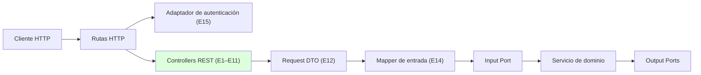
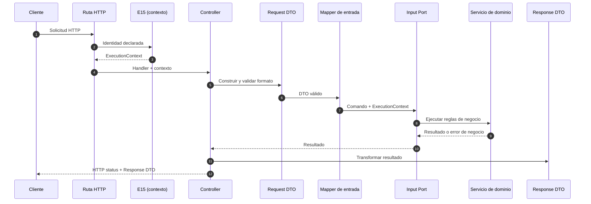

# Adaptadores REST — Controllers

> Adaptadores de entrada **E1–E11** de la capa de adaptadores de NexusMarket.

## 1. Propósito

Documentar los adaptadores de entrada HTTP de NexusMarket: los **controllers REST** que reciben
las solicitudes externas y las traducen en invocaciones a los **Input Ports** definidos en
`SDD/Domain/Input-Ports.md`.

## 2. Responsabilidad

Un controller REST:

1. Recibe la solicitud HTTP ya enrutada.
2. Construye y valida el **Request DTO** correspondiente (validación de formato únicamente).
3. Obtiene el `ExecutionContext` (`userId`, `role`) resuelto por el adaptador de autenticación
   (E15).
4. Delega la transformación al **mapper de entrada** (E14).
5. Invoca el **Input Port** correspondiente.
6. Traduce el resultado del caso de uso a un **Response DTO** (E13) mediante el mapper de salida.
7. Determina el código de estado HTTP y delega el error al manejador de errores del adaptador.

Un controller **no** contiene reglas de negocio, no accede a repositorios, no conoce servicios de
dominio concretos y no conoce la base de datos.

## 3. Ubicación arquitectónica



Los controllers viven **fuera** del núcleo. Dependen de contratos de entrada, nunca al contrario.
El dominio no conoce su existencia.

## 4. Puertos relacionados

Cada controller se asocia a uno o varios Input Ports tomados de `Input-Ports.md` (sección 21). La
agrupación se realizó por dominio funcional, tal como propone `Input-Ports.md` (sección 6).

| Adaptador | Controller | Dominio | Input Ports consumidos | Actor documentado |
|---|---|---|---|---|
| E1 | `BuyerController` | Usuarios | `RegisterBuyerUseCase` | Comprador |
| E1 | `SellerController` | Usuarios | `OnboardSellerUseCase` | Administrador |
| E1 | `UserController` | Usuarios | `UpdateUserAccessStatusUseCase` | Administrador |
| E2 | `WarehouseController` | Bodegas | `CreateWarehouseUseCase` | Administrador / Vendedor |
| E3 | `ProductController` | Catálogo | `CreateProductUseCase`, `UpdateProductStatusUseCase` | Vendedor / Administrador |
| E4 | `InventoryController` | Inventario | `ReplenishStockUseCase`, `DispatchInventoryUseCase` | Vendedor / Operador Logístico |
| E5 | `CartController` | Carrito | `AddItemToCartUseCase`, `RemoveItemFromCartUseCase`, `ConfirmCartUseCase` | Comprador |
| E6 | `OrderController` | Pedidos | `ConfirmOrderUseCase`, `GetOrderUseCase`, `UpdateOrderStatusUseCase` | Comprador / roles autorizados |
| E7 | `PaymentController`, `InvoiceController` | Pago y facturación | `ProcessPaymentUseCase`, `CreateInvoiceUseCase` | Flujo comercial / Sistema |
| E8 | `ShipmentController` | Logística | `CreateShipmentUseCase`, `DispatchOrderUseCase`, `ConfirmDeliveryUseCase` | Sistema / Operador Logístico |
| E9 | `ReturnController`, `RefundController` | Devoluciones y reembolsos | `RequestReturnUseCase`, `ApproveReturnUseCase`, `ProcessRefundUseCase` | Comprador / Vendedor / flujo autorizado |
| E10 | `ReportController` | Reportes | `GenerateAdministrativeReportUseCase` | Supervisor |
| E11 | `AuditController` | Auditoría | `QueryAuditLogUseCase` | Supervisor |

### Casos de uso sin controller asignado

| Input Port | Motivo |
|---|---|
| `ReserveInventoryUseCase` | `Input-Ports.md` (sección 21) lo asigna al "Flujo de pedido", es decir, es un caso de uso **interno** invocado durante el pago confirmado. No se documenta controller para él. |

El nombre `BuyerController` coincide con el ejemplo explícito de `Input-Ports.md` (sección 4):
`POST /buyers → BuyerController → RegisterBuyerUseCase → UserManagementService`.

---

## 5. Servicios y casos de uso relacionados

El controller **no invoca servicios de dominio directamente**. La cadena documentada es:


| Controller | Servicio de dominio alcanzado indirectamente |
|---|---|
| `BuyerController`, `SellerController`, `UserController` | `UserManagementService` |
| `WarehouseController`, `ProductController` | `CatalogService` |
| `InventoryController` | `InventoryService` |
| `CartController`, `OrderController`, `PaymentController` | `OrderProcessingService` |
| `ShipmentController` | `OrderProcessingService` + `InventoryService` (`DispatchOrderUseCase` relaciona ambos, según `Input-Ports.md`, sección 16.2) |
| `ReturnController`, `RefundController` | **Pendiente de definición**: los servicios documentados no incluyen operaciones de devolución/reembolso (ver `observaciones-arquitectonicas.md`) |
| `ReportController` | Consulta de lectura: `ReportingQuery` (Output Port) según `Input-Ports.md` (sección 19) |
| `AuditController` | `AuditService` (consulta) y `AuditRepository` (Output Port) según `Input-Ports.md` (sección 20) |

La trazabilidad completa por caso de uso está en `../trazabilidad.md`.

---

## 6. Entradas

### 6.1 Composición de la entrada

```text
Entrada del controller
├── Parámetros de ruta (identificadores)
├── Parámetros de consulta (filtros, rangos de fecha)
├── Cuerpo de la solicitud (Request DTO)
└── ExecutionContext (userId, role) resuelto por E15
```

### 6.2 Reglas de entrada

- El cuerpo se valida contra el **Request DTO** (`request-dtos.md`).
- La validación de formato se realiza en el adaptador (`Input-Ports.md`, sección 25.1).
- Los identificadores usados por el dominio provienen de la solicitud, **excepto** el actor: el
  actor siempre proviene del `ExecutionContext`, nunca del cuerpo.
- Ningún controller acepta un rol enviado por el cliente como valor de confianza.

### 6.3 Actor y `ExecutionContext`

`Input-Ports.md` (§8 y §12.3) fija la regla: el actor proviene **siempre** del `ExecutionContext` y
**nunca** del cuerpo de la solicitud. Por ello, `DispatchInventoryCommand` ya no incluye `operatorId`
(resuelve O-06). Cuando un servicio de dominio recibe un `operatorId` (por ejemplo,
`InventoryService.replenishStock`, `Services/InventoryService.md` §4), ese valor lo aporta la capa de
aplicación a partir del contexto, nunca el cliente.

---

## 7. Salidas

| Elemento | Contenido |
|---|---|
| Código de estado HTTP | Determinado por el resultado del caso de uso o por el error traducido |
| Encabezados | Definidos por el framework HTTP elegido (pendiente de decisión) |
| Cuerpo | **Response DTO** (`response-dtos.md`); nunca una entidad de dominio |
| Errores | Estructura de error del adaptador (sección 9 de este documento) |

Regla: el cuerpo de respuesta HTTP nunca expone entidades del dominio, agregados completos ni
campos sensibles (`contraseña`, datos financieros internos).

---

## 8. Flujo de funcionamiento



Si el caso de uso devuelve un error de negocio, el controller **no** lo reinterpreta: lo entrega al
manejador de errores (sección 9), que lo traduce a un estado HTTP.

---

## 9. Manejo de errores

`Input-Ports.md` (§26) establece que los Input Ports deben exponer **errores de aplicación
comprensibles para el adaptador de entrada** y enumera un catálogo conceptual:

```text
UserAlreadyExists        UnauthorizedOperation   ForbiddenOperation
ProductNotFound          InsufficientInventory   InvalidOrderState
OrderAlreadyFinalized    InvalidPayment          ReturnNotAllowed
```

Y determina de forma explícita que **la transformación final a códigos HTTP pertenece al Input
Adapter** (§26), mientras que *el dominio no debe conocer códigos HTTP*.

```text
Domain / Application Error
        │
        ▼
Input Adapter (E1–E11)
        │
        ▼
HTTP Status
```

| Error de aplicación | Origen documental | Categoría HTTP propuesta |
|---|---|---|
| `UserAlreadyExists` | `Input-Ports.md` §26 | `409 Conflicto` |
| `UnauthorizedOperation` | `Input-Ports.md` §26 | `401 No autenticado` |
| `ForbiddenOperation` | `Input-Ports.md` §26 | `403 Prohibido` |
| `ProductNotFound` | `Input-Ports.md` §26 | `404 No encontrado` |
| `InsufficientInventory` | `Input-Ports.md` §26 | `409 Conflicto` |
| `InvalidOrderState` | `Input-Ports.md` §26 | `409 Conflicto` |
| `OrderAlreadyFinalized` | `Input-Ports.md` §26 | `409 Conflicto` |
| `InvalidPayment` | `Input-Ports.md` §26 | `422 Entidad no procesable` |
| `ReturnNotAllowed` | `Input-Ports.md` §26 | `409 Conflicto` (o `422`) |
| DTO con formato inválido o campos obligatorios ausentes | `Input-Ports.md` §25.1 | `400 Solicitud incorrecta` |
| Entidad inexistente distinta de producto (usuario, pedido, carrito, variante, bodega) | `Services/*.md` | `404 No encontrado` (equivalente a `ProductNotFound`) |
| SKU ausente o inválido; estado de producto inválido | `Services/CatalogService.md` §8 | `409 Conflicto` / `422` |
| Cantidad no positiva | `Services/InventoryService.md` §7 | `400` o `409` (a definir) |
| Carrito de otro comprador | `Services/OrderProcessingService.md` §7 | `403 Prohibido` |
| Pago rechazado | `Services/OrderProcessingService.md` §7 | resultado de negocio (`EstadoPago.RECHAZADO`), no error técnico |
| Fallo técnico interno, error del motor o de un proveedor | `Output-Ports.md` §20 | `500 Error interno` |
| Servicio externo no disponible | Adaptador de servicios externos | `502` / `503` (a definir) |

El catálogo de `Input-Ports.md` (§26) es ahora un **catálogo definitivo** de errores de aplicación con
su correspondencia HTTP (resuelve O-18). El adaptador traduce los errores del núcleo a esos códigos
estables.

Reglas:

1. Los errores técnicos de la base de datos o de los SDK nunca llegan al cliente: el adaptador los
   traduce (`Output-Ports.md`, sección 20).
2. El mensaje de error no debe revelar detalles internos de infraestructura.
3. El catálogo de errores de aplicación pertenece al núcleo (`Input-Ports.md`, §26); los adaptadores
   usan esos códigos estables, no mensajes ad hoc.

---

## 10. Endpoints

La documentación existente **no define un catálogo de endpoints**. El único ejemplo explícito es:

```text
POST /buyers
     │
     ▼
BuyerController
     │
     ▼
RegisterBuyerUseCase
     │
     ▼
UserManagementService
     ├── UserRepository
     └── AuditRepository
```

(`Input-Ports.md`, sección 4.)

Por lo tanto, este documento **no inventa rutas, verbos ni parámetros**. Se documentan únicamente
las convenciones que los adaptadores deben respetar cuando el catálogo se defina:

| Convención propuesta | Justificación |
|---|---|
| Un recurso HTTP por dominio funcional (usuarios, bodegas, catálogo, inventario, carrito, pedidos, pagos, envíos, devoluciones, reportes, auditoría) | Coincide con los dominios de `Input-Ports.md` (sección 6) |
| Un endpoint por caso de uso expuesto | Cada Input Port representa una operación funcional (`Input-Ports.md`, sección 5.2) |
| Operaciones de lectura (`GetOrderUseCase`, `GenerateAdministrativeReportUseCase`, `QueryAuditLogUseCase`) sin efectos sobre el estado | `Output-Ports.md` (sección 13.1): `ReportingQuery` es de solo lectura |
| Los identificadores viajan en la ruta o en la consulta; el cuerpo transporta los datos del comando | Convención REST habitual, compatible con los comandos documentados |
| Prohibido exponer endpoints de escritura de auditoría | `Input-Ports.md` (sección 20): la escritura de auditoría no debe exponerse arbitrariamente |

**Resuelto (O-08):** el catálogo definitivo de rutas, verbos, parámetros y códigos de éxito se
documenta en `../contract-alignment.md`. Las convenciones de esta sección se mantienen.

---

## 11. Consideraciones de seguridad

### 11.1 Autenticación

Toda operación debe ser ejecutada por un usuario autenticado (RG-01, citada en `Input-Ports.md`,
sección 8). El mecanismo técnico no está definido y **queda fuera del alcance de estos adaptadores**
(`Input-Ports.md`, sección 8; `Output-Ports.md`, sección 14).

El controller consume el resultado de E15: un `ExecutionContext` con `userId` y `role`.

### 11.2 Autorización

| Nivel | Responsable | Ejemplo |
|---|---|---|
| Presencia de identidad válida | Adaptador de entrada (E15) | Solicitud sin identidad resoluble |
| Rol declarado suficiente para el canal de entrada | Adaptador de entrada | Sin rol no se accede a ninguna operación |
| Cumplimiento de reglas de negocio según rol y alcance | Servicios de dominio | "El vendedor no puede autoregistrarse", "el comprador solo gestiona sus propios pedidos", "un usuario no puede administrar información fuera de su rol" |

El adaptador **no** decide si un usuario puede incorporar vendedores o aprobar devoluciones: eso lo
determinan los servicios (`Domain  Servicies.md`, sección 3; `Services/*.md`).

### 11.3 Reglas de seguridad para el adaptador

- Nunca confiar en el rol enviado en el cuerpo de la solicitud.
- Nunca registrar en auditoría desde el adaptador de entrada: la auditoría la generan los servicios
  (`Services/AuditService.md`, sección 4).
- Nunca devolver `contraseña` ni datos financieros internos en un Response DTO.
- No incluir mensajes internos de infraestructura en las respuestas de error.

---

## 12. Dependencias

### Permitidas

```text
Controllers → Input Ports (interfaces de caso de uso)
Controllers → Request DTOs, Response DTOs, mappers de entrada, catálogo de errores del adaptador
Controllers → Contexto de ejecución provisto por E15
```

### Prohibidas

```text
Controllers → Servicios de dominio concretos
Controllers → Repositorios / Output Ports / adaptadores de salida
Controllers → Entidades del dominio como contrato HTTP público
Controllers → Base de datos, ORM, SDK externos
Controllers → Otros controllers
```

---

## 13. Reglas arquitectónicas

1. El controller es **delgado**: traduce y delega.
2. La validación de formato vive en el adaptador; la validación de negocio, en los servicios.
3. El caso de uso se invoca siempre mediante su Input Port, nunca mediante una implementación
   concreta.
4. El actor proviene del `ExecutionContext`.
5. La respuesta se construye con un Response DTO, nunca con una entidad.
6. Los errores de la infraestructura se traducen antes de salir del adaptador.
7. Ningún controller conoce a otro adaptador.
8. `ReserveInventoryUseCase` no se expone mediante controller: es un caso de uso interno
   (`Input-Ports.md`, §21; resuelve O-07).

### Correspondencia con las reglas IP de `Input-Ports.md` (§29)

| Regla | Aplicación a estos adaptadores |
|---|---|
| IP-02 — Los Input Ports no dependen de HTTP | El controller nunca entrega objetos `Request`, `Response` ni tipos del framework al Input Port |
| IP-05 — Los controladores delegan | El controller llama al Input Port y no implementa reglas de negocio (ejemplo incorrecto en `Input-Ports.md`, §31) |
| IP-08 — Las respuestas no exponen entidades internas | Se usan Response DTOs (`response-dtos.md`) |
| IP-09 — La autorización respeta el contexto del usuario | El `ExecutionContext` (E15) acompaña siempre la invocación (RG-01, RG-02, RG-03) |
| IP-10 — Los puertos son independientes del mecanismo de autenticación | El mecanismo vive en E15 y no se filtra al contrato |

---

## 14. Decisiones de este adaptador

### Decisión

Agrupar los controllers por dominio funcional y no crear un controller por endpoint.

### Justificación

`Input-Ports.md` (secciones 6 y 21) organiza los casos de uso por dominio funcional (usuarios,
catálogo, inventario, carrito, pedidos, facturación, logística, devoluciones, reembolsos, reportes,
auditoría), por lo que un controller por dominio mantiene la coherencia y evita proliferación de
adaptadores.

### Base

`Input-Ports.md` (secciones 4, 6, 21 y 34).

### Consecuencia

Un controller puede contener varios handlers (uno por caso de uso) sin dejar de ser un único
adaptador de entrada. La estructura de rutas definitiva sigue pendiente.

---

## 15. Pendientes de definición

- Framework HTTP concreto.
- Formato de fechas, paginación y filtros en las respuestas.
- Proveedores externos (pago, logística) y mecanismo de autenticación.

Resueltos en la documentación de dominio (ver `../observaciones-arquitectonicas.md`): catálogo de
endpoints (`../contract-alignment.md`, O-08), catálogo de errores con su mapeo HTTP (`Input-Ports.md`
§26, O-18), exposición de `ReserveInventoryUseCase` (`Input-Ports.md` §21, O-07), actor desde el
`ExecutionContext` (O-06) y verificación del estado operativo en el núcleo (O-09).


