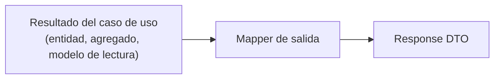

# Mappers de salida — Resultado → Response DTO

> Adaptador de soporte de la capa de entrada de NexusMarket.

## 1. Propósito

Documentar los mappers responsables de transformar el **resultado de un caso de uso** (entidades,
agregados o modelos de lectura del núcleo) en el **Response DTO** que se devuelve por HTTP
(ver `../input/response-dtos.md`).

## 2. Responsabilidad



El mapper:

1. Selecciona **explícitamente** los campos públicos del DTO.
2. Convierte tipos del dominio (objetos de valor, catálogos) a sus códigos estables.
3. Omite datos sensibles e internos.
4. No consulta datos adicionales: transforma únicamente lo que el caso de uso devolvió.

## 3. Ubicación arquitectónica

Los mappers de salida pertenecen al adaptador de entrada: se invocan después de que el Input Port
entrega el resultado y antes de que el controller responda.

```text
Input Port → resultado → Mapper de salida (E13/E14) → Controller → HTTP
```

`Output-Ports.md` (§21) prohíbe que estructuras de persistencia atraviesen el núcleo; este mapper
recibe por tanto entidades o modelos de lectura, nunca filas ni documentos.

## 4. Catálogo de mappers

| Mapper | Origen (dominio / lectura) | Destino (DTO) | Documento del DTO |
|---|---|---|---|
| `toBuyerResponse` | `Comprador` + `Usuario` | `BuyerResponse` | `../input/response-dtos.md` §4.1 |
| `toSellerResponse` | `Vendedor` + `Usuario` | `SellerResponse` | §4.1 |
| `toUserStatusResponse` | `Usuario` | `UserStatusResponse` | §4.1 |
| `toWarehouseResponse` | `Bodega`, `BodegaVendedor` | `WarehouseResponse` | §4.2 |
| `toProductResponse` | `Producto` + `Variante[]` | `ProductResponse` | §4.2 |
| `toProductStatusResponse` | `Producto` | `ProductStatusResponse` | §4.2 |
| `toInventoryMovementResponse` | `MovimientoInventario` | `InventoryMovementResponse` | §4.3 |
| `toInventoryResponse` | `Inventario` | `InventoryResponse` | §4.3 |
| `toCartResponse` | `CarritoDeCompras` + `ItemCarrito[]` | `CartResponse` | §4.4 |
| `toOrderResponse` | `Pedido` + `ItemPedido[]` | `OrderResponse` | §4.4 |
| `toOrderStatusResponse` | `Pedido` | `OrderStatusResponse` | §4.4 |
| `toPaymentStatusResponse` | `EstadoPago` / resultado del pago | `PaymentStatusResponse` | §4.5 |
| `toAuditLogResponse` | `RegistroAuditoria` | `AuditLogResponse` | §4.6 |
| `toAdministrativeReportResponse` | modelo de lectura de `ReportingQuery` | `AdministrativeReportResponse` | §4.6 |
| `toInvoiceResponse`, `toShipmentResponse`, `toReturnResponse`, `toRefundResponse` | — | — | **Pendiente de definición** (entidades no documentadas) |

## 5. Mapeos detallados

### 5.1 `toBuyerResponse`

| DTO | Origen | Nota |
|---|---|---|
| `id` | `Usuario.id` | Identificador |
| `nombreCompleto` | `Usuario.nombreCompleto` | — |
| `correoElectronico` | `Usuario.correoElectronico` | — |
| `rol` | `Usuario.rol` (`SystemRole`) | Código estable (`Domain Object Value.md`, §4) |
| `estado` | `Usuario.estado` (`EstadoUsuario`) | Código estable (§5) |
| `direccionPrincipal` | `Comprador.direccionPrincipal` | — |
| `direccionesAdicionales` | `Comprador.direccionesAdicionales` | — |
| `estadoComercial` | `Comprador.estadoComercial` (`EstadoComercial`) | Código estable (§6) |
| — | `Usuario.contraseña` | **Excluido explícitamente** |

Origen de los atributos: `DomainModel .md` (§5.1 y §5.2).

### 5.2 `toOrderResponse`

| DTO | Origen | Nota |
|---|---|---|
| `id` | `Pedido.id` | — |
| `comprador` | `Pedido.comprador` | Se expone la identidad, no el agregado completo |
| `fechaCreacion` | `Pedido.fechaCreacion` | Formato pendiente de definición |
| `estadoPedido` | `Pedido.estadoPedido` (`EstadoPedido`) | Código estable (`Domain Object Value.md`, §8) |
| `estadoPago` | `Pedido.estadoPago` (`EstadoPago`) | Código estable (§9) |
| `direccionEnvio` | `Pedido.direccionEnvio` | — |
| `items[]` | `ItemPedido[]` | Cada línea: `variante`, `cantidad`, `precioAplicado` (§9.2) |

Origen de los atributos: `DomainModel .md` (§9).

### 5.3 `toInventoryMovementResponse`

| DTO | Origen |
|---|---|
| tipo de movimiento | `MovimientoInventario.tipoMovimiento` (`TipoMovimientoInventario`) |
| fecha | `MovimientoInventario.fecha` |
| cantidad | `MovimientoInventario.cantidad` |
| variante | `MovimientoInventario.variante` |
| bodega | `MovimientoInventario.bodega` |
| actor | `MovimientoInventario.realizadoPor` |

Origen de los atributos: `DomainModel .md` (§10). La documentación de `InventoryService` (§5) exige
que todo movimiento identifique tipo, fecha, cantidad, variante, bodega y actor, lo que confirma
este mapeo.

### 5.4 `toAuditLogResponse`

| DTO | Origen |
|---|---|
| identificación | `RegistroAuditoria.auditId` |
| operación | `RegistroAuditoria.tipoEvento` |
| fecha/hora | `RegistroAuditoria.marcaTiempo` |
| actor | `RegistroAuditoria.realizadoPorUsuario` |
| rol | `RegistroAuditoria.rolUsuario` |
| detalles | `RegistroAuditoria.detalles` |

El mapeo de la entidad afectada, el resultado y la severidad queda **pendiente**, porque no figuran
como atributos explícitos de `RegistroAuditoria` (`../observaciones-arquitectonicas.md`).

---

## 6. Reglas arquitectónicas

1. **Construcción explícita.** Cada campo del DTO se asigna de forma explícita; no se serializan
   objetos de dominio por reflexión ni por copia de propiedades.
2. **Sin datos sensibles.** `contraseña` y cualquier secreto quedan fuera por diseño
   (`DomainModel .md`, §5.1).
3. **Sin agregados ajenos.** Una respuesta no incluye el catálogo completo de un vendedor, ni los
   pedidos de otros compradores, ni el inventario global.
4. **Sin reglas de negocio.** El mapper no decide qué estado "debería" tener un pedido ni calcula
   estados; solo representa el estado recibido.
5. **Códigos de catálogo.** Los valores de estado se emiten con los códigos definidos en
   `Domain Object Value.md`; no se traducen ni se inventan etiquetas nuevas.
6. **Sin acceso a datos.** El mapper no invoca Output Ports para "completar" la respuesta.
7. **Alcance respetado.** Si el caso de uso devolvió un resultado ya filtrado por rol (por ejemplo,
   `GetOrderUseCase`, `Input-Ports.md` §14.2), el mapper no amplía la información.

## 7. Manejo de errores

| Situación | Tratamiento |
|---|---|
| El resultado del caso de uso es nulo o no encontrado | El adaptador responde con el error correspondiente (`404` propuesto) antes de mapear |
| Un dato obligatorio del dominio está ausente | Error interno del adaptador (indica inconsistencia del mapeo), nunca un valor inventado |
| Un valor de catálogo desconocido | Error interno; el valor debe pertenecer a los catálogos de `Domain Object Value.md` |

## 8. Dependencias

### Permitidas

```text
Mapper de salida → entidad o modelo de lectura recibido del caso de uso
Mapper de salida → Response DTO (contrato propio del adaptador)
Mapper de salida → catálogos de dominio (para validar códigos conocidos)
```

### Prohibidas

```text
Mapper de salida → Output Ports / repositorios
Mapper de salida → Servicios de dominio
Mapper de salida → Modelos de persistencia
Mapper de salida → Lógica de autorización
```

## 9. Decisiones de este adaptador

### Decisión

Serializar mediante mappers explícitos y no exponer entidades de dominio directamente.

### Justificación

`Input-Ports.md` (§4) establece que el Response DTO es un elemento distinto de la entidad; la
construcción explícita es la única forma de garantizar que campos como `contraseña`
(`DomainModel .md`, §5.1) nunca se expongan.

### Base

`Input-Ports.md` (§4, §24); `Output-Ports.md` (§21); `DomainModel .md` (§5.1).

### Consecuencia

Cada nuevo campo público requiere una decisión explícita en el mapper, lo que añade trabajo pero
elimina el riesgo de fuga de información.

## 10. Pendientes de definición

- Mappers de `InvoiceResponse`, `ShipmentResponse`, devoluciones y reembolsos (entidades no
  documentadas).
- Mapeo de entidad afectada, resultado y severidad en `AuditLogResponse`.
- Forma definitiva de `AdministrativeReportResponse` a partir de los modelos de lectura de
  `ReportingQuery` (`Output-Ports.md`, §13.1).
- Formato de fechas e identificadores.

