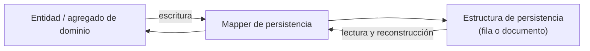

# Mappers de persistencia — Dominio ↔ Persistencia

> Mappers internos de los adaptadores de salida de NexusMarket.

## 1. Propósito

Documentar la traducción bidireccional entre las **entidades y objetos de valor del dominio** y las
**estructuras de persistencia** (filas SQL o documentos MongoDB), de modo que el núcleo nunca vea
modelos de base de datos.

## 2. Responsabilidad



El mapper:

1. Traduce en las dos direcciones del ciclo persistir/recuperar.
2. Reconstruye agregados completos a partir de varias tablas o colecciones.
3. Traduce objetos de valor y catálogos a sus códigos estables.
4. No contiene reglas de negocio, no valida invariantes y no consulta datos por sí mismo.

## 3. Ubicación arquitectónica

Los mappers de persistencia viven **dentro** de cada adaptador de salida
(`output/sql-adapters.md`, `output/mongodb-adapters.md`) y no se comparten con el núcleo. La regla de
`Output-Ports.md` (§21) es explícita: ningún modelo de persistencia puede atravesar el puerto.

```text
Servicio de dominio → Output Port → Adaptador → Mapper de persistencia → Base de datos
```

## 4. Reglas generales

1. **Un mapper por agregado persistido**, no uno por tabla.
2. **Identidad explícita:** el identificador de la entidad se mapea al identificador almacenado. El
   identificador es **opaco y único**, representado como `string` (`DomainModel .md`, §2.5); en SQL se
   almacena como UUID/`CHAR(36)` y en MongoDB como `string` (resuelve O-05).
3. **Catálogos como códigos:** los valores de `Domain Object Value.md` se almacenan con su `codigo`
   estable, nunca con textos libres ni con nombres legibles.
4. **Objetos de valor inmutables:** al reconstruir, se crean instancias coherentes con
   `DomainCatalog` (`codigo`, `nombre`, `descripcion`).
5. **Sin reglas de negocio:** el mapper no decide transiciones de estado ni corrige datos
   inconsistentes.
6. **Sin fugas:** nunca devuelve filas, documentos ni modelos de ORM al núcleo.
7. **Simetría:** todo dato que se escribe debe poder reconstruirse; si no es posible, el mapeo está
   incompleto y debe documentarse.

## 5. Mapeo lógico por agregado

Las estructuras físicas (nombres de tablas, columnas, índices) **no están documentadas**; el mapeo
se presenta a nivel lógico, campo de dominio ↔ dato persistido, sin inventar esquema físico.

### 5.1 Usuarios: `Usuario`, `Comprador`, `Vendedor`

Jerarquía documentada (`DomainModel .md`, §3): `Usuario` (abstracto) → `Comprador` y
`UsuarioAdministrativo` (abstracto) → `Vendedor`, `OperadorLogistico`, `Administrador`, `Supervisor`.

| Campo de dominio | Tipo documentado | Persistencia |
|---|---|---|
| `Usuario.id` | `String` | Identificador opaco (UUID) |
| `Usuario.nombreCompleto` | `String` | Texto |
| `Usuario.correoElectronico` | `String` | Texto con restricción de unicidad |
| `Usuario.contraseña` | `String` | Almacenamiento seguro (representación de credencial) |
| `Usuario.rol` | `SystemRole` | Código de `SystemRole` |
| `Usuario.estado` | `EstadoUsuario` | Código de `EstadoUsuario` |
| `Comprador.direccionPrincipal` | `String` | Texto |
| `Comprador.direccionesAdicionales` | `List<String>` | Colección de textos (representación física pendiente) |
| `Comprador.estadoComercial` | `EstadoComercial` | Código |
| `Vendedor.razonSocial` | `String` | Texto |

**Pendiente de decisión:** la representación de la herencia (tabla única con discriminador, tabla
por especialización o tabla base con extensión). La documentación de dominio no la determina y el
mapper debe soportar cualquiera de ellas.

### 5.2 Catálogo: `Producto`, `ProductoFisico`, `ProductoDigital`, `Variante`

| Campo de dominio | Persistencia |
|---|---|
| `Producto.id` | Identificador |
| `Producto.nombre`, `Producto.descripcion` | Texto |
| `Producto.categoria` | Código de `CategoriaProducto` |
| `Producto.estado` | Código de `EstadoProducto` |
| `Producto.vendedor` | Referencia al vendedor propietario |
| Tipo (`ProductoFisico` / `ProductoDigital`) | Discriminador de tipo de producto |
| `Variante.id` | Identificador |
| `Variante.sku` | Texto con restricción de unicidad |
| `Variante.nombreVariante` | Texto |
| `Variante.precio` | Valor monetario (`BigDecimal`) |

Regla documentada: las variantes forman parte del modelo de producto y conservan su identidad y SKU
(`Output-Ports.md`, §5.4). El agregado se reconstruye con sus variantes.

### 5.3 Bodegas e inventario: `Bodega`, `Inventario`

| Campo de dominio | Persistencia |
|---|---|
| `Bodega.id` | Identificador |
| `Bodega.nombre` | Texto |
| `Bodega.ubicacion` | Texto |
| `Bodega.tipoBodega` | Código de `TipoBodega` (`MARKETPLACE`, `VENDEDOR`) |
| Propietario de `BodegaVendedor` | Referencia al vendedor (`DomainModel .md`, §7.1) |
| `Inventario.id` | Identificador |
| `Inventario.bodega` | Referencia a la bodega |
| `Inventario.variante` | Referencia a la variante |
| `Inventario.cantidadDisponible` | Entero (`>= 0`) |
| `Inventario.cantidadReservada` | Entero (`>= 0`) |

La combinación **variante + bodega** identifica el inventario (`Services/InventoryService.md`, §1),
lo que se refleja como restricción de unicidad compuesta en la persistencia.

### 5.4 `MovimientoInventario`

| Campo de dominio | Persistencia |
|---|---|
| `id` | Identificador |
| `tipoMovimiento` | Código de `TipoMovimientoInventario` (`INGRESO`, `RESERVA`, `SALIDA_VENTA`, `AJUSTE`, `DEVOLUCION`) |
| `fecha` | Fecha y hora |
| `cantidad` | Entero |
| `variante` | Referencia a la variante |
| `bodega` | Referencia a la bodega |
| `realizadoPor` | Referencia al usuario responsable |

Origen: `DomainModel .md` (§10). El movimiento es el registro operativo; su trazabilidad se
completa con `RegistroAuditoria` (regla AUD-01).

### 5.5 Carrito y pedidos

| Campo de dominio | Persistencia |
|---|---|
| `CarritoDeCompras.id` | Identificador |
| `CarritoDeCompras.comprador` | Referencia al comprador |
| `ItemCarrito.variante` | Referencia a la variante |
| `ItemCarrito.cantidad` | Entero |
| `ItemCarrito.precioUnitario` | Valor monetario |
| `Pedido.id` | Identificador |
| `Pedido.comprador` | Referencia al comprador |
| `Pedido.fechaCreacion` | Fecha y hora |
| `Pedido.estadoPedido` | Código de `EstadoPedido` |
| `Pedido.estadoPago` | Código de `EstadoPago` |
| `Pedido.direccionEnvio` | Texto |
| `ItemPedido.variante` | Referencia a la variante |
| `ItemPedido.cantidad` | Entero |
| `ItemPedido.precioAplicado` | Valor monetario |

Origen: `DomainModel .md` (§8 y §9). El `precioAplicado` conserva el valor utilizado en la
operación, independientemente de cambios posteriores en el catálogo (§9.2), por lo que debe
persistirse como dato propio de la línea del pedido y no derivarse del catálogo al leer.

### 5.6 `RegistroAuditoria` → documento MongoDB

| Campo de dominio | Documento |
|---|---|
| `auditId` | Campo del documento (único) |
| `tipoEvento` | Campo del documento |
| `marcaTiempo` | Campo del documento (indexable) |
| `realizadoPorUsuario` | Referencia al actor |
| `rolUsuario` | Código de `SystemRole` |
| `entidadTipo` | Campo del documento (indexable) |
| `entidadId` | Campo del documento (indexable) |
| `resultado` | Campo del documento |
| `gravedad` | Código de `GravedadAuditoria` |
| `detalles` | Mapa libre `Map<String,Object>` |

Origen: `DomainModel .md` (§11). Los atributos `entidadTipo`, `entidadId`, `resultado` y `gravedad`
ya forman parte de `RegistroAuditoria` (`DomainModel .md`, §11), por lo que el mapper cubre la
información exigida por `Services/AuditService.md` (§6) y los índices de `buscarPorEntidad`
(resuelve O-10).

---

## 6. Objetos de valor y catálogos

`DomainCatalog` (`Domain Object Value.md`, §3) define `codigo`, `nombre` y `descripcion`, con la
regla de que **el código no debe cambiar una vez utilizado por el dominio**.

Opciones de representación (decisión pendiente, no tomada por este adaptador):

| Opción | Descripción | Observación |
|---|---|---|
| A. Solo el código | Se persiste únicamente `codigo`; la definición del catálogo reside en el dominio | Simple y consistente con la inmutabilidad del código |
| B. Tabla de referencia | Se persiste el catálogo con `codigo`, `nombre` y `descripcion` | Permite consultas legibles e integridad referencial |
| C. Código + etiqueta en la respuesta | Se persiste el código y la etiqueta se resuelve al responder | No debe introducir estados no definidos |

En cualquiera de las opciones, el mapper debe garantizar que:

1. Un valor desconocido para el catálogo produce un error de mapeo, no un valor inventado.
2. El código almacenado coincide exactamente con los definidos en `Domain Object Value.md`.
3. Ningún texto libre sustituye a un estado de negocio (`Domain Object Value.md`, §3, regla 4).

---

## 7. Dirección y prohibiciones

```text
Permitido:
  dominio → mapper → estructura de persistencia
  estructura de persistencia → mapper → dominio

Prohibido:
  estructura de persistencia → núcleo (sin pasar por el mapper)
  dominio → estructura de persistencia (acoplamiento directo)
  mapper → reglas de negocio
  mapper → otras fuentes de datos
```

---

## 8. Manejo de errores de mapeo

| Situación | Tratamiento |
|---|---|
| Dato obligatorio ausente en la base | Error interno del adaptador: el dato es inconsistente respecto al dominio |
| Código de catálogo desconocido | Error interno: indica desalineación con `Domain Object Value.md` |
| Referencia rota (variante, bodega, usuario) | Error de integridad traducido a error con significado para la aplicación |
| Valor numérico fuera de las reglas documentadas (por ejemplo, cantidad negativa) | **No** se corrige en el mapper: la consistencia corresponde a las restricciones de la base y a las invariantes del dominio |

---

## 9. Decisiones de este adaptador

### Decisión

Un mapper de persistencia por agregado, con traducción explícita y reconstrucción completa del
agregado.

### Justificación

`Output-Ports.md` (§21) prohíbe exponer modelos de persistencia al núcleo, y los puertos trabajan
con entidades y agregados (`Producto` con variantes, `Pedido` con ítems, `Carrito` con ítems).

### Base

`Output-Ports.md` (§5.4, §7.1, §7.2, §21); `DomainModel .md` (§6, §8, §9).

### Consecuencia

El esquema físico puede cambiar sin afectar al dominio, siempre que el mapper siga reconstruyendo el
agregado completo. Los adaptadores de prueba permiten validar el núcleo sin depender del esquema.

---

## 10. Pendientes de definición

- Representación de la herencia de usuarios, productos y bodegas.
- Representación física de `direccionesAdicionales` y de `detalles` de auditoría.
- Opción de representación de catálogos (§6).
- Esquema de `Envio` (modelo de aplicación; `Factura` y devoluciones quedan fuera de alcance).

Resueltos (ver `../observaciones-arquitectonicas.md`): formato de identificadores —`string` opaco—
(O-05); mapeo de `entidadTipo`/`entidadId`/`resultado`/`gravedad` (O-10).


