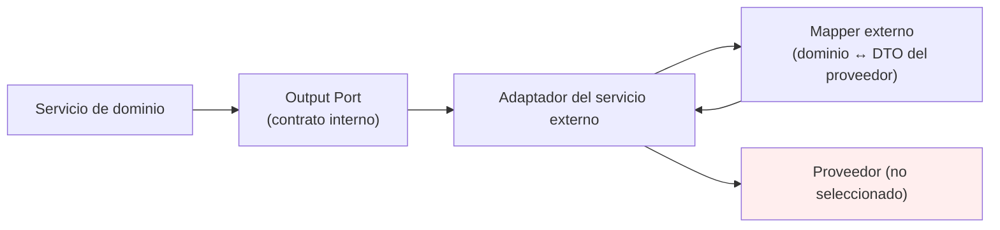
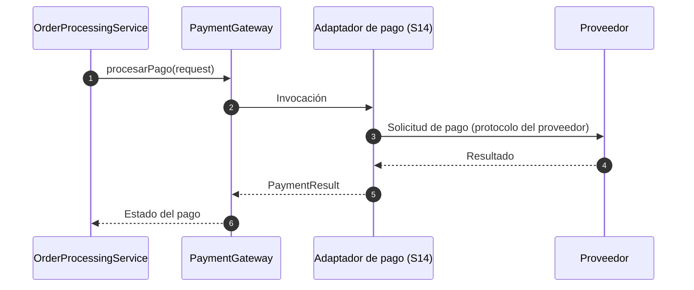
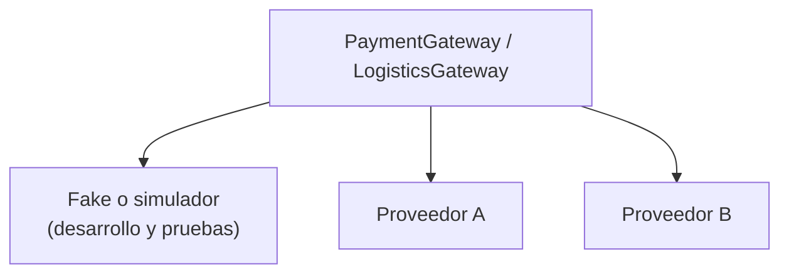

# Adaptadores de servicios externos

> Adaptadores de salida **S14–S17** de la capa de adaptadores de NexusMarket.

## 1. Propósito

Documentar los adaptadores que implementan los Output Ports de **servicios externos**
(`PaymentGateway`, `LogisticsGateway`, `BillingGateway`, `IdentityProvider`) y que traducen el
contrato interno de NexusMarket al protocolo del proveedor que finalmente se seleccione.

## 2. Base documental

| Puerto | Documento | Contenido |
|---|---|---|
| `PaymentGateway` | `Output-Ports.md` §8.1 | `procesarPago`, `consultarPago`, `solicitarReembolso` |
| `LogisticsGateway` | `Output-Ports.md` §10.1 | `crearEnvio`, `consultarEnvio`, `confirmarEntrega` |
| `BillingGateway` (condicional) | `Output-Ports.md` §9 | `emitirFactura`, `consultarFactura` |
| `IdentityProvider` (condicional) | `Output-Ports.md` §14 | `validarCredenciales` |
| Independencia tecnológica | `Output-Ports.md` §18 | El dominio depende de abstracciones, no de proveedores |
| Uso funcional del pago | `Input-Ports.md` §15.1 y §18.1 | `ProcessPaymentUseCase` y `ProcessRefundUseCase` se integran mediante `PaymentGateway` |
| Uso funcional de la logística | `Input-Ports.md` §16.2 | `DispatchOrderUseCase` relaciona `LogisticsGateway` junto a inventario y envíos |

**Importante:** la documentación **no define proveedores concretos**. Por lo tanto estos adaptadores
se documentan como contratos de traducción y **no** se asocia ningún proveedor específico.

## 3. Principio de traducción



El adaptador:

1. Traduce la solicitud interna al formato del proveedor.
2. Ejecuta la comunicación externa (protocolo, credenciales, reintentos).
3. Traduce la respuesta del proveedor al formato del contrato interno.
4. Traduce errores técnicos a errores con significado para la aplicación
   (`Output-Ports.md`, §20).

El núcleo **nunca** conoce el SDK, el endpoint, el token ni el proveedor
(`Output-Ports.md`, §8.1).

## 4. Catálogo de adaptadores

### 4.1 S14 — Adaptador de pasarela de pago

| Aspecto | Detalle |
|---|---|
| Puerto implementado | `PaymentGateway` (`Output-Ports.md`, §8.1) |
| Métodos | `procesarPago(request: PaymentRequest)`, `consultarPago(paymentId)`, `solicitarReembolso(request: RefundRequest)` |
| Casos de uso relacionados | `ProcessPaymentUseCase` (`Input-Ports.md`, §15.1), `ProcessRefundUseCase` (`Input-Ports.md`, §18.1) |
| Servicio relacionado | `OrderProcessingService` (`confirmPayment`, `Domain  Servicies.md`, §7.2) |
| Resultado interno | `EstadoPago` con valores `PENDIENTE`, `APROBADO`, `RECHAZADO`, `REEMBOLSADO` (`Input-Ports.md`, §15.1; `Domain Object Value.md`, §9) |
| Proveedor | **No definido** |



Distinción importante: un pago **rechazado** no es un error técnico, es un resultado de negocio
(`EstadoPago.RECHAZADO`, `Domain Object Value.md`, §9). Un fallo de comunicación sí es un error
técnico.

### 4.2 S15 — Adaptador de logística

| Aspecto | Detalle |
|---|---|
| Puerto implementado | `LogisticsGateway` (`Output-Ports.md`, §10.1) |
| Métodos | `crearEnvio(request: ShipmentRequest)`, `consultarEnvio(shipmentId)`, `confirmarEntrega(shipmentId)` |
| Casos de uso relacionados | `CreateShipmentUseCase` (`Input-Ports.md`, §16.1), `DispatchOrderUseCase` (§16.2), `ConfirmDeliveryUseCase` (§16.3) |
| Servicios relacionados | `OrderProcessingService` y `InventoryService` (el despacho coordina reservas y salida física) |
| Alcance funcional | Empaque, despacho, transporte y confirmación de entrega para productos físicos (`Output-Ports.md`, §10) |
| Proveedor | **No definido.** `Output-Ports.md` (§10.1) admite varias empresas logísticas o un sistema interno |

```text
LogisticsGateway
     │
     ▼
Adaptador de logística (S15)
     ├── Empresa logística A  (posible)
     ├── Empresa logística B  (posible)
     └── Sistema interno      (posible)
```

El adaptador **no** almacena el envío: la información propia del envío se persiste mediante
`ShipmentRepository` (adaptador S11). Esta separación es explícita en `Output-Ports.md` (§11).

### 4.3 S16 — Adaptador de facturación externa (condicional)

| Aspecto | Detalle |
|---|---|
| Puerto implementado | `BillingGateway` (`Output-Ports.md`, §9) |
| Métodos | `emitirFactura(request: BillingRequest)`, `consultarFactura(id)` |
| Caso de uso relacionado | `CreateInvoiceUseCase` (`Input-Ports.md`, §15.2) |
| Condición | Solo existe si la facturación se delega a un sistema externo |
| Alternativa | `InvoiceRepository` implementado por `SQLInvoiceRepository` (S10) |

`Output-Ports.md` (§9) fija ahora la decisión (resuelve O-12):

```text
Facturación externa  → BillingGateway     → adaptador externo (S16)   [DECIDIDO]
Facturación interna  → InvoiceRepository  → adaptador SQL (S10)       [NO utilizada inicialmente]
```

**Decisión:** se implementa únicamente **S16** (`BillingGateway`). La entidad `Factura` no forma parte
del modelo de dominio (`DomainModel .md`, §15.1), por lo que **S10** (`SQLInvoiceRepository`) queda
documentado como alternativa no utilizada inicialmente. S10 y S16 **no coexisten**.

### 4.4 S17 — Adaptador de proveedor de identidad (condicional)

| Aspecto | Detalle |
|---|---|
| Puerto implementado | `IdentityProvider` (`Output-Ports.md`, §14) |
| Método | `validarCredenciales(credentials: Credentials): Promise<AuthenticatedIdentity>` |
| Consumidor | Adaptador de autenticación de entrada (E15), no un servicio de dominio |
| Condición | Solo si el diseño de autenticación exige abstraer un proveedor externo |

`Output-Ports.md` (§14) aclara que este port "solo debe incorporarse si el diseño de autenticación
elegido requiere que NexusMarket abstraiga un proveedor de identidad". El mecanismo sigue siendo
**pendiente** (`input/authentication-adapter.md`, §6).

Particularidad arquitectónica: es el único Output Port cuyo consumidor es otro adaptador (E15) y no
un servicio de dominio.

---

## 5. Contratos y mapeo

### 5.1 DTOs del contrato interno

Los contratos internos están definidos en `Output-Ports.md` y **no** se modifican. Sus campos
internos no están documentados:

| Contrato | Origen | Estado |
|---|---|---|
| `PaymentRequest` / `PaymentResult` | `Output-Ports.md` §8.1 | Campos **pendientes de definición** |
| `RefundRequest` / `RefundResult` | `Output-Ports.md` §8.1 | Campos **pendientes de definición** |
| `ShipmentRequest` / `ShipmentResult` | `Output-Ports.md` §10.1 | Campos **pendientes de definición** |
| `DeliveryResult` | `Output-Ports.md` §10.1 | Campos **pendientes de definición** |
| `BillingRequest` / `BillingResult` | `Output-Ports.md` §9 | Campos **pendientes de definición** |
| `Credentials` / `AuthenticatedIdentity` | `Output-Ports.md` §14 | Campos **pendientes de definición** |

### 5.2 Mapeo dominio ↔ proveedor

```text
Dominio / aplicación            Adaptador externo              Proveedor
─────────────────────           ─────────────────              ─────────
Pedido, estado del pago   →     mapper externo            →    DTO del proveedor
PaymentResult             ←     mapper externo            ←    Respuesta del proveedor

Envío, dirección, método  →     mapper externo            →    DTO logístico
ShipmentResult            ←     mapper externo            ←    Respuesta logística
```

Reglas:

1. El mapper externo traduce en ambas direcciones y **no** contiene reglas de negocio.
2. Ningún DTO del proveedor atraviesa el puerto: al núcleo solo llegan los contratos internos.
3. Los códigos de estado internos (`EstadoPago`, `EstadoPedido`) se derivan de la respuesta del
   proveedor según la traducción definida por el adaptador, respetando los valores documentados en
   `Domain Object Value.md` (§8 y §9).

---

## 6. Dependencias

### Permitidas

```text
Adaptador externo → Output Port que implementa
Adaptador externo → Mapper externo y DTOs del contrato interno
Adaptador externo → SDK / protocolo / credenciales del proveedor (solo dentro del adaptador)
Adaptador externo → Mecanismo de resiliencia (timeout, reintento, idempotencia)
```

### Prohibidas

```text
Adaptador externo → Entidades de dominio usadas como contrato del proveedor
Adaptador externo → Otros adaptadores (por ejemplo, repositorios)
Adaptador externo → Reglas de negocio (por ejemplo, decidir si el reembolso procede)
Proveedor → Núcleo: el SDK nunca se importa en dominio, servicios ni puertos
```

Verificación explícita derivada de `Output-Ports.md` (§8.1): el dominio no puede depender de
proveedor de pagos, SDK específico, API HTTP concreta, credenciales, endpoints ni tokens técnicos.

## 7. Manejo de errores

| Situación | Naturaleza | Tratamiento |
|---|---|---|
| Pago rechazado por el proveedor | Resultado de negocio | `EstadoPago.RECHAZADO` (`Domain Object Value.md`, §9); no es un error técnico |
| Reembolso no procedente según las reglas | Regla de negocio | Lo determina el núcleo, no el adaptador |
| Timeout o indisponibilidad del proveedor | Error técnico | Error de disponibilidad (`502`/`503` propuesto) |
| Respuesta con formato inesperado | Error técnico | Error interno del adaptador (indica desalineación del mapeo) |
| Credenciales inválidas o expiradas | Error de configuración | Error interno; requiere intervención operativa |
| Envío no encontrado en el proveedor | Error técnico/de datos | Error de recurso no encontrado |

Reglas:

1. Los errores del SDK no se propagan al núcleo (`Output-Ports.md`, §20).
2. Un rechazo del proveedor se traduce a un valor del catálogo `EstadoPago`, no a una excepción.
3. Las operaciones que modifican estado financiero o logístico deben ser **idempotentes** cuando el
   proveedor lo permita, para evitar duplicaciones por reintentos.

## 8. Consideraciones de seguridad

1. Las credenciales, claves y URLs del proveedor se resuelven en infraestructura, nunca en el
   dominio (`architecture.md`, §10).
2. Las credenciales no se registran en trazas ni en mensajes de error.
3. El adaptador no expone datos del proveedor al cliente HTTP: solo el contrato interno.
4. No deben almacenarse datos financieros sensibles más allá de lo que exija el contrato interno;
   `DomainModel .md` (§5.1) exige almacenamiento seguro de credenciales de usuario, y el mismo
   criterio se aplica a cualquier secreto técnico.
5. Si el pago se delega a un proveedor externo, la validación de datos financieros de tarjeta
   pertenece al proveedor; el adaptador solo transporta lo que el contrato interno defina (campos
   aún no especificados).

## 9. Sustitución y entorno de desarrollo

Gracias a la inversión de dependencias, el mismo puerto admite varias implementaciones:



`Output-Ports.md` (§26) documenta el uso de dobles de prueba (`FakePaymentGateway`), lo que permite
desarrollar el flujo comercial completo sin contratar un proveedor. La documentación no describe un
modo de simulación adicional; si se requiriera, sería un adaptador más del mismo puerto.

## 10. Decisiones de estos adaptadores

### Decisión

Implementar los servicios externos mediante adaptadores **sustituibles**, sin proveedor fijado, y
mantener `BillingGateway` e `IdentityProvider` como adaptadores **condicionales**.

### Justificación

La especificación funcional no determina proveedores ni mecanismos técnicos, y `Output-Ports.md`
(§8, §9, §10, §14, §18) obliga a que el núcleo dependa de abstracciones y no de proveedores.

### Base

`Output-Ports.md` (§8.1, §9, §10.1, §14, §18); `Input-Ports.md` (§15.1, §16.2, §18.1).

### Consecuencia

El proyecto puede avanzar con adaptadores de prueba y sustituirlos cuando se seleccionen los
proveedores. Ningún cambio de proveedor debe afectar al dominio, a los servicios ni a los puertos.

## 11. Pendientes de definición

- Proveedores de pago, logística y (si aplica) facturación.
- Campos de `PaymentRequest`, `PaymentResult`, `RefundRequest`, `RefundResult`, `ShipmentRequest`,
  `ShipmentResult`, `DeliveryResult`, `BillingRequest`, `BillingResult`, `Credentials` y
  `AuthenticatedIdentity`.
- Decisión entre facturación interna (S10) y externa (S16).
- Decisión sobre `IdentityProvider` (S17) y el mecanismo de autenticación.
- Políticas de timeout, reintento e idempotencia.
- Adaptador de notificaciones: la documentación menciona los servicios de notificación como
  dependencia a evitar (`Output-Ports.md`, §1) pero **no define un puerto**; no se crea adaptador.
- Entrega de productos digitales: `DomainModel .md` (§12) describe entrega inmediata tras el pago,
  pero no existe puerto ni caso de uso concretos; no se crea adaptador.


