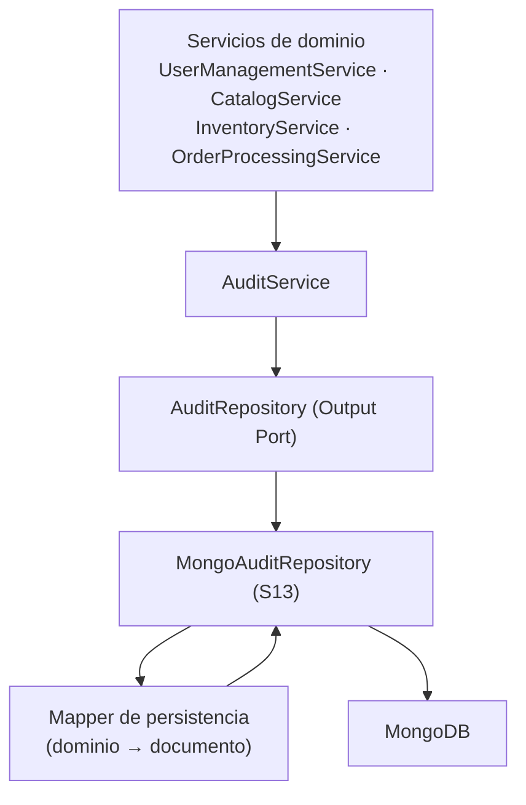
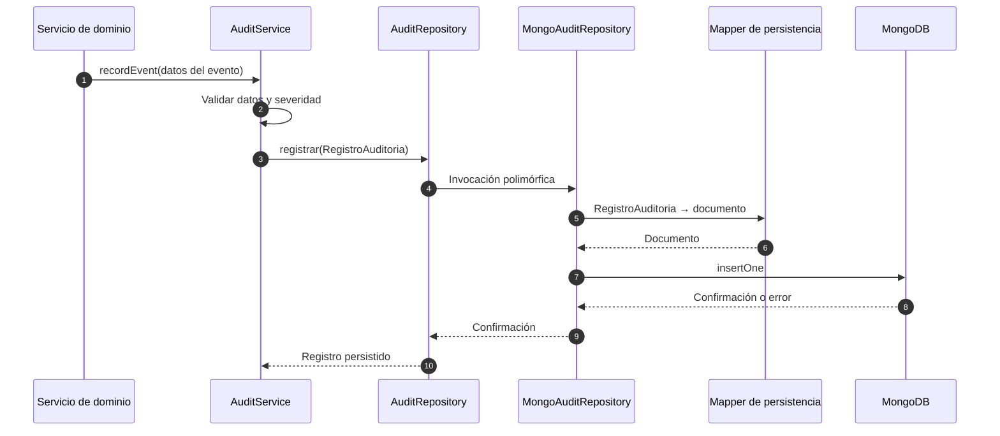

# Adaptadores MongoDB — Auditoría y trazabilidad

> Adaptador de salida **S13** de la capa de adaptadores de NexusMarket.

## 1. Propósito

Documentar el adaptador documental que implementa `AuditRepository`, el único Output Port que
`Output-Ports.md` (§12 y §17) asigna a MongoDB.

## 2. Base documental

| Elemento | Documento | Contenido |
|---|---|---|
| `AuditRepository` | `Output-Ports.md` §12.1 | `registrar(evento)`, `buscarPorEntidad(entidadTipo, entidadId)` |
| Carácter append-only | `Output-Ports.md` §12.1; `DomainModel .md` §11; `DomainModel .md` RG AUD-02 | Crear y leer permitido; editar y borrar prohibido |
| Entidad registrada | `DomainModel .md` §11 | `RegistroAuditoria` |
| Atributos | `DomainModel .md` §11 | `auditId`, `tipoEvento`, `marcaTiempo`, `realizadoPorUsuario`, `rolUsuario`, `entidadTipo`, `entidadId`, `resultado`, `gravedad`, `detalles` |
| Servicio que lo invoca | `Services/AuditService.md` §4 | `recordEvent(eventData)` |
| Uso de MongoDB | `Output-Ports.md` §12, §17 | Auditoría, trazabilidad y eventos operativos |
| Prohibición | `Output-Ports.md` §5, §17 | MongoDB no debe duplicar los datos transaccionales ni sustituir a SQL |

## 3. Responsabilidad

El adaptador `MongoAuditRepository`:

1. Recibe un `RegistroAuditoria` ya construido por el núcleo y lo persiste como documento.
2. Recupera registros por entidad afectada cuando el rol autorizado lo solicita.
3. **Nunca** modifica ni elimina un documento existente.
4. Traduce los errores del motor documental a errores con significado para la aplicación.
5. No decide qué eventos deben auditarse: esa decisión pertenece a los servicios
   (`Services/AuditService.md`, §4 y §5).

## 4. Ubicación arquitectónica

MongoDB es un **almacén secundario especializado**. No participa de la transacción SQL
(`persistence-adapters.md`, §9).

## 5. Puerto implementado

| Método | Firma documentada | Responsabilidad |
|---|---|---|
| `registrar(evento)` | `registrar(evento: RegistroAuditoria): Promise<void>` | Añadir un registro inmutable al historial |
| `buscarPorEntidad(entidadTipo, entidadId)` | `buscarPorEntidad(entidadTipo: string, entidadId: string): Promise<RegistroAuditoria[]>` | Recuperar los registros asociados a una entidad afectada |

Casos de uso que consumen este puerto indirectamente:

| Caso de uso | Relación |
|---|---|
| `QueryAuditLogUseCase` | Consulta de trazabilidad con autorización de rol (`Input-Ports.md`, §20.1) |
| Todas las operaciones que generan trazabilidad | Escritura mediante `AuditService.recordEvent` (`Services/AuditService.md`, §5) |

---

## 6. Datos que maneja

El documento se construye a partir de los atributos documentados de `RegistroAuditoria`
(`DomainModel .md`, §11) y de la información mínima exigida por `Services/AuditService.md` (§6):

| Atributo de `RegistroAuditoria` | Pregunta que responde (`AuditService.md`, §6) | Tipo documentado |
|---|---|---|
| `auditId` | Identificación del registro | Identificador |
| `tipoEvento` | ¿Qué ocurrió? | Tipo de evento |
| `marcaTiempo` | ¿Cuándo? | `LocalDateTime` |
| `realizadoPorUsuario` | ¿Quién? | `Usuario` |
| `rolUsuario` | Rol vigente durante la operación | `SystemRole` |
| `detalles` | ¿Sobre qué? ¿Resultado? — información adicional | `Map<String,Object>` |

### 6.1 Campos exigidos por `AuditService`

`Services/AuditService.md` (§6) exige, además, entidad afectada, resultado y severidad. Estos datos
**ya son atributos** de `RegistroAuditoria` (`DomainModel .md`, §11): `entidadTipo`, `entidadId`,
`resultado` y `gravedad`. El adaptador los indexa directamente (resuelve O-10).

### 6.2 Eventos auditables documentados

`Services/AuditService.md` (§5) y `DomainModel .md` (§10, §11) determinan los eventos que llegan a
este adaptador:

| Categoría | Eventos |
|---|---|
| Usuarios | Registro de comprador, incorporación de vendedor, cambio de estado de usuario |
| Catálogo | Publicación de producto, cambio de estado |
| Inventario | `INGRESO`, `RESERVA`, `SALIDA_VENTA`, `AJUSTE`, `DEVOLUCION` (regla AUD-01) |
| Pedidos | Creación, resultado del pago, cambios de estado, despacho, entrega, cancelación |

## 7. Flujo de funcionamiento

El adaptador **solo** realiza `insert` y lecturas por consulta. No expone operaciones de
actualización ni de borrado.

## 8. Reglas arquitectónicas

1. **Append-only.** No implementa `update` ni `delete` sobre registros existentes
   (`Output-Ports.md`, §12.1; `DomainModel .md`, §11 y AUD-02).
2. **Sin reglas de negocio.** No decide la severidad ni el tipo de evento: los recibe.
3. **Sin acoplamiento al motor.** El puerto no conoce MongoDB; el driver solo aparece en el
   adaptador (`Output-Ports.md`, §21).
4. **Sin duplicación transaccional.** No almacena usuarios, pedidos, inventario ni catálogo.
5. **Sin participación en la transacción SQL.** La consistencia entre ambos se documenta como
   riesgo en `persistence-adapters.md` (§9).
6. **Sin autorización propia.** El filtrado por rol pertenece al núcleo; el adaptador aplica los
   criterios de consulta recibidos.
7. **Inmutabilidad del dato.** Un documento persistido no se sobrescribe
   (`Services/AuditService.md`, §10).

## 9. Consideraciones de persistencia

| Aspecto | Regla |
|---|---|
| Naturaleza del almacén | Documental, adecuado para registros heterogéneos de trazabilidad (`Output-Ports.md`, §17) |
| Índices mínimos sugeridos | `auditId` (único), `marcaTiempo`, y los criterios usados por `buscarPorEntidad` y por `QueryAuditLogCommand` (`userId`, `eventType`, `dateRange`, `severity` según `Input-Ports.md`, §20.1) |
| Formato de `detalles` | Mapa libre de información adicional; su contenido concreto no está especificado |
| Crecimiento | El historial es acumulativo por diseño; la política de retención no está documentada |
| Eliminación | Prohibida por AUD-02 |
| Migración de esquema | Pertenecen a infraestructura y no están documentadas |

## 10. Manejo de errores

| Error técnico | Traducción propuesta |
|---|---|
| Fallo de conexión o timeout | Error de disponibilidad |
| Documento duplicado (`auditId`) | Conflicto de unicidad |
| Error de validación del documento | Error interno del adaptador (indica inconsistencia en el mapeo) |
| Motor no disponible | Error de disponibilidad |

**Estrategia (resuelve O-11):** la auditoría se escribe con **idempotencia y reintentos** (patrón
*outbox*) desde la transacción SQL; la garantía es de consistencia eventual (`Output-Ports.md`, §19.1;
`persistence-adapters.md`, §9), lo que satisface AUD-01 sin transacción distribuida.

---

## 11. Consideraciones de seguridad

1. Los registros de auditoría contienen identidad del actor (`realizadoPorUsuario`, `rolUsuario`) y
   detalles operativos: el acceso de lectura debe restringirse por rol
   (`QueryAuditLogUseCase`, `Input-Ports.md`, §20.1).
2. La escritura de auditoría **no** se expone como operación arbitraria al cliente
   (`Input-Ports.md`, §20.1); el adaptador no ofrece endpoints ni métodos de escritura directa.
3. Las credenciales de conexión al motor documental viven en infraestructura
   (`architecture.md`, §10).
4. No deben almacenarse datos sensibles innecesarios en `detalles` (por ejemplo, contraseñas);
   `DomainModel .md` (§5.1) exige almacenamiento seguro de la credencial.

## 12. Pruebas

| Tipo de prueba | Enfoque |
|---|---|
| Unitaria | `FakeAuditRepository` en lugar del adaptador documental (`Output-Ports.md`, §26) |
| Integración | Verificar la escritura inmutable, los índices y la consulta por entidad |
| Verificación de invariantes | Confirmar que no existe operación de actualización ni de borrado |

## 13. Decisiones de este adaptador

### Decisión

Usar MongoDB como almacén especializado exclusivamente para la auditoría, mediante un único
adaptador `MongoAuditRepository`.

### Justificación

`Output-Ports.md` (§12 y §17) propone MongoDB para auditoría y trazabilidad, y prohíbe que se
convierta en una segunda fuente autoritativa de los datos transaccionales. El modelo documental
`RegistroAuditoria` incluye un mapa libre de detalles (`detalles`), adecuado para documentos
heterogéneos.

### Base

`Output-Ports.md` (§5, §12, §17); `DomainModel .md` (§11); `Services/AuditService.md`.

### Consecuencia

El ciclo de vida, las copias de seguridad y las decisiones de escalado del almacén documental son
independientes de la base transaccional. La auditoría nunca se usa como fuente de datos de negocio.

## 14. Pendientes de definición

- Estructura definitiva de `detalles`.
- Índices definitivos y política de retención.
- Definición de los tipos de evento (`tipoEvento`) utilizados por `QueryAuditLogCommand`.

Resueltos (ver `../observaciones-arquitectonicas.md`): ubicación de la entidad afectada, el resultado y
la severidad —atributos `entidadTipo`, `entidadId`, `resultado` y `gravedad`— (O-10) y estrategia de
consistencia SQL ↔ MongoDB (O-11).

