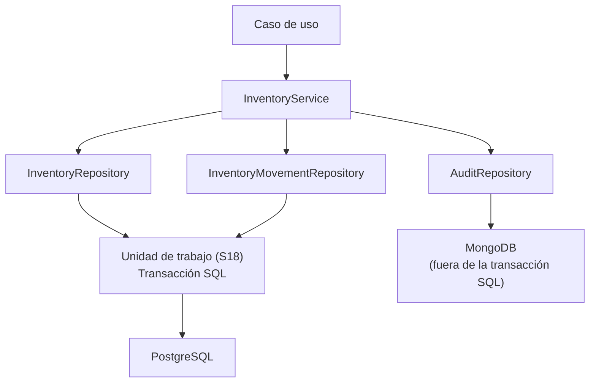
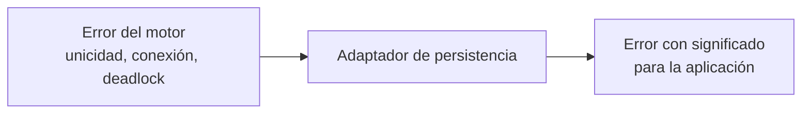

# Adaptadores de persistencia — Visión general

> Adaptadores de salida **S1–S13** y unidad de trabajo **S18** de la capa de adaptadores de
> NexusMarket.

## 1. Propósito

Describir las reglas comunes a todos los adaptadores de persistencia y la forma en que implementan
los Output Ports de almacenamiento definidos en `SDD/Domain/Output-Ports.md`.

El detalle por tecnología está en `sql-adapters.md` (PostgreSQL) y `mongodb-adapters.md`.

## 2. Clasificación

`Output-Ports.md` (§4) establece cuatro grupos de Output Ports. Los adaptadores de persistencia
cubren los tres primeros, mientras el cuarto se resuelve con un adaptador de consulta de solo
lectura:

```text
1. Persistencia transaccional   → adaptadores SQL (S1–S11)
2. Auditoría y trazabilidad     → adaptador documental MongoDB (S13)
3. Servicios externos           → adaptadores externos (S14–S17)
4. Consulta y reporting         → adaptador de consulta SQL (S12)
```

## 3. Correspondencia adaptador ↔ puerto

| Adaptador | Puerto | Tecnología | Documento |
|---|---|---|---|
| `SQLUserRepository` | `UserRepository` | SQL | `sql-adapters.md` |
| `SQLSellerRepository` | `SellerRepository` | SQL | `sql-adapters.md` |
| `SQLBuyerRepository` | `BuyerRepository` | SQL | `sql-adapters.md` |
| `SQLProductRepository` | `ProductRepository` | SQL | `sql-adapters.md` |
| `SQLWarehouseRepository` | `WarehouseRepository` | SQL | `sql-adapters.md` |
| `SQLInventoryRepository` | `InventoryRepository` | SQL | `sql-adapters.md` |
| `SQLInventoryMovementRepository` | `InventoryMovementRepository` | SQL | `sql-adapters.md` |
| `SQLCartRepository` | `CartRepository` | SQL | `sql-adapters.md` |
| `SQLOrderRepository` | `OrderRepository` | SQL | `sql-adapters.md` |
| `SQLInvoiceRepository` | `InvoiceRepository` (**no utilizado inicialmente**, O-12) | SQL | `sql-adapters.md` |
| `SQLShipmentRepository` | `ShipmentRepository` | SQL | `sql-adapters.md` |
| `SQLReportingQueryAdapter` | `ReportingQuery` | SQL (lectura) | §8 de este documento |
| `MongoAuditRepository` | `AuditRepository` | MongoDB | `mongodb-adapters.md` |
| Unidad de trabajo | — (infraestructura) | SQL | §5 de este documento |

## 4. Reglas comunes a todo adaptador de persistencia

1. **Implementa exactamente un puerto.** La firma del puerto es el contrato; el adaptador no la
   amplía ni la recorta.
2. **Traduce en ambas direcciones.** Entidad de dominio → estructura de persistencia y viceversa,
   mediante los mappers de persistencia (`../mappers/persistence-mappers.md`).
3. **Nunca devuelve modelos de persistencia.** `Output-Ports.md` (§21) prohíbe exponer filas SQL,
   documentos o entidades de ORM hacia el núcleo.
4. **Traduce los errores.** Un error del motor no puede propagarse como error de negocio ni como
   error técnico sin significado (`Output-Ports.md`, §20).
5. **No contiene reglas de negocio.** Ejemplo explícito: el repositorio de pedidos no debe usarse
   para saltarse la regla "un pedido finalizado no puede modificarse"; esa validación pertenece al
   dominio o a la aplicación (`Output-Ports.md`, §7.2).
6. **Protege las invariantes que le corresponden.** `Output-Ports.md` (§6.1) exige que el adaptador
   SQL garantice la atomicidad necesaria para que no existan existencias negativas ni condiciones
   de carrera en la reserva.
7. **No decide la autorización.** El control de acceso y de alcance ocurre en el núcleo; el
   adaptador solo ejecuta la operación que recibe.
8. **Mantiene la auditoría separada.** La auditoría se escribe a través de `AuditRepository`
   (Mongo) y nunca a través de los repositorios transaccionales.
9. **Respeta el carácter append-only de la auditoría.** `Output-Ports.md` (§12) y
   `Services/AuditService.md` (§10) prohíben editar y borrar registros.
10. **No se comunica con otros adaptadores** (`architecture.md`, §8).

### 4.1 Restricciones de unicidad

| Dato | Regla | Fuente | Responsable |
|---|---|---|---|
| `correoElectronico` de usuario | Único | `DomainModel .md` §5.1; `Output-Ports.md` §5.1 | Servicio (validación previa) + base de datos (restricción) |
| Documento de identidad | Único en la plataforma | `DomainModel .md` §5.1 | Servicio (validación previa) + base de datos (restricción) |
| `sku` de variante | Único | `DomainModel .md` §6.4 | Dominio + base de datos |

El adaptador **materializa** la restricción (si la base de datos la soporta) y **traduce** el error
resultante, pero no reemplaza la validación del servicio.

---

## 5. Unidad de trabajo y transacciones (S18)

`Output-Ports.md` (§19) establece que algunas operaciones requieren más de un Output Port y que la
implementación concreta de la transacción pertenece **al adaptador o a la unidad de trabajo de
infraestructura, no al modelo de dominio**.



### 5.1 Operaciones que requieren atomicidad

| Operación | Puertos implicados | Base documental |
|---|---|---|
| Reserva de inventario | `InventoryRepository` (disminuir disponible, aumentar reservado) + `InventoryMovementRepository` (`RESERVA`) | `Output-Ports.md` §19; `Services/InventoryService.md` §4 |
| Despacho de inventario | `InventoryRepository` (disminuir reservado) + `InventoryMovementRepository` (`SALIDA_VENTA`) + `OrderRepository` (estado `DESPACHADO`) | `Services/InventoryService.md` §4; `Domain  Servicies.md` §6.3 |
| Creación de pedido desde carrito | `CartRepository` + `OrderRepository` | `Services/OrderProcessingService.md` §4 |
| Confirmación de pago | `OrderRepository` (estado `PAGADO`) + reserva de inventario | `Domain  Servicies.md` §7.2 |
| Ingreso de existencias | `InventoryRepository` + `InventoryMovementRepository` (`INGRESO`) | `Services/InventoryService.md` §4 |

### 5.2 Reglas de transacción

1. La transacción abarca **puertos del mismo almacén** (SQL). No existe transacción distribuida
   entre PostgreSQL y MongoDB.
2. La auditoría se escribe a través de `AuditRepository` y **no** participa de la transacción SQL;
   su fallo debe manejarse explícitamente (ver §9).
3. El núcleo nunca abre transacciones: solo declara la operación a través de los puertos.
4. La reserva de inventario no puede implementarse como lectura seguida de escritura sin
   protección (`Output-Ports.md`, §6.1).

---

## 6. Manejo de errores en persistencia

`Output-Ports.md` (§20) establece la traducción obligatoria:



| Error técnico | Traducción propuesta | Estado HTTP (propuesta) |
|---|---|---|
| Violación de unicidad (correo, documento, SKU) | Conflicto de unicidad | `409` |
| Registro no encontrado | Recurso inexistente | `404` |
| Violación de clave foránea | Referencia inválida | `409` / `422` |
| Fallo de conexión o timeout | Error de disponibilidad | `503` |
| Conflicto de concurrencia (reserva de inventario) | Reintento o conflicto de negocio | `409` |
| Error no clasificado | Error interno | `500` |

Regla explícita: el núcleo **no** debe recibir errores propios de la librería de persistencia
(por ejemplo, `PrismaClientKnownRequestError`, citado como contraejemplo en `Output-Ports.md` §20).

---

## 7. Cómo se evita contaminar el dominio

| Riesgo | Mitigación |
|---|---|
| Filtrar modelos de ORM | El adaptador traduce con mappers de persistencia y devuelve entidades de dominio (`Output-Ports.md`, §21) |
| Filtrar restricciones del motor en las firmas | Las firmas de los puertos usan tipos de dominio (`Output-Ports.md`, §21) |
| Añadir reglas de negocio al repositorio | Prohibición explícita (`Output-Ports.md`, §7.2) |
| Dependencia del motor | El puerto se define en el núcleo; el motor solo aparece en el adaptador |

Ejemplo documentado de lo incorrecto y lo preferible (`Output-Ports.md`, §21):

```typescript
// Incorrecto: el núcleo dependería del modelo de persistencia
interface UserRepository {
    findUser(): Promise<PrismaUser>;
}

// Preferible: el puerto expresa el contrato en términos del dominio
interface UserRepository {
    buscarPorId(id: string): Promise<Usuario | null>;
}
```

---

## 8. Adaptador de consulta de solo lectura (S12)

`ReportingQuery` (`Output-Ports.md`, §13.1) alimenta `GenerateAdministrativeReportUseCase`
(`Input-Ports.md`, §19.1).

| Aspecto | Regla |
|---|---|
| Naturaleza | Solo lectura: no modifica el estado del sistema |
| Implementación posible | Consultas SQL optimizadas, vistas, proyecciones o consultas especializadas (`Output-Ports.md`, §13.1) |
| Resultados | `SalesReport`, `InventoryReport`, `OrderReport`: **modelos de lectura**, no entidades de dominio |
| Separación | Se mantiene aparte de los repositorios de escritura para no mezclar modelos de lectura y de escritura |

**Autorización (resuelve O-14):** `Output-Ports.md` (§13.1) fija que la autorización corresponde al
núcleo (servicio o caso de uso); el adaptador solo aplica los filtros ya decididos que recibe y no
implementa reglas de negocio ni de autorización.

---

## 9. Consistencia entre SQL y MongoDB

| Regla | Base |
|---|---|
| SQL es la fuente autoritativa de los datos transaccionales | `Output-Ports.md` §5, §16 |
| MongoDB no sustituye a SQL ni duplica los datos transaccionales | `Output-Ports.md` §5, §17 |
| `AuditRepository` es append-only | `Output-Ports.md` §12; `Services/AuditService.md` §10 |
| No existe transacción distribuida SQL ↔ MongoDB; la consistencia es **eventual** | `Output-Ports.md` §19.1 |
| Los movimientos de inventario deben quedar auditados | `DomainModel .md` §7.2; `Services/AuditService.md` §7 |

**Estrategia (resuelve O-11):** la operación de negocio se confirma en la transacción SQL; el evento de
auditoría se registra como *outbox* dentro de la misma transacción y un proceso posterior lo confirma en
MongoDB de forma **idempotente** y con **reintentos**. Nivel de garantía: consistencia eventual acotada
para la trazabilidad (`Output-Ports.md`, §19.1).

---

## 10. Adaptadores de prueba

`Output-Ports.md` (§26) documenta el uso de dobles de prueba para el núcleo:

| Adaptador de prueba | Puerto que implementa | Uso |
|---|---|---|
| `FakeUserRepository`, `FakeSellerRepository`, `FakeBuyerRepository` | Repositorios de usuarios | Pruebas de `UserManagementService` |
| `FakeProductRepository`, `FakeWarehouseRepository` | Catálogo y bodegas | Pruebas de `CatalogService` |
| `FakeInventoryRepository`, `FakeInventoryMovementRepository` | Inventario | Pruebas de reserva y despacho (`Output-Ports.md`, §26) |
| `FakeCartRepository`, `FakeOrderRepository` | Carrito y pedidos | Pruebas de `OrderProcessingService` |
| `FakeAuditRepository` | `AuditRepository` | Verificación de trazabilidad |
| `FakePaymentGateway`, `FakeLogisticsGateway` | Servicios externos | Flujo comercial sin proveedores |

Los adaptadores de prueba son implementaciones alternativas de los mismos puertos, por lo que el
núcleo no requiere modificaciones para usarlos.

---

## 11. Decisiones de este adaptador (conjunto)

### Decisión

Separar los adaptadores por puerto y por tecnología, con una unidad de trabajo independiente para
la atomicidad.

### Justificación

`Output-Ports.md` exige contratos específicos en lugar de puertos genéricos (§4), reserva SQL para
los datos transaccionales (§5, §16), MongoDB para la auditoría (§12, §17) y delega la transacción en
la infraestructura (§19).

### Base

`Output-Ports.md` (§4, §5, §12, §16, §17, §19, §21).

### Consecuencia

Cada adaptador puede evolucionar o sustituirse de manera independiente. La coordinación entre
puertos ocurre en los servicios de dominio y la atomicidad en la unidad de trabajo.

---

## 12. Pendientes de definición

- Motor SQL definitivo (PostgreSQL está recomendado, no decidido formalmente).
- Librería de acceso a datos o mecanismo de consulta.
- Esquema físico y migraciones (no documentados; pertenecen a infraestructura).
- Modelos de lectura de `ReportingQuery` (`SalesReport`, `InventoryReport`, `OrderReport`).

Resueltos (ver `../observaciones-arquitectonicas.md`): estrategia de consistencia SQL ↔ MongoDB
(`Output-Ports.md` §19.1, O-11); formato de identificadores —`string` opaco— (O-05); decisión de
facturación —`BillingGateway`, S10 no utilizado inicialmente— (O-12). Las devoluciones/reembolsos y las
entidades `Factura`/`Envio` quedan declarados **fuera del alcance** del modelo de dominio
(`DomainModel .md` §15.1; O-01 y O-02).


