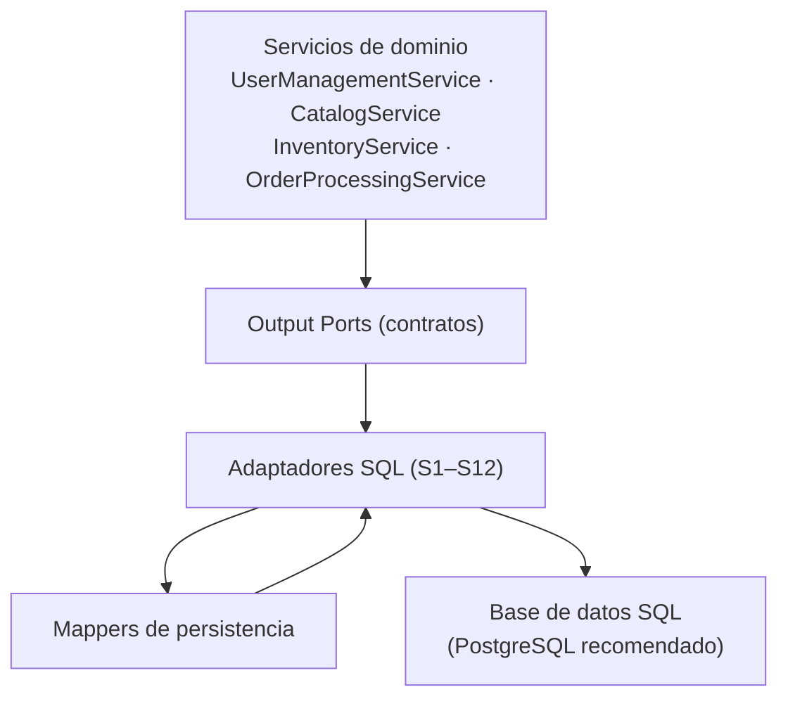

# Adaptadores SQL — Persistencia transaccional

> Adaptadores de salida **S1–S12** de la capa de adaptadores de NexusMarket.

## 1. Propósito

Documentar los adaptadores que implementan los Output Ports de **persistencia transaccional** y de
**consulta** mediante una base de datos SQL, que `Output-Ports.md` (§5) define como **fuente
principal de verdad** de NexusMarket.

## 2. Ubicación arquitectónica



Los adaptadores SQL viven fuera del núcleo y dependen únicamente del contrato de su puerto, del
mapper de persistencia y de la tecnología de acceso a datos.

## 3. Catálogo de adaptadores y métodos implementados

Cada método corresponde exactamente al contrato definido en `Output-Ports.md`. No se añadieron
métodos.

### 3.1 `SQLUserRepository` → `UserRepository` (`Output-Ports.md`, §5.1)

| Método | Responsabilidad |
|---|---|
| `guardar(usuario)` | Persistir usuarios |
| `buscarPorId(id)` | Recuperar usuario por identificador |
| `buscarPorCorreo(correo)` | Recuperar usuario por correo |
| `existePorCorreo(correo)` | Verificar unicidad del correo |

Datos manejados: `Usuario` y sus especializaciones (`Comprador`, `UsuarioAdministrativo`),
`rol`, `estado` (`Output-Ports.md`, §5.1; `DomainModel .md`, §5).

### 3.2 `SQLSellerRepository` → `SellerRepository` (`Output-Ports.md`, §5.2)

| Método | Responsabilidad |
|---|---|
| `guardar(vendedor)` | Registrar vendedores |
| `buscarPorId(id)` | Consultar vendedores |

Datos manejados: `Vendedor` (`razonSocial`) y su relación con el catálogo.

### 3.3 `SQLBuyerRepository` → `BuyerRepository` (`Output-Ports.md`, §5.3)

| Método | Responsabilidad |
|---|---|
| `guardar(comprador)` | Registrar compradores |
| `buscarPorId(id)` | Recuperar compradores |

Datos manejados: dirección principal, direcciones adicionales y estado comercial
(`DomainModel .md`, §5.2).

### 3.4 `SQLProductRepository` → `ProductRepository` (`Output-Ports.md`, §5.4)

| Método | Responsabilidad |
|---|---|
| `guardar(producto)` | Registrar productos y variantes |
| `buscarPorId(id)` | Recuperar productos |
| `listarPublicados()` | Consultar productos publicados |
| `actualizar(producto)` | Actualizar información permitida |

Datos manejados: `Producto` (físico o digital), `Variante` con `sku`, `nombreVariante` y `precio`
(`DomainModel .md`, §6).

Regla documentada: las variantes forman parte del modelo de producto y conservan su identidad y
SKU (`Output-Ports.md`, §5.4).

### 3.5 `SQLWarehouseRepository` → `WarehouseRepository` (`Output-Ports.md`, §5.5)

| Método | Responsabilidad |
|---|---|
| `guardar(bodega)` | Registrar bodegas |
| `buscarPorId(id)` | Recuperar bodegas |
| `listarPorVendedor(vendedorId)` | Consultar bodegas de un vendedor |

Datos manejados: `BodegaMarketplace` y `BodegaVendedor` (`DomainModel .md`, §7.1).

### 3.6 `SQLInventoryRepository` → `InventoryRepository` (`Output-Ports.md`, §6.1)

| Método | Responsabilidad |
|---|---|
| `buscarPorVarianteYBodega(varianteId, bodegaId)` | Recuperar existencias |
| `guardar(inventario)` | Persistir el estado del inventario |
| `actualizar(inventario)` | Actualizar disponible y reservado |

Invariante que el adaptador debe proteger: **no se permiten existencias negativas**
(`Output-Ports.md`, §6.1; `DomainModel .md`, §7.2). La reserva no puede ser una lectura seguida de
escritura sin protección contra condiciones de carrera.

### 3.7 `SQLInventoryMovementRepository` → `InventoryMovementRepository` (`Output-Ports.md`, §6.2)

| Método | Responsabilidad |
|---|---|
| `guardar(movimiento)` | Persistir movimientos |
| `listarPorInventario(inventarioId)` | Consultar el historial de un inventario |

Tipos registrados: `INGRESO`, `RESERVA`, `SALIDA_VENTA`, `AJUSTE`, `DEVOLUCION`
(`Domain Object Value.md`, §10).

### 3.8 `SQLCartRepository` → `CartRepository` (`Output-Ports.md`, §7.1)

| Método | Responsabilidad |
|---|---|
| `buscarPorComprador(compradorId)` | Recuperar el carrito del comprador |
| `guardar(carrito)` | Persistir el carrito |
| `actualizar(carrito)` | Actualizar cantidades e ítems |

Datos manejados: `CarritoDeCompras` e `ItemCarrito` (`variante`, `cantidad`, `precioUnitario`)
(`DomainModel .md`, §8).

### 3.9 `SQLOrderRepository` → `OrderRepository` (`Output-Ports.md`, §7.2)

| Método | Responsabilidad |
|---|---|
| `guardar(pedido)` | Crear pedidos |
| `buscarPorId(id)` | Recuperar pedidos |
| `listarPorComprador(compradorId)` | Consultar pedidos del comprador |
| `listarPorVendedor(vendedorId)` | Consultar pedidos del vendedor |
| `actualizar(pedido)` | Persistir cambios de estado permitidos |

Datos manejados: `Pedido` e `ItemPedido`, con estado del pedido y del pago
(`Domain Model`, §9; `Domain Object Value.md`, §8 y §9).

**Restricción crítica documentada:** un pedido entregado/finalizado no puede modificarse. El
repositorio **no** debe utilizarse para saltarse esa regla; la validación pertenece al dominio o a
la aplicación, y el adaptador persiste únicamente una operación válida (`Output-Ports.md`, §7.2).

### 3.10 `SQLInvoiceRepository` → `InvoiceRepository` (`Output-Ports.md`, §9)

| Método | Responsabilidad |
|---|---|
| `guardar(factura)` | Persistir la factura |
| `buscarPorId(id)` | Recuperar factura por identificador |
| `buscarPorPedido(pedidoId)` | Recuperar la factura de un pedido |

**Observación:** la entidad `Factura` no está descrita en `DomainModel .md`, por lo que este
adaptador solo puede definirse a nivel de contrato. Además, `Output-Ports.md` (§9) deja abierta la
alternativa de delegar la facturación a un sistema externo (`BillingGateway`, adaptador S16).

### 3.11 `SQLShipmentRepository` → `ShipmentRepository` (`Output-Ports.md`, §11)

| Método | Responsabilidad |
|---|---|
| `guardar(envio)` | Persistir el envío |
| `buscarPorId(id)` | Recuperar envío por identificador |
| `buscarPorPedido(pedidoId)` | Recuperar el envío de un pedido |
| `actualizar(envio)` | Actualizar el estado del envío |

Separación intencional documentada (`Output-Ports.md`, §11):

```text
ShipmentRepository  = datos propios de NexusMarket
LogisticsGateway    = comunicación con el sistema logístico externo
```

**Observación:** la entidad `Envio` no está descrita en `DomainModel .md`.

### 3.12 `SQLReportingQueryAdapter` → `ReportingQuery` (`Output-Ports.md`, §13.1)

| Método | Responsabilidad |
|---|---|
| `obtenerResumenVentas(filtros)` | `SalesReport` |
| `obtenerResumenInventario(filtros)` | `InventoryReport` |
| `obtenerResumenPedidos(filtros)` | `OrderReport` |

Adaptador de **solo lectura**: no modifica el estado del sistema y no comparte modelos con los
repositorios de escritura. Detalle de comportamiento en `persistence-adapters.md` (§8).

---

## 4. Motor y librería de acceso a datos

| Aspecto | Estado | Base |
|---|---|---|
| Motor SQL | **Pendiente de decisión.** PostgreSQL es "una opción inicial recomendada" | `Output-Ports.md` §16 |
| Librería de acceso a datos | **Pendiente.** Prisma y TypeORM aparecen únicamente como contraejemplos de lo que no debe filtrarse al núcleo | `Output-Ports.md` §20, §21 |
| Esquema físico y migraciones | **Pendiente.** Pertenecen a infraestructura y no están documentados | — |

Los adaptadores se denominan `SQL*` (y no `Postgres*`) precisamente porque el puerto es neutral
respecto del motor y de la librería.

---

## 5. Mapeo entre dominio y persistencia

El mapeo se documenta en `../mappers/persistence-mappers.md`. Reglas aplicables a los adaptadores
SQL:

1. La traducción es responsabilidad del adaptador y de su mapper, no del servicio de dominio.
2. Los agregados se reconstruyen completos:
   - `Producto` + `Variante[]`
   - `Pedido` + `ItemPedido[]`
   - `CarritoDeCompras` + `ItemCarrito[]`
   - `Inventario` + `Bodega` + `Variante`
3. Los catálogos (`EstadoPedido`, `EstadoProducto`, `TipoMovimientoInventario`, `TipoBodega`, etc.)
   se almacenan como códigos estables definidos en `Domain Object Value.md`.
4. `DomainCatalog` exige que el código no cambie una vez usado por el dominio
   (`Domain Object Value.md`, §3), por lo que los códigos son estables en la base de datos.

---

## 6. Concurrencia y atomicidad

| Escenario | Riesgo | Responsabilidad del adaptador |
|---|---|---|
| Reserva de inventario | Dos pedidos reservan la misma existencia | Garantizar atomicidad (`Output-Ports.md`, §6.1) |
| Despacho | Salida sobre reservas inexistentes | Verificar y actualizar en la misma operación |
| Registro de usuario | Correo o documento duplicados simultáneos | Restricción de unicidad en la base de datos y traducción del error |
| Publicación de producto | SKU duplicado | Restricción de unicidad y traducción del error |

El adaptador coordina la ejecución de varias operaciones dentro de la unidad de trabajo S18
(`persistence-adapters.md`, §5).

---

## 7. Reglas arquitectónicas

1. El adaptador SQL implementa **exactamente** el contrato del puerto.
2. No contiene reglas de negocio (por ejemplo, no decide si un pedido puede cancelarse ni si un
   producto pertenece a un vendedor).
3. No devuelve filas ni modelos de ORM al núcleo (`Output-Ports.md`, §21).
4. Traduce los errores del motor a errores con significado para la aplicación
   (`Output-Ports.md`, §20).
5. No abre transacciones por decisión propia: participa de la unidad de trabajo cuando la
   operación lo requiere.
6. No escribe auditoría: esta se registra a través de `AuditRepository` (`Services/AuditService.md`).
7. No aplica autorización: el alcance por rol lo determina el núcleo.
8. Es sustituible: cambiar el motor o la librería no debe afectar a los puertos ni al dominio.

## 8. Manejo de errores específico de SQL

| Error del motor | Traducción | Ejemplo de origen documentado |
|---|---|---|
| Violación de unicidad | Conflicto de unicidad | Correo duplicado, documento duplicado (`Services/UserManagementService.md`, §6), SKU inválido (`Services/CatalogService.md`, §8) |
| Registro inexistente | Recurso no encontrado | Usuario, producto, pedido o carrito inexistente |
| Violación de referencia | Referencia inválida | Variante o bodega inexistente (`Services/InventoryService.md`, §7) |
| Conflicto de concurrencia | Conflicto de negocio | Reserva simultánea sobre el mismo inventario |
| Error de conexión o timeout | Error de disponibilidad | — |

## 9. Pruebas de los adaptadores SQL

| Tipo de prueba | Enfoque |
|---|---|
| Unitaria del servicio | Se usa el adaptador de prueba (`Fake*Repository`) en lugar del adaptador SQL (`Output-Ports.md`, §26) |
| Integración del adaptador | Se verifica el mapeo, las restricciones de unicidad y la atomicidad contra una base real |
| Verificación de la frontera | Se comprueba que el adaptador nunca devuelve estructuras de persistencia al núcleo |

## 10. Decisiones de este adaptador (conjunto)

### Decisión

Implementar un adaptador SQL **por cada Output Port** de persistencia transaccional, nombrado con
el prefijo `SQL`, y mantener la unidad de trabajo separada.

### Justificación

`Output-Ports.md` define contratos específicos por responsabilidad (§4 y §27), establece SQL como
fuente de verdad (§5) y asigna la transacción a la infraestructura (§19).

### Base

`Output-Ports.md` (§4, §5, §6.1, §7.2, §16, §19, §21).

### Consecuencia

Es posible sustituir el motor, la librería de acceso a datos o incluso el esquema físico sin
modificar el dominio, los servicios ni los puertos. Los adaptadores de prueba permiten ejecutar el
núcleo sin base de datos.

## 11. Pendientes de definición

- Motor SQL definitivo y librería de acceso a datos.
- Esquema físico, claves, índices y migraciones.
- Formato definitivo de identificadores.
- Modelos de lectura de `ReportingQuery`.
- Entidades `Factura` y `Envio` (referenciadas por puertos, ausentes del modelo de dominio).
- Persistencia de devoluciones y reembolsos (sin puerto asociado).
- Estrategia exacta de bloqueo o control de concurrencia para la reserva de inventario.


