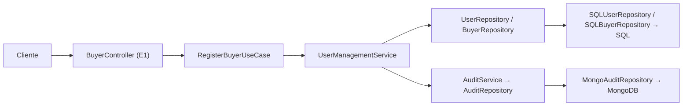
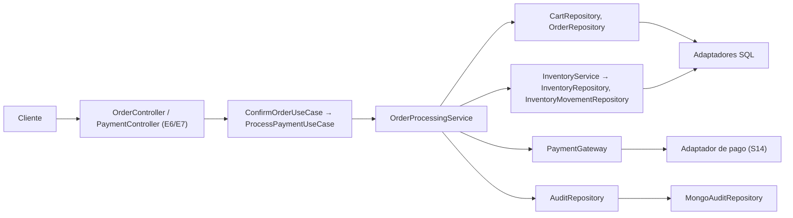
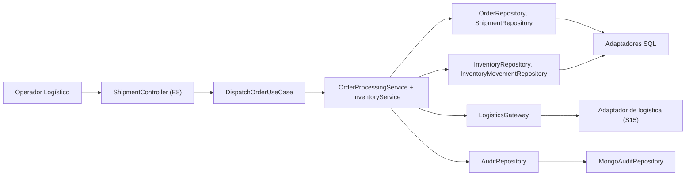

# Trazabilidad de la capa de adaptadores

## 1. Propósito

Establecer la trazabilidad completa entre:

```text
Caso de uso (Input Port)
      ↓
Adaptador de entrada
      ↓
Servicio de dominio
      ↓
Output Ports
      ↓
Adaptadores de salida
      ↓
Tecnología
```

Cada eslabón se refiere a un documento existente del repositorio. Nada de esta matriz fue
inventado: cuando la documentación no define una relación, se indica explícitamente como
**pendiente**.

## 2. Matriz principal: caso de uso → adaptadores

### 2.1 Administración de usuarios

| Caso de uso | Adaptador de entrada | Servicio | Output Ports | Adaptadores de salida |
|---|---|---|---|---|
| `RegisterBuyerUseCase` | `BuyerController` (E1) | `UserManagementService` | `UserRepository`, `BuyerRepository`, `AuditRepository` | `SQLUserRepository`, `SQLBuyerRepository`, `MongoAuditRepository` |
| `OnboardSellerUseCase` | `SellerController` (E1) | `UserManagementService` | `UserRepository` (unicidad), `SellerRepository`, `AuditRepository`; `WarehouseRepository` si se registra la primera bodega | `SQLUserRepository`, `SQLSellerRepository`, `SQLWarehouseRepository`, `MongoAuditRepository` |
| `UpdateUserAccessStatusUseCase` | `UserController` (E1) | `UserManagementService` | `UserRepository`, `AuditRepository` | `SQLUserRepository`, `MongoAuditRepository` |

Flujo documentado del registro (`Input-Ports.md`, §9.1):

```text
BuyerController → RegisterBuyerUseCase → UserManagementService
                                              ├── UserRepository
                                              └── AuditRepository
```

### 2.2 Bodegas y catálogo

| Caso de uso | Adaptador de entrada | Servicio | Output Ports | Adaptadores de salida |
|---|---|---|---|---|
| `CreateWarehouseUseCase` | `WarehouseController` (E2) | **Pendiente de definición:** `Input-Ports.md` (§10) no asigna el caso de uso a un servicio; `InventoryService` incluye `Warehouse` entre sus entidades | `WarehouseRepository` | `SQLWarehouseRepository` |
| `CreateProductUseCase` | `ProductController` (E3) | `CatalogService` | `ProductRepository`, `SellerRepository`, `AuditRepository` | `SQLProductRepository`, `SQLSellerRepository`, `MongoAuditRepository` |
| `UpdateProductStatusUseCase` | `ProductController` (E3) | `CatalogService` | `ProductRepository`, `AuditRepository` | `SQLProductRepository`, `MongoAuditRepository` |

### 2.3 Inventario

| Caso de uso | Adaptador de entrada | Servicio | Output Ports | Adaptadores de salida |
|---|---|---|---|---|
| `ReplenishStockUseCase` | `InventoryController` (E4) | `InventoryService` | `InventoryRepository`, `InventoryMovementRepository`, `WarehouseRepository`, `ProductRepository` (variante), `AuditRepository` | `SQLInventoryRepository`, `SQLInventoryMovementRepository`, `SQLWarehouseRepository`, `SQLProductRepository`, `MongoAuditRepository` |
| `ReserveInventoryUseCase` | **Sin adaptador de entrada** (caso de uso interno del flujo de pedido) | `InventoryService` | `InventoryRepository`, `InventoryMovementRepository`, `OrderRepository` (contexto del pedido), `AuditRepository` | `SQLInventoryRepository`, `SQLInventoryMovementRepository`, `SQLOrderRepository`, `MongoAuditRepository` |
| `DispatchInventoryUseCase` | `InventoryController` (E4) | `InventoryService` | `InventoryRepository`, `InventoryMovementRepository`, `OrderRepository`, `AuditRepository` | `SQLInventoryRepository`, `SQLInventoryMovementRepository`, `SQLOrderRepository`, `MongoAuditRepository` |

### 2.4 Carrito

| Caso de uso | Adaptador de entrada | Servicio | Output Ports | Adaptadores de salida |
|---|---|---|---|---|
| `AddItemToCartUseCase` | `CartController` (E5) | `OrderProcessingService` | `CartRepository`, `BuyerRepository` (pertenencia), `ProductRepository` (variante válida), `InventoryRepository` (disponibilidad) | `SQLCartRepository`, `SQLBuyerRepository`, `SQLProductRepository`, `SQLInventoryRepository` |
| `RemoveItemFromCartUseCase` | `CartController` (E5) | `OrderProcessingService` | `CartRepository` | `SQLCartRepository` |
| `ConfirmCartUseCase` | `CartController` (E5) | `OrderProcessingService` | `CartRepository`, `OrderRepository`, `ProductRepository` | `SQLCartRepository`, `SQLOrderRepository`, `SQLProductRepository` |

### 2.5 Pedidos

| Caso de uso | Adaptador de entrada | Servicio | Output Ports | Adaptadores de salida |
|---|---|---|---|---|
| `ConfirmOrderUseCase` | `OrderController` (E6) | `OrderProcessingService` | `OrderRepository`, `CartRepository`, `InventoryRepository`, `PaymentGateway`, `AuditRepository` | `SQLOrderRepository`, `SQLCartRepository`, `SQLInventoryRepository`, adaptador de pago (S14), `MongoAuditRepository` |
| `GetOrderUseCase` | `OrderController` (E6) | `OrderProcessingService` (consulta) | `OrderRepository` | `SQLOrderRepository` |
| `UpdateOrderStatusUseCase` | `OrderController` (E6) | `OrderProcessingService` | `OrderRepository`, `AuditRepository` | `SQLOrderRepository`, `MongoAuditRepository` |

Flujo documentado de confirmación (`Input-Ports.md`, §22):

```text
ConfirmOrderUseCase → OrderProcessingService
                          ├── CartRepository
                          ├── OrderRepository
                          ├── InventoryRepository
                          ├── PaymentGateway
                          └── AuditRepository
```

### 2.6 Pago y facturación

| Caso de uso | Adaptador de entrada | Servicio | Output Ports | Adaptadores de salida |
|---|---|---|---|---|
| `ProcessPaymentUseCase` | `PaymentController` (E7) | `OrderProcessingService` | `PaymentGateway`, `OrderRepository`, `InventoryRepository` (reserva posterior a la aprobación), `AuditRepository` | Adaptador de pago (S14), `SQLOrderRepository`, `SQLInventoryRepository`, `MongoAuditRepository` |
| `CreateInvoiceUseCase` | `InvoiceController` (E7) | **Pendiente de definición** (el actor documentado es "Sistema") | `InvoiceRepository` **o** `BillingGateway` (decisión abierta, `Output-Ports.md` §9) | `SQLInvoiceRepository` (S10) **o** adaptador de facturación externa (S16) |

### 2.7 Logística y envíos

| Caso de uso | Adaptador de entrada | Servicio | Output Ports | Adaptadores de salida |
|---|---|---|---|---|
| `CreateShipmentUseCase` | `ShipmentController` (E8) | `OrderProcessingService` | `ShipmentRepository`, `LogisticsGateway`, `OrderRepository` | `SQLShipmentRepository`, adaptador de logística (S15), `SQLOrderRepository` |
| `DispatchOrderUseCase` | `ShipmentController` (E8) | `OrderProcessingService` + `InventoryService` | `InventoryRepository`, `InventoryMovementRepository`, `ShipmentRepository`, `OrderRepository`, `LogisticsGateway`, `AuditRepository` | `SQLInventoryRepository`, `SQLInventoryMovementRepository`, `SQLShipmentRepository`, `SQLOrderRepository`, adaptador de logística (S15), `MongoAuditRepository` |
| `ConfirmDeliveryUseCase` | `ShipmentController` (E8) | `OrderProcessingService` | `ShipmentRepository`, `OrderRepository`, `LogisticsGateway`, `AuditRepository` | `SQLShipmentRepository`, `SQLOrderRepository`, adaptador de logística (S15), `MongoAuditRepository` |

Relación documentada de `DispatchOrderUseCase` (`Input-Ports.md`, §16.2):

```text
DispatchOrderUseCase
        ├── InventoryService
        ├── InventoryRepository
        ├── ShipmentRepository
        └── LogisticsGateway
```

### 2.8 Devoluciones y reembolsos

| Caso de uso | Adaptador de entrada | Servicio | Output Ports | Adaptadores de salida |
|---|---|---|---|---|
| `RequestReturnUseCase` | `ReturnController` (E9) | **Pendiente de definición:** los servicios documentados no incluyen devoluciones (`Services/OrderProcessingService.md`, §8) | **Pendiente de definición:** no existe entidad `Devolucion` ni puerto asociado | **Ninguno documentado** |
| `ApproveReturnUseCase` | `ReturnController` (E9) | **Pendiente de definición** | **Pendiente de definición** | **Ninguno documentado** |
| `ProcessRefundUseCase` | `RefundController` (E9) | **Pendiente de definición**; el reembolso se comunica con el proveedor financiero | `PaymentGateway` (`Input-Ports.md`, §18.1) | Adaptador de pago (S14) |

### 2.9 Reportes y auditoría

| Caso de uso | Adaptador de entrada | Servicio | Output Ports | Adaptadores de salida |
|---|---|---|---|---|
| `GenerateAdministrativeReportUseCase` | `ReportController` (E10) | Consulta de lectura (sin servicio de modificación) | `ReportingQuery` | `SQLReportingQueryAdapter` (S12) |
| `QueryAuditLogUseCase` | `AuditController` (E11) | `AuditService` (consulta) | `AuditRepository` | `MongoAuditRepository` (S13) |

`Input-Ports.md` (§19 y §20) confirma que estos casos de uso son de consulta y que la escritura de
auditoría no se expone como operación arbitraria.

---

## 3. Matriz: Output Port → adaptador → tecnología

| # | Output Port | Adaptador | Tecnología | Estado | Documento |
|---|---|---|---|---|---|
| 1 | `UserRepository` | `SQLUserRepository` | SQL | Definido | `output/sql-adapters.md` §3.1 |
| 2 | `SellerRepository` | `SQLSellerRepository` | SQL | Definido | `output/sql-adapters.md` §3.2 |
| 3 | `BuyerRepository` | `SQLBuyerRepository` | SQL | Definido | `output/sql-adapters.md` §3.3 |
| 4 | `ProductRepository` | `SQLProductRepository` | SQL | Definido | `output/sql-adapters.md` §3.4 |
| 5 | `WarehouseRepository` | `SQLWarehouseRepository` | SQL | Definido | `output/sql-adapters.md` §3.5 |
| 6 | `InventoryRepository` | `SQLInventoryRepository` | SQL | Definido | `output/sql-adapters.md` §3.6 |
| 7 | `InventoryMovementRepository` | `SQLInventoryMovementRepository` | SQL | Definido | `output/sql-adapters.md` §3.7 |
| 8 | `CartRepository` | `SQLCartRepository` | SQL | Definido | `output/sql-adapters.md` §3.8 |
| 9 | `OrderRepository` | `SQLOrderRepository` | SQL | Definido | `output/sql-adapters.md` §3.9 |
| 10 | `InvoiceRepository` | `SQLInvoiceRepository` | SQL | Condicional (decisión abierta) | `output/sql-adapters.md` §3.10 |
| 11 | `ShipmentRepository` | `SQLShipmentRepository` | SQL | Definido | `output/sql-adapters.md` §3.11 |
| 12 | `AuditRepository` | `MongoAuditRepository` | MongoDB | Definido | `output/mongodb-adapters.md` |
| 13 | `PaymentGateway` | Adaptador de pasarela de pago (S14) | Proveedor externo | Condicionado al proveedor | `output/external-service-adapters.md` §4.1 |
| 14 | `BillingGateway` | Adaptador de facturación externa (S16) | Proveedor externo | Condicional | `output/external-service-adapters.md` §4.3 |
| 15 | `LogisticsGateway` | Adaptador de logística (S15) | Proveedor externo | Condicionado al proveedor | `output/external-service-adapters.md` §4.2 |
| 16 | `ReportingQuery` | `SQLReportingQueryAdapter` | SQL (solo lectura) | Definido | `output/sql-adapters.md` §3.12 |
| 17 | `IdentityProvider` | Adaptador de proveedor de identidad (S17) | Servicio de identidad | Condicional | `output/external-service-adapters.md` §4.4 |

**Cobertura:** los 17 Output Ports de la matriz de `Output-Ports.md` (§27) tienen al menos un
adaptador documentado. Cuatro de ellos (`InvoiceRepository`, `BillingGateway`, `IdentityProvider` y
el detalle del proveedor de pago/logística) quedan **condicionados a decisiones pendientes**.

---

## 4. Matriz: input port → adaptador de entrada

| Adaptador de entrada | Controllers | Input Ports | Actor documentado |
|---|---|---|---|
| E1 | `BuyerController`, `SellerController`, `UserController` | `RegisterBuyerUseCase`, `OnboardSellerUseCase`, `UpdateUserAccessStatusUseCase` | Comprador, Administrador |
| E2 | `WarehouseController` | `CreateWarehouseUseCase` | Administrador / Vendedor |
| E3 | `ProductController` | `CreateProductUseCase`, `UpdateProductStatusUseCase` | Vendedor / Administrador |
| E4 | `InventoryController` | `ReplenishStockUseCase`, `DispatchInventoryUseCase` | Vendedor / Operador Logístico |
| E5 | `CartController` | `AddItemToCartUseCase`, `RemoveItemFromCartUseCase`, `ConfirmCartUseCase` | Comprador |
| E6 | `OrderController` | `ConfirmOrderUseCase`, `GetOrderUseCase`, `UpdateOrderStatusUseCase` | Comprador / roles autorizados |
| E7 | `PaymentController`, `InvoiceController` | `ProcessPaymentUseCase`, `CreateInvoiceUseCase` | Flujo comercial / Sistema |
| E8 | `ShipmentController` | `CreateShipmentUseCase`, `DispatchOrderUseCase`, `ConfirmDeliveryUseCase` | Sistema / Operador Logístico |
| E9 | `ReturnController`, `RefundController` | `RequestReturnUseCase`, `ApproveReturnUseCase`, `ProcessRefundUseCase` | Comprador / Vendedor / flujo autorizado |
| E10 | `ReportController` | `GenerateAdministrativeReportUseCase` | Supervisor |
| E11 | `AuditController` | `QueryAuditLogUseCase` | Supervisor |
| E12 | (soporte) | Request DTOs de todos los casos de uso con comando | — |
| E13 | (soporte) | Response DTOs de los casos de uso con salida | — |
| E14 | (soporte) | Mappers DTO → comando | — |
| E15 | (transversal) | Genera el `ExecutionContext` para todos los Input Ports | Todos |

**Cobertura:** 23 de los 24 Input Ports documentados tienen adaptador de entrada. El único sin
controller es `ReserveInventoryUseCase`, por tratarse de un caso de uso interno del flujo de pedido
(`Input-Ports.md`, §21).

---

## 5. Cadenas de trazabilidad completas

### 5.1 Registro de comprador



### 5.2 Confirmación de pedido y pago



### 5.3 Despacho de un pedido



### 5.4 Consulta de trazabilidad


---

## 6. Verificación de trazabilidad por adaptador

Cada adaptador responde a las cuatro preguntas de trazabilidad:

| Adaptador | ¿Qué problema resuelve? | ¿Qué puerto usa? | ¿Qué servicio/caso de uso interviene? | ¿Qué tecnología conecta? |
|---|---|---|---|---|
| `BuyerController` (E1) | Exponer el registro de compradores por HTTP | `RegisterBuyerUseCase` | `UserManagementService` | HTTP |
| `SellerController` (E1) | Exponer la incorporación de vendedores | `OnboardSellerUseCase` | `UserManagementService` | HTTP |
| `UserController` (E1) | Exponer el cambio de estado de usuario | `UpdateUserAccessStatusUseCase` | `UserManagementService` | HTTP |
| `WarehouseController` (E2) | Exponer el registro de bodegas | `CreateWarehouseUseCase` | Pendiente de definición | HTTP |
| `ProductController` (E3) | Exponer publicación y estado del producto | `CreateProductUseCase`, `UpdateProductStatusUseCase` | `CatalogService` | HTTP |
| `InventoryController` (E4) | Exponer reabastecimiento y salida de inventario | `ReplenishStockUseCase`, `DispatchInventoryUseCase` | `InventoryService` | HTTP |
| `CartController` (E5) | Exponer la gestión del carrito | `AddItemToCartUseCase`, `RemoveItemFromCartUseCase`, `ConfirmCartUseCase` | `OrderProcessingService` | HTTP |
| `OrderController` (E6) | Exponer consulta y transiciones del pedido | `GetOrderUseCase`, `ConfirmOrderUseCase`, `UpdateOrderStatusUseCase` | `OrderProcessingService` | HTTP |
| `PaymentController` (E7) | Exponer el procesamiento del pago | `ProcessPaymentUseCase` | `OrderProcessingService` | HTTP |
| `InvoiceController` (E7) | Exponer la generación de facturación | `CreateInvoiceUseCase` | Pendiente de definición | HTTP |
| `ShipmentController` (E8) | Exponer envío, despacho y entrega | `CreateShipmentUseCase`, `DispatchOrderUseCase`, `ConfirmDeliveryUseCase` | `OrderProcessingService`, `InventoryService` | HTTP |
| `ReturnController` / `RefundController` (E9) | Exponer devoluciones y reembolsos | `RequestReturnUseCase`, `ApproveReturnUseCase`, `ProcessRefundUseCase` | Pendiente de definición | HTTP |
| `ReportController` (E10) | Exponer reportes administrativos | `GenerateAdministrativeReportUseCase` | Consulta de lectura | HTTP |
| `AuditController` (E11) | Exponer la consulta de trazabilidad | `QueryAuditLogUseCase` | `AuditService` | HTTP |
| E12 / E13 / E14 | Separar el modelo HTTP del modelo de aplicación | — | Todos los casos de uso expuestos | — |
| E15 | Resolver identidad y rol | — | Todos los Input Ports | Mecanismo pendiente |

| `SQL*Repository` (S1–S11) | Persistir los datos transaccionales | Repositorios de `Output-Ports.md` §27 | Todos los servicios | SQL |
| `SQLReportingQueryAdapter` (S12) | Consolidar información administrativa | `ReportingQuery` | `GenerateAdministrativeReportUseCase` | SQL (lectura) |
| `MongoAuditRepository` (S13) | Preservar la trazabilidad inmutable | `AuditRepository` | `AuditService` | MongoDB |
| Adaptador de pago (S14) | Comunicar con el proveedor financiero | `PaymentGateway` | `OrderProcessingService` | Proveedor externo |
| Adaptador de logística (S15) | Comunicar con el operador logístico | `LogisticsGateway` | `OrderProcessingService` | Proveedor externo |
| Adaptador de facturación (S16) | Emitir facturas en un sistema externo | `BillingGateway` | `CreateInvoiceUseCase` | Proveedor externo |
| Adaptador de identidad (S17) | Validar credenciales externas | `IdentityProvider` | Adaptador de entrada E15 | Proveedor de identidad |
| Unidad de trabajo (S18) | Garantizar atomicidad entre puertos SQL | — | Operaciones de inventario, pedido y pago | SQL |

---

## 7. Elementos sin trazabilidad completa

| Elemento | Motivo |
|---|---|
| Servicio y puertos de `CreateWarehouseUseCase` | `Input-Ports.md` (§10) no asigna servicio |
| Servicio y puertos de `CreateInvoiceUseCase` | Decisión de facturación pendiente (`Output-Ports.md`, §9) |
| Servicio y puertos de devoluciones y reembolsos | No existen entidad ni servicio documentados |
| Entrada conceptual de `ConfirmOrderUseCase`, `UpdateOrderStatusUseCase`, `ApproveReturnUseCase` y `GetOrderUseCase` | No documentada |
| Endpoints HTTP | No documentados |
| Mecanismo de autenticación | Fuera del alcance de la especificación (`Input-Ports.md`, §8) |
| Proveedores externos | No definidos |
| Entidades `Factura` y `Envio` | Referenciadas por puertos, ausentes del modelo de dominio |

Todos ellos se detallan en `observaciones-arquitectonicas.md`.

---

## 8. Referencias cruzadas

| Tema | Documento |
|---|---|
| Visión general de la capa | `README.md` |
| Arquitectura, reglas de dependencia y decisiones | `architecture.md` |
| Controllers REST | `input/rest-controllers.md` |
| Contratos de entrada | `input/request-dtos.md` |
| Contratos de salida | `input/response-dtos.md` |
| Mappers de entrada | `input/input-mappers.md` |
| Autenticación y contexto | `input/authentication-adapter.md` |
| Persistencia (general) | `output/persistence-adapters.md` |
| Persistencia SQL | `output/sql-adapters.md` |
| Persistencia documental | `output/mongodb-adapters.md` |
| Servicios externos | `output/external-service-adapters.md` |
| Mappers de salida | `mappers/output-mappers.md` |
| Mappers de persistencia | `mappers/persistence-mappers.md` |
| Hallazgos y pendientes | `observaciones-arquitectonicas.md` |


