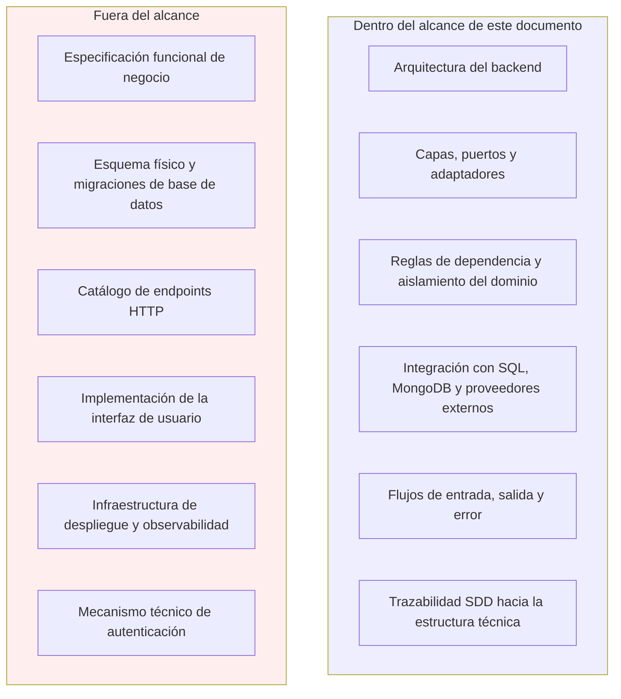
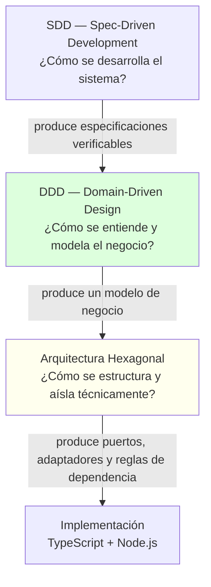
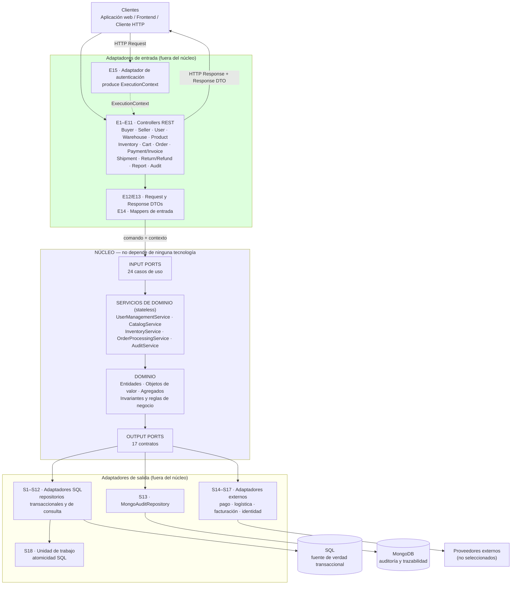
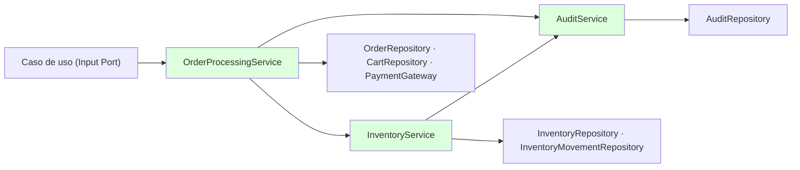
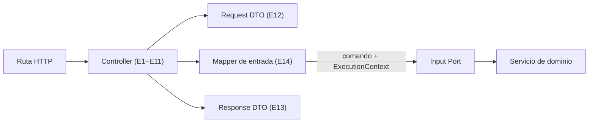
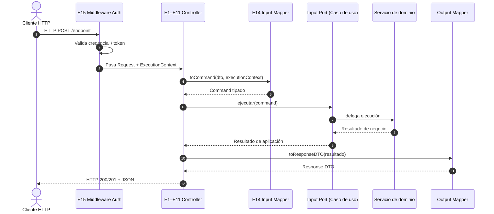

# Software Architecture — NexusMarket

> **Documento central de arquitectura de software de NexusMarket.**
> Define cómo está estructurado técnicamente el sistema, qué responsabilidad tiene cada capa, cómo se
> relacionan dominio, aplicación, puertos y adaptadores, y qué reglas deben respetarse durante la
> implementación.

## Ficha del documento

| Campo | Valor |
|---|---|
| Proyecto | NexusMarket |
| Documento | Especificación arquitectónica central (`Software Architecture.md`) |
| Alcance | Arquitectura de software del backend de NexusMarket |
| Estado | Definido a partir de la documentación SDD existente; contiene decisiones pendientes explícitas |
| Lenguaje de implementación | TypeScript |
| Runtime | Node.js |
| Arquitectura | Hexagonal (Ports & Adapters) + DDD |
| Estilo inicial | Monolito Modular (Modular Monolith) |
| Entrada principal | REST API sobre HTTP |
| Persistencia | SQL (fuente de verdad transaccional) + MongoDB (auditoría y trazabilidad) |
| Enfoque de desarrollo | Spec-Driven Development (SDD) |
| Idioma del documento | Español |

## Documentación analizada

Toda afirmación de este documento se deriva de los siguientes archivos existentes del repositorio.
No se introdujeron entidades, puertos, adaptadores, tecnologías ni procesos que no estén documentados.

| Documento | Ruta real | Aporte arquitectónico |
|---|---|---|
| Modelo de dominio | `SDD/Domain/DomainModel .md` | Entidades, jerarquías, relaciones, invariantes y límites del modelo |
| Objetos de valor | `SDD/Domain/Domain Object Value.md` | Catálogos controlados (`SystemRole`, `EstadoPedido`, `TipoMovimientoInventario`, etc.) |
| Servicios de dominio | `SDD/Domain/Domain  Servicies.md` | Servicios, operaciones, precondiciones, invariantes globales |
| Servicios (detalle) | `SDD/Domain/Services/*.md` | `UserManagementService`, `CatalogService`, `InventoryService`, `OrderProcessingService`, `AuditService` |
| Input Ports | `SDD/Domain/Input-Ports.md` | 24 casos de uso, `ExecutionContext`, flujo de solicitud, reglas IP-01…IP-10, decisión arquitectónica |
| Output Ports | `SDD/Domain/Output-Ports.md` | 17 puertos, reglas OP-01…OP-10, SQL como fuente de verdad, MongoDB para auditoría, transacciones |
| Arquitectura de adaptadores | `SDD/Adapters/architecture.md` | Capa de adaptadores, criterios, reglas de dependencia, decisiones 1–6 |
| Visión general de adaptadores | `SDD/Adapters/README.md` | Catálogo resumido de adaptadores E1–E15 y S1–S18 |
| Trazabilidad | `SDD/Adapters/trazabilidad.md` | Correspondencia caso de uso ↔ adaptador ↔ servicio ↔ puerto ↔ tecnología |
| Hallazgos | `SDD/Adapters/observaciones-arquitectonicas.md` | Vacíos e inconsistencias O-01…O-18 y prioridades |
| Adaptadores de entrada | `SDD/Adapters/input/*.md` | `rest-controllers.md`, `request-dtos.md`, `response-dtos.md`, `input-mappers.md`, `authentication-adapter.md` |
| Adaptadores de salida | `SDD/Adapters/output/*.md` | `persistence-adapters.md`, `sql-adapters.md`, `mongodb-adapters.md`, `external-service-adapters.md` |
| Mappers | `SDD/Adapters/mappers/*.md` | `output-mappers.md`, `persistence-mappers.md` |

### Correspondencia con la nomenclatura solicitada

La estructura real del repositorio agrupa la especificación bajo `SDD/`. La equivalencia es:

| Nomenclatura genérica | Ubicación real en NexusMarket |
|---|---|
| `domain/` | `SDD/Domain/` |
| `services/` | `SDD/Domain/Domain  Servicies.md` + `SDD/Domain/Services/` |
| `input-ports/` | `SDD/Domain/Input-Ports.md` |
| `output-ports/` | `SDD/Domain/Output-Ports.md` |
| `adapters/` | `SDD/Adapters/` |
| Documento de arquitectura | `SDD/Software Architecture/Software Architecture.md` (este documento) |

**Nota:** el repositorio contiene únicamente documentación de especificación (`.md`). **No existe código
fuente, `package.json` ni configuración de proyecto**. Por lo tanto, todo lo referido a estructura de
carpetas de código es una **propuesta documental**, no una implementación existente.

---

# 1. Introducción

**NexusMarket** es una aplicación web de tipo *marketplace* que centraliza la operación comercial entre
compradores y vendedores: registro de usuarios, incorporación administrativa de vendedores, catálogo y
variantes, inventario distribuido por bodegas, carrito, pedidos, pago, facturación, logística, envíos,
devoluciones, reembolsos, reportes administrativos y auditoría.

Este documento es la **especificación arquitectónica central** del proyecto. Su función es explicar
cómo el sistema se organiza técnicamente para poder cumplir lo que las especificaciones funcionales ya
definen. Responde, entre otras, a estas preguntas:

- ¿Qué arquitectura utiliza NexusMarket y por qué fue elegida?
- ¿Cómo se relacionan SDD, DDD y Arquitectura Hexagonal sin confundirse entre sí?
- ¿Qué responsabilidad tiene cada capa y qué dependencias puede tener?
- ¿Cómo fluye una petición desde el cliente hasta una base de datos y regresa?
- ¿Cómo conviven SQL y MongoDB sin acoplar el negocio a ninguna de las dos?
- ¿Qué papel cumplen TypeScript y Node.js, y qué papel **no** cumplen?
- ¿Qué reglas deben respetarse durante la implementación y qué queda pendiente de decisión?

### A quién está dirigido

A los desarrolladores que implementarán NexusMarket, a quienes evaluarán el diseño y a quienes
mantendrán la documentación SDD. Se asume familiaridad con TypeScript, HTTP y conceptos básicos de
bases de datos relacionales y documentales.

### Qué es y qué no es este documento

| Es | No es |
|---|---|
| La descripción de la arquitectura y de las reglas estructurales del sistema | Una especificación funcional de negocio (esa función la cumplen `Input-Ports.md` y el modelo de dominio) |
| La justificación de las decisiones arquitectónicas adoptadas | Un manual de instalación, despliegue o esquema físico de base de datos |
| La trazabilidad entre especificación, puertos, adaptadores y tecnología | Un catálogo de endpoints HTTP (pendiente de definición) |
| El registro explícito de los vacíos que la documentación aún no resuelve | Código fuente o pseudoimplementación |

---

# 2. Objetivos de la arquitectura

| # | Objetivo | Cómo lo resuelve la arquitectura de NexusMarket |
|---|---|---|
| OA-01 | **Aislar la lógica de negocio** de HTTP, bases de datos, frameworks y proveedores externos | Arquitectura Hexagonal: el núcleo depende de contratos (puertos), no de tecnologías |
| OA-02 | **Modelar el negocio** con el lenguaje del dominio | DDD: entidades, objetos de valor, servicios *stateless* e invariantes documentadas |
| OA-03 | **Garantizar trazabilidad** entre lo especificado y lo estructurado | SDD: cada caso de uso, puerto y adaptador se refiere a un documento existente |
| OA-04 | **Permitir sustitución tecnológica** sin reescribir el negocio | Output Adapters sustituibles detrás de Output Ports estables |
| OA-05 | **Soportar dos mecanismos de persistencia** sin acoplar el dominio | SQL y MongoDB se exponen mediante puertos distintos con responsabilidades distintas |
| OA-06 | **Facilitar pruebas** sin infraestructura | Adaptadores de prueba (`Fake*`) que implementan los mismos puertos |
| OA-07 | **Evitar dependencias circulares y acoplamiento accidental** | Regla de dependencia única: `Adapter → Port → Application/Domain` |
| OA-08 | **Evitar la invención de componentes** | Ningún adaptador se crea sin un puerto o una necesidad documentada |
| OA-09 | **Permitir crecimiento sin microservicios prematuros** | Estilo inicial: monolito modular con puertos y fronteras claras |
| OA-10 | **Explicitar lo que falta decidir** | Sección 23 «Aspectos pendientes de definición» |

---

# 3. Contexto arquitectónico

## 3.1 Decisión arquitectónica base (derivada de la documentación)

`Input-Ports.md` (§35) y `Output-Ports.md` (§29) fijan de forma explícita la decisión arquitectónica del
proyecto. Este documento la adopta como marco y no la reinterpreta:

```text
Arquitectura:            Hexagonal (Ports and Adapters) + DDD
Estilo inicial:          Modular Monolith (Monolito Modular)
Lenguaje:                TypeScript
Runtime:                 Node.js
Entrada principal:       REST API (HTTP)
Input Adapter:           Controllers
Input Port:              Use Cases (24)
Lógica de negocio:       Application / Domain Services (5 servicios documentados)
Persistencia:            SQL (fuente de verdad transaccional)
Persistencia documental: MongoDB (auditoría y trazabilidad)
Integraciones:           Output Ports + Output Adapters
```

## 3.2 Volumetría documentada del sistema

| Elemento | Cantidad documentada | Fuente |
|---|---|---|
| Casos de uso expuestos (Input Ports) | 24 | `Input-Ports.md` §21 |
| Servicios de dominio | 5 | `Domain  Servicies.md` §2 |
| Output Ports | 17 | `Output-Ports.md` §27 |
| Adaptadores de entrada (controllers REST) | 11 grupos (E1–E11) | `Adapters/architecture.md` §5.1 |
| Adaptadores de soporte de entrada | 4 (E12–E15) | `Adapters/architecture.md` §5.1 |
| Adaptadores de salida SQL | 12 (S1–S12) | `Adapters/architecture.md` §5.2 |
| Adaptador documental (MongoDB) | 1 (S13) | `Adapters/architecture.md` §5.2 |
| Adaptadores de servicios externos | 4 (S14–S17, dos condicionales) | `Adapters/architecture.md` §5.2 |
| Adaptador de infraestructura (unidad de trabajo) | 1 (S18) | `Adapters/architecture.md` §5.2 |

## 3.3 Restricciones de contexto relevantes

1. **No existe código.** El diseño debe poder traducirse a TypeScript sobre Node.js, pero no se asume
   ninguna decisión de framework ni de librería no documentada.
2. **La especificación funcional tiene vacíos** (devoluciones, `Factura`, `Envio`, endpoints,
   autenticación, proveedores). Esos vacíos se documentan como pendientes y **no se rellenan por
   suposición**.
3. **La autenticación está deliberadamente fuera del alcance funcional** (`Input-Ports.md` §8 y §27;
   `Output-Ports.md` §14). La arquitectura solo define **dónde** vive esa responsabilidad.
4. **SQL es autoritativo para lo transaccional** y **MongoDB no debe duplicarlo** (`Output-Ports.md`
   §5, §12, §17).

## 3.4 Alcance arquitectónico



---

# 4. Enfoques y principios utilizados

NexusMarket combina **tres marcos complementarios** que cumplen funciones **distintas**. No son
sinónimos ni alternativas entre sí: cada uno responde a una pregunta diferente.



## 4.1 SDD — Spec-Driven Development

**Función:** definir *cómo* se desarrolla el sistema a partir de especificaciones verificables.

En NexusMarket, el SDD se materializa en la propia carpeta `SDD/`: **la especificación precede a la
implementación y la gobierna**. Cada elemento técnico debe poder rastrearse hasta un documento.

| Concepto SDD | Materialización en NexusMarket |
|---|---|
| **Especificación** | Documentos `DomainModel .md`, `Domain Object Value.md`, `Domain  Servicies.md`, `Input-Ports.md`, `Output-Ports.md` y `SDD/Adapters/*` |
| **Requisitos** | Reglas de negocio e invariantes con código estable: `RG-01`, `RG-02`, `RG-03`, `INV-01`…`INV-03`, `ORD-01`, `USR-01`, `SEL-01`, `AUD-01`, `AUD-02`, `VO-01`…`VO-08` |
| **Trazabilidad** | Matriz caso de uso → adaptador → servicio → Output Port → adaptador de salida → tecnología (`Adapters/trazabilidad.md`) |
| **Contratos** | Input Ports (24 casos de uso), Output Ports (17 contratos), Request DTOs (E12), Response DTOs (E13) |
| **Documentación** | Carpeta `SDD/` como fuente autoritativa; este documento describe su traducción arquitectónica |
| **Relación especificación ↔ implementación** | Ninguna operación se implementa si no está especificada; si falta, se registra como **pendiente de definición** (hallazgos O-01…O-18) |

### Regla SDD de NexusMarket

> Una capacidad del sistema debe existir primero como **especificación** (requisito, regla, caso de uso
> o puerto) y solo después como **implementación**. Si la especificación falta, la implementación no se
> inventa: se documenta el vacío.

### Trazabilidad documental ya establecida

`Adapters/trazabilidad.md` demuestra que el principio se aplicó: **23 de los 24 Input Ports** tienen
adaptador de entrada documentado (`ReserveInventoryUseCase` es interno), y **los 17 Output Ports**
tienen al menos un adaptador de salida documentado (cuatro de ellos condicionados a decisiones
pendientes).

## 4.2 DDD — Domain-Driven Design

**Función:** definir *cómo se entiende y modela* el problema del negocio.

DDD aporta el vocabulario y las reglas del negocio independientemente de la tecnología. En NexusMarket
se materializa en `SDD/Domain/`.

### Conceptos DDD presentes en NexusMarket

| Concepto DDD | Aplicación en NexusMarket |
|---|---|
| **Dominio** | Operación comercial del marketplace: usuarios, catálogo, inventario, carrito, pedidos, pagos, envíos, devoluciones, reportes y auditoría |
| **Lenguaje ubicuo** | Términos estables usados por negocio y código: `Pedido`, `Variante`, `Bodega`, `EstadoPedido`, `TipoMovimientoInventario`, `RegistroAuditoria` |
| **Entidades** | `Usuario`, `Comprador`, `Vendedor`, `OperadorLogistico`, `Administrador`, `Supervisor`, `Producto`, `ProductoFisico`, `ProductoDigital`, `Variante`, `Bodega`, `BodegaMarketplace`, `BodegaVendedor`, `Inventario`, `CarritoDeCompras`, `ItemCarrito`, `Pedido`, `ItemPedido`, `MovimientoInventario`, `RegistroAuditoria` |
| **Objetos de valor / catálogos** | `SystemRole`, `EstadoUsuario`, `EstadoComercial`, `EstadoProducto`, `EstadoPedido`, `EstadoPago`, `TipoMovimientoInventario`, `TipoBodega`, `CategoriaProducto`, `GravedadAuditoria`, `MetodoEntrega`, y la abstracción `DomainCatalog` |
| **Agregados persistidos** | `Producto` + `Variante[]`; `Pedido` + `ItemPedido[]`; `CarritoDeCompras` + `ItemCarrito[]`; `Usuario`/`Comprador`/`Vendedor`; `Inventario` + `MovimientoInventario`; `RegistroAuditoria` |
| **Servicios de dominio** | `UserManagementService`, `CatalogService`, `InventoryService`, `OrderProcessingService`, `AuditService` (todos *stateless*) |
| **Reglas de negocio / invariantes** | `cantidadDisponible >= 0`, `cantidadReservada >= 0`; «un pedido finalizado no puede modificarse»; «un vendedor no puede autorregistrarse»; «todo movimiento de inventario debe quedar auditado»; auditoría *append-only* |
| **Límites del dominio** | `DomainModel .md` §15 excluye explícitamente interfaces gráficas, mecanismos técnicos de autenticación, tecnología de implementación y tecnología de almacenamiento |

### Regla DDD de NexusMarket

> El modelo de dominio describe **conceptos y reglas del negocio**. No describe HTTP, motores de base
> de datos, frameworks, protocolos ni mecanismos técnicos.

## 4.3 Arquitectura Hexagonal (Ports & Adapters)

**Función:** definir *cómo se estructura técnicamente* el sistema para aislar el núcleo de las
tecnologías externas.

Es la arquitectura **principal** de NexusMarket. `Input-Ports.md` (§3) y `Output-Ports.md` (§2) la
establecen como marco estructural del proyecto.

### Elementos

| Elemento | Definición en NexusMarket |
|---|---|
| **Núcleo (core)** | Dominio (entidades, objetos de valor, servicios) + aplicación (casos de uso) |
| **Input Ports** | Contratos de entrada: 24 casos de uso (`RegisterBuyerUseCase`, `ConfirmOrderUseCase`, `QueryAuditLogUseCase`, …) |
| **Output Ports** | Contratos de salida: 17 puertos (`UserRepository`, `InventoryRepository`, `AuditRepository`, `PaymentGateway`, `ReportingQuery`, …) |
| **Input Adapters** | Controllers REST (E1–E11), DTOs (E12/E13), mappers de entrada (E14), adaptador de autenticación (E15) |
| **Output Adapters** | Repositorios SQL (S1–S12), `MongoAuditRepository` (S13), adaptadores externos (S14–S17), unidad de trabajo (S18) |
| **Infraestructura** | Configuración, composición (*wiring*), cadenas de conexión, credenciales, arranque de la aplicación |

### Dirección de la dependencia

```text
Adaptador  ──►  Puerto  ──►  Aplicación / Dominio
```

Siempre hacia el interior. Nunca al revés.

### Por qué se eligió esta arquitectura

| Razón | Explicación concreta en NexusMarket |
|---|---|
| Aislamiento del negocio | El dominio contiene reglas como «un pedido finalizado no puede modificarse» y no puede depender de SQL ni de Express |
| Dos tecnologías de persistencia | SQL y MongoDB conviven porque el núcleo solo conoce contratos; cada tecnología implementa su contrato |
| Proveedores externos no elegidos | `PaymentGateway` y `LogisticsGateway` permiten avanzar con adaptadores de prueba y sustituirlos después |
| Testabilidad | Los adaptadores `Fake*` implementan los mismos puertos, por lo que el núcleo se prueba sin infraestructura |
| Evolución | Cambiar de motor SQL, de framework HTTP o de proveedor solo afecta a un adaptador |
| Trazabilidad SDD | Cada puerto y adaptador se corresponde con un documento de especificación |

## 4.4 Cómo se complementan (y en qué se diferencian)

```text
SDD
 │  Define y guía las especificaciones
 │  Herramienta: contratos, reglas verificables, trazabilidad
 ▼
DDD
 │  Define y modela el dominio
 │  Herramienta: entidades, objetos de valor, servicios, invariantes
 ▼
Arquitectura Hexagonal
 │  Define cómo se estructura y aísla técnicamente
 │  Herramienta: puertos, adaptadores, inversión de dependencias
 ▼
Implementación (TypeScript sobre Node.js)
```

| Pregunta | Marco que la responde |
|---|---|
| ¿Qué debe hacer el sistema? | SDD (especificaciones) + DDD (reglas de negocio) |
| ¿Con qué conceptos se expresa? | DDD (lenguaje ubicuo, modelo de dominio) |
| ¿Cómo se organiza el código para que el negocio no se acople? | Arquitectura Hexagonal |
| ¿Cómo se verifica que la implementación corresponde a lo especificado? | SDD (trazabilidad) |
| ¿Con qué tecnología se ejecuta? | TypeScript + Node.js (herramientas, no arquitectura) |

> **Importante:** SDD, DDD y Arquitectura Hexagonal **no son lo mismo**. SDD es un enfoque de
> desarrollo; DDD es un enfoque de modelado; la Arquitectura Hexagonal es un estilo estructural. Los
> tres se combinan en NexusMarket, pero cada uno responde a una pregunta distinta.

---

# 5. Arquitectura general

## 5.1 Diagrama de arquitectura de NexusMarket

Adaptación del diagrama conceptual a los componentes **reales** documentados (E1–E15, S1–S18, 24 Input
Ports, 17 Output Ports y 5 servicios de dominio).



## 5.2 Lectura del diagrama

1. **Las dependencias entran al núcleo.** Ningún componente del núcleo conoce HTTP, SQL, MongoDB ni
   SDK de proveedores.
2. **Los adaptadores no se conocen entre sí.** La colaboración entre límites externos se coordina en
   los servicios de dominio, nunca entre adaptadores.
3. **SQL y MongoDB son destinos distintos de puertos distintos.** `AuditRepository` es el único puerto
   asignado a MongoDB; los repositorios transaccionales y `ReportingQuery` se resuelven con SQL.
4. **El `ExecutionContext` cruza el sistema como dato, no como tecnología.** E15 resuelve `{userId, role}`
   y no filtra el mecanismo de autenticación al núcleo.
5. **La respuesta sale por el mismo camino, traducida.** El resultado del caso de uso se convierte en
   Response DTO en el adaptador de entrada.

## 5.3 Regla estructural única

```text
Adapter ──► Port ──► Application / Domain
```

`Adapters/architecture.md` (§3) la declara «única y sin excepciones».

## 5.4 Estilo: monolito modular

NexusMarket se organiza inicialmente como **monolito modular**. Esto significa:

| Implicación | Detalle |
|---|---|
| Un único proceso desplegable | Una sola aplicación Node.js con todos los módulos funcionales |
| Módulos con fronteras explícitas | Usuarios, bodegas, catálogo, inventario, carrito, pedidos, pago/facturación, logística, devoluciones/reembolsos, reportes y auditoría |
| Sin microservicios en esta etapa | No hay puertos ni requisitos documentados que justifiquen servicios distribuidos |
| Fronteras preparadas para extracción futura | Los puertos ya separan responsabilidades (persistencia, auditoría, servicios externos, consultas) |
| Una sola base SQL autoritativa | Evita consistencia distribuida en esta etapa |

---

# 6. Capas y componentes

## 6.0 Vista general de responsabilidades

| Capa / componente | Responde a | Ubicación documental | Tecnología permitida |
|---|---|---|---|
| **Domain** | ¿Qué es y qué reglas tiene el negocio? | `SDD/Domain/DomainModel .md`, `Domain Object Value.md`, `Domain  Servicies.md`, `Services/*` | TypeScript puro |
| **Application** | ¿Qué operaciones puede solicitar el exterior y cómo se orquestan? | `SDD/Domain/Input-Ports.md` | TypeScript puro |
| **Input Ports** | Contratos de los casos de uso | `SDD/Domain/Input-Ports.md` | TypeScript (interfaces) |
| **Output Ports** | ¿Qué necesita el sistema del exterior? | `SDD/Domain/Output-Ports.md` | TypeScript (interfaces) |
| **Input Adapters** | ¿Cómo llega la solicitud? | `SDD/Adapters/input/*` | HTTP, REST, framework, DTOs |
| **Output Adapters** | ¿Cómo se satisface la necesidad? | `SDD/Adapters/output/*` | SQL, MongoDB, SDK de proveedores |
| **Infrastructure** | Composición y configuración | `Adapters/architecture.md` §10 | Configuración, credenciales, arranque |

## 6.1 Domain

### Responsabilidad

Contener el **modelo de negocio** de NexusMarket: qué conceptos existen, cómo se relacionan, qué
estados son válidos y qué reglas no pueden violarse.

### Qué contiene (documentado)

| Elemento | Contenido real |
|---|---|
| **Entidades** | `Usuario` (abstracta), `Comprador`, `UsuarioAdministrativo` (abstracta), `Vendedor`, `OperadorLogistico`, `Administrador`, `Supervisor`, `Producto` (abstracta), `ProductoFisico`, `ProductoDigital`, `Variante`, `Bodega` (abstracta), `BodegaMarketplace`, `BodegaVendedor`, `Inventario`, `CarritoDeCompras`, `ItemCarrito`, `Pedido`, `ItemPedido`, `MovimientoInventario`, `RegistroAuditoria` |
| **Objetos de valor / catálogos** | `DomainCatalog` (`codigo`, `nombre`, `descripcion`), `SystemRole`, `EstadoUsuario`, `EstadoComercial`, `EstadoProducto`, `EstadoPedido`, `EstadoPago`, `TipoMovimientoInventario`, `TipoBodega`, `CategoriaProducto`, `GravedadAuditoria`, `MetodoEntrega` |
| **Reglas e invariantes** | `RG-01`…`RG-03`, `INV-01`…`INV-03`, `ORD-01`, `USR-01`, `SEL-01`, `AUD-01`, `AUD-02`, `VO-01`…`VO-08` |
| **Servicios de dominio** | `UserManagementService`, `CatalogService`, `InventoryService`, `OrderProcessingService`, `AuditService` (todos *stateless*) |
| **Excepciones de dominio** | Los errores documentados con significado de negocio: usuario duplicado, stock insuficiente, estado de pedido inválido, pedido finalizado, operación no autorizada, etc. (`Input-Ports.md` §26; `Services/*.md` §Errores) |

### Qué NO debe contener

- Código HTTP, controladores, rutas ni objetos `Request`/`Response`.
- Consultas SQL, documentos MongoDB, entidades de ORM o esquemas.
- Dependencias de Node.js, Express, Fastify, Prisma, TypeORM, `mongodb`, SDK de proveedores.
- Variables de entorno, cadenas de conexión o credenciales.
- Serialización de respuestas HTTP o DTOs de transporte.
- Transacciones de base de datos (pertenecen a la unidad de trabajo, S18).

### Dependencias permitidas

```text
Dominio ──► Entidades del dominio
Dominio ──► Objetos de valor del dominio
Dominio ──► Contratos (Output Ports)
Dominio ──► Tipos y utilidades de TypeScript
```

### Dependencias prohibidas

```text
Dominio ──► HTTP / REST / JSON
Dominio ──► Express / Fastify / framework HTTP
Dominio ──► SQL (PostgreSQL, SQL Server, MySQL u otro motor)
Dominio ──► MongoDB
Dominio ──► Prisma / TypeORM / librerías de persistencia
Dominio ──► SDK de pago, logística o facturación
Dominio ──► Node.js como detalle de plataforma
Dominio ──► Adaptadores (de entrada o de salida)
```

### Aislamiento verificado

`DomainModel .md` (§15) declara que el modelo **no define** interfaces gráficas, mecanismos técnicos
de autenticación, tecnología de implementación, arquitectura de software ni tecnología de
almacenamiento. `Input-Ports.md` (§5.1) y `Output-Ports.md` (§2, §8.1, §21) confirman la prohibición de
esas dependencias. El dominio de NexusMarket es, por diseño, **independiente de Node.js, Express,
MongoDB, SQL, HTTP, frameworks y APIs externas**.

### Aclaración sobre el lenguaje técnico del modelo

`DomainModel .md` expresa atributos con tipos como `int`, `String`, `BigDecimal`, `LocalDateTime` y
`List<>`. Se trata de **notación descriptiva de especificación**, no de tipos de un lenguaje concreto:
la implementación en TypeScript debe traducir esos conceptos siguiendo las convenciones del lenguaje
(texto, número, fecha, colección) sin alterar la semántica del negocio. El **formato definitivo de
identificadores** (`int` en el modelo frente a `string` en las firmas de los puertos) está **pendiente
de alineación** (hallazgo O-05).

## 6.2 Application / Services

### Responsabilidad

Coordinar la ejecución de las operaciones solicitadas: recibir la intención del exterior, aplicar las
reglas de negocio correspondientes, solicitar los recursos externos necesarios mediante Output Ports y
devolver un resultado comprensible para el adaptador de entrada.

### Terminología en la documentación de NexusMarket

Los documentos de NexusMarket describen esta capa como **«Application / Domain Services»**
(`Input-Ports.md` §3, §22, §24; `Output-Ports.md` §25). La terminología se usa de forma conjunta:

| Concepto | Estado en NexusMarket |
|---|---|
| **Input Ports (casos de uso)** | Definidos y enumerados (24) en `Input-Ports.md` §21 |
| **Servicios de dominio** | Definidos y detallados (5) en `Domain  Servicies.md` y `Services/*.md` |
| **Capa de servicios de aplicación independiente** | **No documentada como artefacto propio.** La orquestación se documenta como la delegación del caso de uso hacia el servicio de dominio |

**Decisión documentada:** el caso de uso define el contrato de entrada y **delega** en el servicio de
dominio; el caso de uso **no** contiene la lógica de negocio. Ejemplo explícito de `Input-Ports.md`
(§22):

```text
ConfirmOrderUseCase              → define la entrada de la aplicación
        │
        ▼
OrderProcessingService           → contiene la lógica de negocio
        │
        ├── CartRepository
        ├── OrderRepository
        ├── InventoryRepository
        ├── PaymentGateway
        └── AuditRepository
```

`Input-Ports.md` (§22, §29-IP-06) es explícito: «Los Input Ports no deben convertirse en una segunda
ubicación para las reglas de negocio».

**Aspecto estructural pendiente:** si durante la implementación se requiere un **Application Service**
explícito (orquestador distinto del servicio de dominio), esa separación debe declararse como decisión
arquitectónica y documentarse; la especificación actual no la introduce, y **no debe inventarse** un
artefacto que no esté respaldado por un documento.

### Servicios documentados

| Servicio | Responsabilidad | Entidades principales |
|---|---|---|
| `UserManagementService` | Registro de compradores, incorporación de vendedores, cambio de estado de acceso | `Usuario`, `Comprador`, `Vendedor`, `Administrador` |
| `CatalogService` | Catálogo, productos, variantes, SKU y estados de publicación | `Producto`, `Variante`, `Vendedor` |
| `InventoryService` | Stock distribuido, reservas, ingresos, salidas y movimientos | `Inventario`, `Bodega`, `Variante`, `MovimientoInventario` |
| `OrderProcessingService` | Checkout, pago y ciclo de vida de pedidos | `Comprador`, `CarritoDeCompras`, `Pedido`, `ItemPedido`, `Inventario` |
| `AuditService` | Registro inmutable de operaciones críticas (transversal) | `RegistroAuditoria`, `Usuario`, `MovimientoInventario` |

### Reglas transversales de los servicios (documentadas)

1. **Autenticación:** toda operación se ejecuta por un usuario autenticado (`RG-01`).
2. **Autorización por rol:** cada operación valida el rol correspondiente (`RG-02`).
3. **Alcance:** ningún usuario administra información fuera de su rol (`RG-03`).
4. **Auditoría:** las operaciones críticas producen trazabilidad (`AUD-01`).
5. **Consistencia:** una operación que modifica varias entidades mantiene las invariantes.
6. **No inventar estados:** solo se usan los estados definidos por el dominio.

### Orquestación y coordinación entre servicios

La coordinación entre servicios documentada es explícita. Ejemplo verificado en
`Services/OrderProcessingService.md` §6 y `Input-Ports.md` §16.2:

```text
Pago aprobado
    → OrderProcessingService.confirmPayment
        → InventoryService.reserveStockForOrder()

Despacho
    → InventoryService.dispatchStock()
        → MovimientoInventario(SALIDA_VENTA)
        → Pedido = DESPACHADO
```



**Regla:** la coordinación entre varios Output Ports corresponde al servicio de dominio; la atomicidad
corresponde a la unidad de trabajo (S18). La coordinación **nunca** ocurre entre adaptadores.

### Dependencias permitidas y prohibidas

| Permitido | Prohibido |
|---|---|
| Servicio de dominio → entidades y objetos de valor | Servicio de dominio → adaptadores concretos |
| Servicio de dominio → Output Ports (contratos) | Servicio de dominio → HTTP, framework o motor de base de datos |
| Servicio de dominio → otros servicios de dominio documentados | Servicio de dominio → `Request`/`Response` del framework HTTP |
| Caso de uso → servicios de dominio y Output Ports | Caso de uso → implementaciones concretas de adaptadores |

## 6.3 Input Ports

### Qué son

Los **contratos de entrada** de la aplicación. Responden a la pregunta **«¿Qué puede hacer
NexusMarket?»** y no a «¿Cómo llega la solicitud?» (`Input-Ports.md` §2).

### Para qué sirven

- Definir los casos de uso disponibles.
- Establecer contratos claros entre los Input Adapters y la lógica de aplicación.
- Evitar que los controladores conozcan la implementación de los servicios.
- Mantener el núcleo independiente del protocolo de entrada.
- Facilitar pruebas sin servidor HTTP.
- Permitir que una misma operación se invoque desde distintos adaptadores (REST hoy; CLI o mensajería
  en el futuro, según `Input-Ports.md` §33).

### Quién los implementa y quién los utiliza

| Rol | Quién |
|---|---|
| **Define el contrato** | La aplicación (núcleo) |
| **Implementa el caso de uso** | La capa de aplicación (delegando en el servicio de dominio) |
| **Consume el contrato** | Los Input Adapters (controllers REST E1–E11) |
| **Nunca lo consume** | El dominio, los Output Adapters, la base de datos |

### Cómo conectan los adaptadores de entrada con los casos de uso



`Input-Ports.md` (§4) describe el ejemplo canónico:

```text
POST /buyers
     │
     ▼
BuyerController
     │
     ▼
RegisterBuyerUseCase
     │
     ▼
UserManagementService
     │
     ├── UserRepository
     └── AuditRepository
```

### Catálogo documentado de Input Ports (24 casos de uso)

| Dominio | Input Port | Actor documentado |
|---|---|---|
| Usuarios | `RegisterBuyerUseCase` | Comprador |
| Usuarios | `OnboardSellerUseCase` | Administrador |
| Usuarios | `UpdateUserAccessStatusUseCase` | Administrador |
| Bodegas | `CreateWarehouseUseCase` | Administrador / Vendedor |
| Catálogo | `CreateProductUseCase` | Vendedor |
| Catálogo | `UpdateProductStatusUseCase` | Vendedor / Administrador |
| Inventario | `ReplenishStockUseCase` | Vendedor / Operador Logístico |
| Inventario | `ReserveInventoryUseCase` | Flujo de pedido (**caso de uso interno**) |
| Inventario | `DispatchInventoryUseCase` | Operador Logístico |
| Carrito | `AddItemToCartUseCase` | Comprador |
| Carrito | `RemoveItemFromCartUseCase` | Comprador |
| Carrito | `ConfirmCartUseCase` | Comprador |
| Pedidos | `ConfirmOrderUseCase` | Comprador |
| Pedidos | `GetOrderUseCase` | Roles autorizados |
| Pedidos | `UpdateOrderStatusUseCase` | Roles autorizados |
| Pago | `ProcessPaymentUseCase` | Flujo comercial |
| Facturación | `CreateInvoiceUseCase` | Sistema |
| Logística | `CreateShipmentUseCase` | Sistema / Operador |
| Logística | `DispatchOrderUseCase` | Operador Logístico |
| Logística | `ConfirmDeliveryUseCase` | Operador Logístico |
| Devoluciones | `RequestReturnUseCase` | Comprador |
| Devoluciones | `ApproveReturnUseCase` | Vendedor |
| Reembolsos | `ProcessRefundUseCase` | Flujo autorizado |
| Reportes | `GenerateAdministrativeReportUseCase` | Supervisor |
| Auditoría | `QueryAuditLogUseCase` | Supervisor |

### Convención de nombres y estructura

```text
Convención:  <Acción><Objeto>UseCase
Correcto:    RegisterBuyerUseCase
Incorrecto:  SaveUserToPostgresUseCase
```

Organización por dominio funcional (`Input-Ports.md` §6): usuarios, vendedores, compradores, bodegas,
catálogo, inventario, carrito, pedidos, facturación, logística, devoluciones, reembolsos, reportes y
auditoría.

### Contexto de ejecución

```text
ExecutionContext
├── userId
└── role
```

Representa la identidad y el rol **ya resueltos por la infraestructura de entrada** (`Input-Ports.md`
§8). Es un **dato**, no un mecanismo: el contrato del caso de uso incluye el contexto sin conocer cómo
se obtuvo.

### Reglas arquitectónicas de los Input Ports (IP-01…IP-10)

| Regla | Contenido |
|---|---|
| IP-01 | Un Input Port representa un caso de uso |
| IP-02 | Los Input Ports no dependen de HTTP (sin `Request`, `Response` ni tipos de framework) |
| IP-03 | Los Input Ports no conocen bases de datos |
| IP-04 | Los Input Ports no contienen detalles de infraestructura |
| IP-05 | Los controladores delegan (no implementan reglas de negocio) |
| IP-06 | Las reglas de negocio permanecen en Domain/Application |
| IP-07 | Los Output Ports se utilizan para dependencias externas |
| IP-08 | Las respuestas no exponen necesariamente entidades internas (Response DTOs) |
| IP-09 | La autorización respeta el contexto del usuario (`RG-01`, `RG-02`, `RG-03`) |
| IP-10 | Los puertos son independientes del mecanismo de autenticación |

## 6.4 Output Ports

### Qué son

Los **contratos mediante los cuales el núcleo solicita recursos del exterior**. Responden a la pregunta
**«¿Qué necesita NexusMarket?»**, sin decir cómo se implementa esa necesidad (`Output-Ports.md` §1, §3).

### Para qué sirven y cómo abstraen la infraestructura

Un Output Port expresa una necesidad en términos del negocio. Ejemplo documentado (`Output-Ports.md`
§3):

```typescript
interface OrderRepository {
    guardar(pedido: Pedido): Promise<void>;
    buscarPorId(id: string): Promise<Pedido | null>;
}
```

El núcleo no conoce PostgreSQL, SQL, Prisma, TypeORM ni MongoDB. La implementación concreta se coloca
detrás del contrato:

```text
OrderRepository
        ^
        |
SQLOrderRepository
        |
        v
   Base de datos SQL
```

Si el motor cambia, el contrato interno permanece estable.

### Quién los implementa y quién los utiliza

| Rol | Quién |
|---|---|
| **Define el contrato** | El núcleo (dominio / aplicación) |
| **Lo consume** | Los servicios de dominio y los casos de uso que necesitan la dependencia |
| **Lo implementa** | Los Output Adapters (S1–S18), fuera del núcleo |
| **Lo inyecta** | La composición de infraestructura al arrancar la aplicación |

### Clasificación documentada (4 grupos)

1. **Persistencia transaccional** → adaptadores SQL.
2. **Auditoría y trazabilidad** → adaptador documental MongoDB.
3. **Servicios externos** → adaptadores externos.
4. **Consulta y reporting** → adaptador de consulta de solo lectura.

### Matriz completa de Output Ports (17) y su implementación inicial

| # | Output Port | Propósito | Implementación documentada | Adaptador |
|---|---|---|---|---|
| 1 | `UserRepository` | Usuarios | SQL | `SQLUserRepository` (S1) |
| 2 | `SellerRepository` | Vendedores | SQL | `SQLSellerRepository` (S2) |
| 3 | `BuyerRepository` | Compradores | SQL | `SQLBuyerRepository` (S3) |
| 4 | `ProductRepository` | Productos y variantes | SQL | `SQLProductRepository` (S4) |
| 5 | `WarehouseRepository` | Bodegas | SQL | `SQLWarehouseRepository` (S5) |
| 6 | `InventoryRepository` | Existencias | SQL | `SQLInventoryRepository` (S6) |
| 7 | `InventoryMovementRepository` | Movimientos de inventario | SQL | `SQLInventoryMovementRepository` (S7) |
| 8 | `CartRepository` | Carritos | SQL | `SQLCartRepository` (S8) |
| 9 | `OrderRepository` | Pedidos | SQL | `SQLOrderRepository` (S9) |
| 10 | `InvoiceRepository` | Facturación propia | SQL (condicional) | `SQLInvoiceRepository` (S10) |
| 11 | `ShipmentRepository` | Envíos propios | SQL | `SQLShipmentRepository` (S11) |
| 12 | `AuditRepository` | Auditoría y trazabilidad | MongoDB | `MongoAuditRepository` (S13) |
| 13 | `PaymentGateway` | Pagos y reembolsos | Servicio externo | adaptador de pago (S14) |
| 14 | `BillingGateway` | Facturación externa, si aplica | Servicio externo (condicional) | adaptador de facturación (S16) |
| 15 | `LogisticsGateway` | Logística | Servicio externo | adaptador de logística (S15) |
| 16 | `ReportingQuery` | Consultas administrativas | SQL / proyección (solo lectura) | `SQLReportingQueryAdapter` (S12) |
| 17 | `IdentityProvider` | Identidad / autenticación, si aplica | Servicio de identidad (condicional) | adaptador de identidad (S17) |

### Características de diseño

| Característica | Detalle |
|---|---|
| **Contrato en términos del dominio** | Los métodos reciben y devuelven entidades y agregados, no filas ni documentos |
| **Separación por responsabilidad** | No existe un repositorio genérico; cada puerto cubre una necesidad concreta |
| **Solo lectura donde corresponde** | `ReportingQuery` no modifica estado (`Output-Ports.md` §13.1); `AuditRepository` es *append-only* |
| **Sustituibilidad** | Cada puerto puede tener varias implementaciones (producción, prueba, proveedor A/B) |
| **Testabilidad** | `Fake*Repository`, `FakeAuditRepository`, `FakePaymentGateway`, `FakeLogisticsGateway` |

### Reglas arquitectónicas de los Output Ports (OP-01…OP-10)

| Regla | Contenido |
|---|---|
| OP-01 | Los ports pertenecen al interior |
| OP-02 | Los adapters implementan los ports |
| OP-03 | El dominio no depende de infraestructura |
| OP-04 | Un port representa una necesidad (no ports genéricos) |
| OP-05 | No filtrar detalles tecnológicos |
| OP-06 | SQL es la fuente de verdad transaccional |
| OP-07 | MongoDB tiene responsabilidad específica (auditoría y trazabilidad) |
| OP-08 | Las operaciones críticas deben ser atómicas |
| OP-09 | Los pedidos finalizados son inmutables (ningún adapter puede saltarse las reglas del dominio) |
| OP-10 | La autorización no depende exclusivamente del controller |

### Vinculación con los servicios

```text
InventoryService ──► InventoryRepository
OrderProcessingService ──► OrderRepository · InventoryRepository · PaymentGateway
AuditService ──► AuditRepository
GenerateAdministrativeReportUseCase ──► ReportingQuery
```

El servicio **nunca** conoce PostgreSQL, MongoDB, SDK de pago ni SDK logístico
(`Output-Ports.md` §25).

## 6.5 Adapters

### Responsabilidad de la capa

Conectar los **límites externos** del sistema (HTTP, SQL, MongoDB, proveedores) con los **contratos
internos** ya definidos, sin contaminar el dominio. Un adaptador **traduce**; no decide reglas de
negocio, no se conoce con otros adaptadores y nunca invierte la dirección de la dependencia
(`Adapters/README.md`; `Adapters/architecture.md` §3, §8).

### Criterio para que un adaptador exista

Un elemento de infraestructura se documenta como adaptador **solo si cumple al menos uno** de estos
criterios (`Adapters/architecture.md` §4):

1. Implementa un Output Port de la matriz de `Output-Ports.md` §27.
2. Consume un Input Port declarado en `Input-Ports.md` §21.
3. Resuelve un límite externo exigido explícitamente (por ejemplo, el `ExecutionContext` o la unidad de
   trabajo transaccional).

Si no cumple ninguno, **no se crea**.

### 6.5.1 Adaptadores de entrada

| # | Adaptador | Tipo | Puerto(s) consumido(s) |
|---|---|---|---|
| E1 | `BuyerController`, `SellerController`, `UserController` | Input Adapter (REST) | `RegisterBuyerUseCase`, `OnboardSellerUseCase`, `UpdateUserAccessStatusUseCase` |
| E2 | `WarehouseController` | Input Adapter (REST) | `CreateWarehouseUseCase` |
| E3 | `ProductController` | Input Adapter (REST) | `CreateProductUseCase`, `UpdateProductStatusUseCase` |
| E4 | `InventoryController` | Input Adapter (REST) | `ReplenishStockUseCase`, `DispatchInventoryUseCase` |
| E5 | `CartController` | Input Adapter (REST) | `AddItemToCartUseCase`, `RemoveItemFromCartUseCase`, `ConfirmCartUseCase` |
| E6 | `OrderController` | Input Adapter (REST) | `GetOrderUseCase`, `ConfirmOrderUseCase`, `UpdateOrderStatusUseCase` |
| E7 | `PaymentController`, `InvoiceController` | Input Adapter (REST) | `ProcessPaymentUseCase`, `CreateInvoiceUseCase` |
| E8 | `ShipmentController` | Input Adapter (REST) | `CreateShipmentUseCase`, `DispatchOrderUseCase`, `ConfirmDeliveryUseCase` |
| E9 | `ReturnController`, `RefundController` | Input Adapter (REST) | `RequestReturnUseCase`, `ApproveReturnUseCase`, `ProcessRefundUseCase` |
| E10 | `ReportController` | Input Adapter (REST) | `GenerateAdministrativeReportUseCase` |
| E11 | `AuditController` | Input Adapter (REST) | `QueryAuditLogUseCase` |
| E12 | Request DTOs | Soporte de entrada | Todos los casos de uso con comando documentado |
| E13 | Response DTOs | Soporte de entrada | Todos los casos de uso con salida documentada |
| E14 | Mappers de entrada | Soporte de entrada | Traducen E12 hacia los comandos de la aplicación |
| E15 | Adaptador de autenticación y contexto | Input Adapter transversal | Produce el `ExecutionContext` para todos los Input Ports |

**Notas documentadas:** los adaptadores E1–E11 agrupan casos de uso del mismo dominio funcional y no se
crean «uno por endpoint». `ReserveInventoryUseCase` no tiene controller: es un caso de uso interno del
flujo de pedido.

### 6.5.2 Adaptadores de salida

| # | Adaptador | Tipo | Puerto implementado |
|---|---|---|---|
| S1 | `SQLUserRepository` | Persistence Adapter (SQL) | `UserRepository` |
| S2 | `SQLSellerRepository` | Persistence Adapter (SQL) | `SellerRepository` |
| S3 | `SQLBuyerRepository` | Persistence Adapter (SQL) | `BuyerRepository` |
| S4 | `SQLProductRepository` | Persistence Adapter (SQL) | `ProductRepository` |
| S5 | `SQLWarehouseRepository` | Persistence Adapter (SQL) | `WarehouseRepository` |
| S6 | `SQLInventoryRepository` | Persistence Adapter (SQL) | `InventoryRepository` |
| S7 | `SQLInventoryMovementRepository` | Persistence Adapter (SQL) | `InventoryMovementRepository` |
| S8 | `SQLCartRepository` | Persistence Adapter (SQL) | `CartRepository` |
| S9 | `SQLOrderRepository` | Persistence Adapter (SQL) | `OrderRepository` |
| S10 | `SQLInvoiceRepository` | Persistence Adapter (SQL) | `InvoiceRepository` (variante condicional) |
| S11 | `SQLShipmentRepository` | Persistence Adapter (SQL) | `ShipmentRepository` |
| S12 | `SQLReportingQueryAdapter` | Query Adapter (solo lectura) | `ReportingQuery` |
| S13 | `MongoAuditRepository` | Persistence Adapter (documental) | `AuditRepository` |
| S14 | Adaptador de pasarela de pago | External Service Adapter | `PaymentGateway` |
| S15 | Adaptador de logística | External Service Adapter | `LogisticsGateway` |
| S16 | Adaptador de facturación externa (condicional) | External Service Adapter | `BillingGateway` |
| S17 | Adaptador de proveedor de identidad (condicional) | External Service Adapter | `IdentityProvider` |
| S18 | Unidad de trabajo / manejador transaccional | Infrastructure Adapter | Mecanismo de atomicidad SQL |

### 6.5.3 Adaptadores de prueba

| Adaptador | Reemplaza a | Propósito |
|---|---|---|
| `Fake*Repository` en memoria | S1–S11 | Pruebas unitarias sin base de datos |
| `FakeAuditRepository` | S13 | Pruebas de generación de trazabilidad |
| `FakePaymentGateway`, `FakeLogisticsGateway` | S14–S15 | Flujo comercial sin proveedores externos |

Son adaptadores **legítimos** de la arquitectura: implementan los mismos puertos, por lo que el núcleo
no distingue entre producción y prueba.

### 6.5.4 Adaptadores evaluados y descartados

| Componente evaluado | Decisión | Justificación documentada |
|---|---|---|
| «HTTP Handlers» separados de los controllers | No se crea | Duplicaría la responsabilidad de E1–E11 |
| Adaptadores GraphQL, gRPC, CLI, colas de mensajes | No se crean | Solo se mencionan como posibilidad futura; no hay puerto ni requisito actual |
| Adaptador SQL Server / MySQL | No se crea | El puerto permanece neutral; PostgreSQL está recomendado, no decidido |
| Segundo adaptador documental para datos transaccionales | No se crea | MongoDB no debe ser segunda fuente autoritativa de los mismos datos |
| Adaptador de notificaciones (correo/SMS) | No se crea | No existe puerto de notificación en la matriz; queda **pendiente de definición** |
| Adaptador de caché, almacenamiento de archivos, entrega digital | No se crean | No existen puertos asociados |

### 6.5.5 DTOs y Mappers

| Elemento | Responsabilidad | Prohibición explícita |
|---|---|---|
| **Request DTO (E12)** | Representar cuerpo, ruta y consulta de la solicitud HTTP | No contiene lógica de negocio; no representa entidades; no acepta `rol`, `estado` ni identificadores ajenos |
| **Response DTO (E13)** | Representar la respuesta pública | No expone entidades completas, `contraseña` ni modelos de persistencia |
| **Mapper de entrada (E14)** | Traducir DTO + `ExecutionContext` → comando de aplicación | No consulta datos, no invoca puertos, no decide reglas de negocio |
| **Mapper de salida** | Traducir resultado del caso de uso → Response DTO | No consulta datos adicionales, no amplía el alcance autorizado |
| **Mapper de persistencia** | Traducir entidad de dominio ↔ fila/documento | No contiene reglas de negocio; no devuelve estructuras de persistencia al núcleo |

### 6.5.6 Composiciones y restricciones entre adaptadores

| Relación | ¿Permitida? | Motivo |
|---|---|---|
| Adaptador → Puerto | **Sí** | Única dirección válida |
| Adaptador → Composición / configuración | **Sí** | Solo para recibir dependencias y parámetros técnicos |
| Controller → Controller | No | La colaboración ocurre mediante casos de uso o servicios |
| Controller → Repositorio | No | El acceso a datos ocurre dentro del servicio, a través del puerto |
| Controller → Servicio de dominio | No | El controller depende del Input Port |
| Repositorio → Repositorio | No | Coordina el servicio; la atomicidad, la unidad de trabajo |
| Repositorio → Gateway externo | No | Son límites distintos; los coordina el servicio de dominio |

---

# 7. Arquitectura de entrada (REST y API)

## 7.1 Protocolo y estilo: HTTP y REST

El mecanismo de entrada primario de NexusMarket es una **API REST sobre HTTP**, consumida por clientes
web, aplicaciones frontend o clientes HTTP automatizados.

| Característica | Especificación en NexusMarket |
|---|---|
| Protocolo | HTTP/1.1 o HTTP/2 sobre TLS |
| Formato de intercambio | JSON UTF-8 |
| Semántica de verbos | `GET` (lectura idempotente), `POST` (creación / acción), `PUT`/`PATCH` (actualización), `DELETE` (eliminación) |
| Códigos de estado HTTP | Mapeo determinista desde excepciones de dominio y aplicación (ver §7.8) |
| Neutralidad del núcleo | El protocolo HTTP termina en los controllers (E1–E11); el núcleo solo recibe comandos tipados |

## 7.2 Controllers como adaptadores (E1–E11)

Un controller en NexusMarket **no es un componente de negocio**. Es un **adaptador de entrada** con un
conjunto cerrado de responsabilidades (`Adapters/input/rest-controllers.md`):

1. **Recibir la solicitud HTTP:** extraer parámetros de ruta, consulta y cuerpo.
2. **Obtener el `ExecutionContext`:** recibir la identidad y el rol ya resueltos por el middleware de
   autenticación (E15).
3. **Instanciar el Request DTO (E12):** validar tipos y estructura sintáctica.
4. **Invocar el Mapper de entrada (E14):** transformar DTO + `ExecutionContext` en el comando del caso
   de uso.
5. **Invocar el Input Port:** llamar al método del caso de uso correspondiente.
6. **Mapear el resultado:** transformar el resultado de la aplicación en Response DTO (E13) mediante el
   mapper de salida.
7. **Responder al cliente:** enviar el código de estado HTTP adecuado y el cuerpo serializado.

### Lo que un controller NUNCA debe hacer

- Ejecutar reglas de negocio o validar invariantes del dominio.
- Importar ni utilizar adaptadores de persistencia (SQL, MongoDB) o servicios externos.
- Acceder directamente a la base de datos o ejecutar transacciones.
- Llamar a otro controller.
- Modificar el `ExecutionContext` recibido.

## 7.3 Request DTOs (E12)

Representan los **datos que entran desde el cliente HTTP**. Son objetos de transferencia puros
(`Adapters/input/request-dtos.md`):

- **Validación sintáctica:** verifican tipos primitivos, presencia de campos obligatorios, formatos de
  cadena y rangos numéricos básicos.
- **Campos prohibidos en un Request DTO:** no deben aceptar `rol`, `estado`, identificadores de usuario
  creador ni marcas temporales de auditoría; esos valores los resuelve el sistema a través del
  `ExecutionContext`.
- **Inmutabilidad:** una vez construidos, sus propiedades no deben mutar.

## 7.4 Response DTOs (E13)

Representan los **datos que el sistema expone al cliente HTTP** (`Adapters/input/response-dtos.md`):

- **Ocultamiento de datos sensibles:** excluyen contraseñas, hashes, tokens, claves internas y datos
  técnicos de infraestructura.
- **Desacoplamiento del modelo:** no exponen las entidades de dominio directamente. Si el modelo interno
  evoluciona, el Response DTO protege la estabilidad del contrato público de la API.
- **Estructura predecible:** proporcionan esquemas consistentes para colecciones, paginación y recursos
  individuales.

## 7.5 Mappers de entrada (E14)

Traducen la representación de transporte a la representación del caso de uso
(`Adapters/input/input-mappers.md`):

```text
Request DTO + ExecutionContext ──[ E14 Mapper ]──► Command del Input Port
```

- **Puros y sin efectos secundarios:** no consultan bases de datos ni invocan servicios.
- **Combinan intención y contexto:** inyectan el `userId` y `role` del `ExecutionContext` en el comando,
  garantizando que el caso de uso reciba quién solicita la operación de forma inalterable.

## 7.6 Flujo canónico de entrada



## 7.7 Autenticación y resolución de ExecutionContext (E15)

El adaptador E15 (`Adapters/input/authentication-adapter.md`) intercepta la solicitud antes de que
alcance el controller:

1. Extrae la credencial del encabezado HTTP (por ejemplo, encabezado `Authorization`).
2. Valida la firma o autenticidad de la credencial (contra token firmado o contra `IdentityProvider`,
   S17, si aplica).
3. Construye el objeto inmutable `ExecutionContext`:
   ```typescript
   interface ExecutionContext {
       readonly userId: string;
       readonly role: SystemRole;
   }
   ```
4. Si la credencial es inválida o ausente en una ruta protegida, responde `401 Unauthorized` de
   inmediato, sin invocar ningún controller ni caso de uso.

## 7.8 Manejo de errores HTTP

Los errores del núcleo se traducen a respuestas HTTP de forma determinista y centralizada:

| Tipo de error en el núcleo | Código HTTP | Semántica |
|---|---|---|
| `CredencialInvalidaError` / Token ausente | `401 Unauthorized` | Autenticación requerida o fallida (`RG-01`) |
| `AccesoDenegadoError` / `RolInsuficienteError` | `403 Forbidden` | Rol o alcance no autorizado (`RG-02`, `RG-03`) |
| `EntidadNoEncontradaError` | `404 Not Found` | Recurso no existe |
| `ReglaDeNegocioError` / `StockInsuficienteError` / `EstadoInvalidoError` | `422 Unprocessable Entity` o `400 Bad Request` | Sintaxis válida, pero viola reglas del dominio |
| `ConflictoEstadoError` / `UsuarioDuplicadoError` | `409 Conflict` | Conflicto con el estado actual del recurso |
| Error no controlado / fallo de infraestructura | `500 Internal Server Error` | Detalle técnico oculto al cliente; registrado internamente |

---

# 8. Arquitectura de salida y persistencia

## 8.1 Estrategia de persistencia dual: SQL y MongoDB

NexusMarket adopta una **estrategia de persistencia híbrida o políglota**, donde cada tecnología
responde a una necesidad técnica y de negocio diferenciada (`Output-Ports.md` §11, §18;
`Adapters/observaciones-arquitectonicas.md` §1):

| Criterio | SQL (transaccional) | MongoDB (auditoría y trazabilidad) |
|---|---|---|
| **Rol en el sistema** | **Fuente de verdad transaccional única** | **Registro append-only de eventos críticos** |
| **Garantías requeridas** | ACID, integridad referencial, consistencia inmediata | Esquema flexible, inserción rápida, inmutabilidad de logs |
| **Output Ports asignados** | `UserRepository`, `SellerRepository`, `BuyerRepository`, `ProductRepository`, `WarehouseRepository`, `InventoryRepository`, `InventoryMovementRepository`, `CartRepository`, `OrderRepository`, `InvoiceRepository`, `ShipmentRepository`, `ReportingQuery` | **Únicamente `AuditRepository`** |
| **Adaptador asociado** | S1–S12 | **Únicamente S13 (`MongoAuditRepository`)** |
| **Operaciones permitidas** | Lectura, inserción, actualización, bloqueo transaccional | Inserción (*append*) y consulta administrativa de solo lectura |
| **Operaciones prohibidas** | Almacenar logs de auditoría masivos sin esquema fijo | Modificar registros existentes, eliminar registros, almacenar estado transaccional |

### Prohibición arquitectónica fundamental

**MongoDB nunca es una segunda fuente de verdad para los mismos datos transaccionales.** No existe
duplicación de pedidos, usuarios o inventario en MongoDB. Esta regla previene inconsistencias de doble
escritura entre bases de datos heterogéneas.

## 8.2 Adaptadores SQL (S1–S12)

Cada adaptador SQL implementa un Output Port transaccional (`Adapters/output/sql-adapters.md`):

- **Encapsulamiento del motor:** las consultas SQL, llamadas a ORM o query builders residen
  estrictamente dentro del adaptador.
- **Mapeo bidireccional:** utilizan mappers de persistencia para convertir filas/registros de la base
  de datos a entidades ricas de dominio, y viceversa.
- **Participación en transacciones:** los adaptadores SQL que mutan estado operan bajo el contexto de
  la unidad de trabajo (S18) para garantizar atomicidad cuando una operación abarca múltiples repositorios.

## 8.3 Adaptador MongoDB (S13 · MongoAuditRepository)

Implementa el puerto `AuditRepository` (`Adapters/output/mongodb-adapters.md`):

- **Modelo de datos documental:** cada registro de auditoría (`RegistroAuditoria`) se serializa como un
  documento JSON con metadatos contextuales: `id`, `tipoOperacion`, `entidadAfectada`, `entidadId`,
  `usuarioId`, `rolUsuario`, `detalles` (payload estructurado en JSON), `nivelGravedad` y `fechaHora`.
- **Naturaleza append-only:** el adaptador solo expone operaciones de inserción y consultas con filtros.
  No existe método de actualización ni de eliminación física.
- **Resiliencia:** los fallos en el registro de auditoría deben manejarse según la criticidad de la
  operación (`AUD-01`, `AUD-02`).

## 8.4 Mappers de persistencia

Garantizan la separación entre el modelo relacional/documental y el modelo de dominio
(`Adapters/mappers/persistence-mappers.md`):

```text
Entidad de Dominio ◄──[ Persistence Mapper ]──► Fila SQL / Documento Mongo
```

- **Reconstitución íntegra:** reconstruyen las entidades con sus invariantes, asegurando que ningún
  objeto de dominio ingrese a la aplicación en un estado inconsistente.
- **Aislamiento de tipos de base de datos:** los tipos específicos de base de datos (`timestamp`,
  `uuid`, `jsonb`, `ObjectId`) se transforman a tipos estándar del modelo de dominio.

## 8.5 Unidad de trabajo y manejo de transacciones (S18)

Las operaciones complejas (por ejemplo, confirmación de pedido con decremento de inventario y cambio
de estado) exigen consistencia transaccional:

- **Mecanismo S18:** provee el control de inicio, confirmación (*commit*) y reversión (*rollback*) de la
  transacción sobre el motor SQL (`Adapters/output/persistence-adapters.md`).
- **Coordinación con el servicio:** el servicio de dominio orquesta las operaciones de negocio dentro
  del límite transaccional gestionado por S18, sin acoplarse a los detalles del driver de base de datos.

## 8.6 Adaptadores externos: pagos, logística, facturación e identidad (S14–S17)

| Adaptador | Puerto | Responsabilidad | Modo de fallo |
|---|---|---|---|
| S14 Pasarela de pago | `PaymentGateway` | Procesar cobros, autorizaciones y reembolsos | Fallo síncrono controlado; nunca deja pagos en estado ambiguo sin registro |
| S15 Logística | `LogisticsGateway` | Cotizar envíos, generar guías y consultar tracking | Si el proveedor no responde, la orden puede crearse con estado logístico pendiente |
| S16 Facturación externa | `BillingGateway` | Generación y timbrado de facturas fiscales | Operación asíncrona o reintentable; no bloquea el flujo principal de compra si no es mandatorio |
| S17 Identidad | `IdentityProvider` | Verificación de identidad federada / OAuth / SSO si aplica | Fallo inmediato con denegación de acceso |

<!--CONTINUA-->


